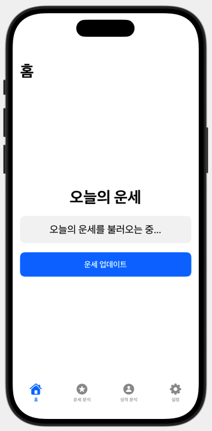
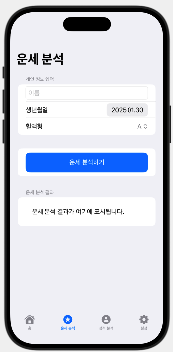
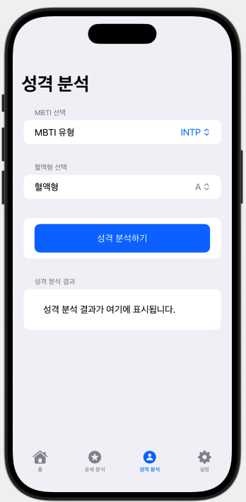
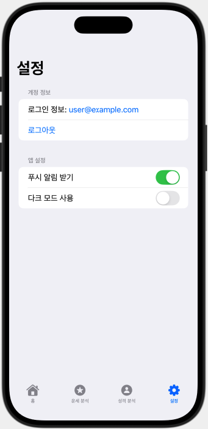

다음은 **"수비학 기반 성격 분석 및 운명 예측 iOS 앱"**의 **각 화면(View) UI 상세 설계**입니다.  
SwiftUI를 사용하여 **홈, 운세 분석, 성격 분석, 설정** 화면을 보다 **구체적인 UI로 구현**합니다.  

---

## **📌 전체적인 TabView 화면**
```swift
import SwiftUI

struct ContentView: View {
    var body: some View {
        TabView {
            HomeView()
                .tabItem {
                    Label("홈", systemImage: "house.fill")
                }
            
            NumerologyView()
                .tabItem {
                    Label("운세 분석", systemImage: "star.circle.fill")
                }
            
            PersonalityView()
                .tabItem {
                    Label("성격 분석", systemImage: "person.circle.fill")
                }
            
            SettingsView()
                .tabItem {
                    Label("설정", systemImage: "gearshape.fill")
                }
        }
        .accentColor(.blue) // 선택된 탭의 색상 변경
    }
}
```
✅ **탭바(TabView) 사용**  
✅ **SF Symbols 아이콘 적용**  
✅ **색상 커스텀 (accentColor)**  

---

# **📌 1️⃣ 홈 화면 (HomeView)**
### ✅ 오늘의 운세 & 핵심 운세 정보 제공

```swift
import SwiftUI

struct HomeView: View {
    @State private var todayFortune: String = "오늘의 운세를 불러오는 중..."
    
    var body: some View {
        NavigationView {
            VStack(spacing: 20) {
                Text("오늘의 운세")
                    .font(.largeTitle)
                    .fontWeight(.bold)
                
                Text(todayFortune)
                    .font(.title2)
                    .multilineTextAlignment(.center)
                    .padding()
                    .frame(maxWidth: .infinity)
                    .background(Color.gray.opacity(0.1))
                    .cornerRadius(10)
                    .padding(.horizontal)
                
                Button(action: fetchTodayFortune) {
                    Text("운세 업데이트")
                        .font(.headline)
                        .foregroundColor(.white)
                        .padding()
                        .frame(maxWidth: .infinity)
                        .background(Color.blue)
                        .cornerRadius(10)
                        .padding(.horizontal)
                }
            }
            .navigationTitle("홈")
        }
    }
    
    func fetchTodayFortune() {
        // 여기에 Firebase or API 연동하여 운세 데이터 불러오기
        todayFortune = "오늘은 긍정적인 기운이 넘치는 날입니다!"
    }
}
```
✅ **오늘의 운세 표시**  
✅ **"운세 업데이트" 버튼 추가**  
✅ **Firebase 또는 API를 활용해 실시간 운세 데이터 로드 가능**  

---

# **📌 2️⃣ 운세 분석 화면 (NumerologyView)**
### ✅ 성명, 생년월일, 혈액형 입력 후 운세 분석

```swift
import SwiftUI

struct NumerologyView: View {
    @State private var name: String = ""
    @State private var birthdate = Date()
    @State private var bloodType: String = "A"
    let bloodTypes = ["A", "B", "O", "AB"]
    @State private var analysisResult: String = "운세 분석 결과가 여기에 표시됩니다."
    
    var body: some View {
        NavigationView {
            Form {
                Section(header: Text("개인 정보 입력")) {
                    TextField("이름", text: $name)
                        .textFieldStyle(RoundedBorderTextFieldStyle())
                    
                    DatePicker("생년월일", selection: $birthdate, displayedComponents: .date)
                    
                    Picker("혈액형", selection: $bloodType) {
                        ForEach(bloodTypes, id: \.self) {
                            Text($0)
                        }
                    }
                }
                
                Section {
                    Button("운세 분석하기") {
                        fetchNumerologyAnalysis()
                    }
                    .frame(maxWidth: .infinity)
                    .padding()
                    .background(Color.blue)
                    .foregroundColor(.white)
                    .cornerRadius(10)
                }
                
                Section(header: Text("운세 분석 결과")) {
                    Text(analysisResult)
                        .padding()
                }
            }
            .navigationTitle("운세 분석")
        }
    }
    
    func fetchNumerologyAnalysis() {
        // Firebase or API 호출 (Heroku/Node.js)
        analysisResult = "당신의 생명 경로 수는 7입니다. 신비로운 지혜와 분석력을 가지고 있습니다."
    }
}
```
✅ **이름, 생년월일, 혈액형 입력**  
✅ **운세 분석 결과를 출력**  
✅ **API 연동 후 결과 표시 가능**  

---

# **📌 3️⃣ 성격 분석 화면 (PersonalityView)**
### ✅ MBTI & 혈액형 기반 성격 분석

```swift
import SwiftUI

struct PersonalityView: View {
    @State private var selectedMBTI: String = "INTP"
    let mbtiTypes = ["INTP", "ENTP", "INFJ", "ENFJ", "ISTP", "ESTP", "ISFP", "ESFP", "INTJ", "ENTJ", "INFJ", "ENFJ", "ISTJ", "ESTJ", "ISFJ", "ESFJ"]
    
    @State private var bloodType: String = "A"
    let bloodTypes = ["A", "B", "O", "AB"]
    
    @State private var personalityResult: String = "성격 분석 결과가 여기에 표시됩니다."
    
    var body: some View {
        NavigationView {
            Form {
                Section(header: Text("MBTI 선택")) {
                    Picker("MBTI 유형", selection: $selectedMBTI) {
                        ForEach(mbtiTypes, id: \.self) {
                            Text($0)
                        }
                    }
                    .pickerStyle(MenuPickerStyle())
                }
                
                Section(header: Text("혈액형 선택")) {
                    Picker("혈액형", selection: $bloodType) {
                        ForEach(bloodTypes, id: \.self) {
                            Text($0)
                        }
                    }
                }
                
                Section {
                    Button("성격 분석하기") {
                        fetchPersonalityAnalysis()
                    }
                    .frame(maxWidth: .infinity)
                    .padding()
                    .background(Color.blue)
                    .foregroundColor(.white)
                    .cornerRadius(10)
                }
                
                Section(header: Text("성격 분석 결과")) {
                    Text(personalityResult)
                        .padding()
                }
            }
            .navigationTitle("성격 분석")
        }
    }
    
    func fetchPersonalityAnalysis() {
        // Firebase or API 연동 가능
        personalityResult = "INTP + A형: 분석적이고 내성적이며 창의력이 뛰어난 성향입니다."
    }
}
```
✅ **MBTI & 혈액형 입력 후 성격 분석 결과 제공**  
✅ **MBTI와 혈액형 조합 분석 가능**  

---

# **📌 4️⃣ 설정 화면 (SettingsView)**
### ✅ 사용자 정보 관리 및 데이터 저장

```swift
import SwiftUI

struct SettingsView: View {
    var body: some View {
        NavigationView {
            Form {
                Section(header: Text("계정 정보")) {
                    Text("로그인 정보: user@example.com")
                    Button("로그아웃") {
                        // Firebase 로그아웃 처리
                    }
                }
                
                Section(header: Text("앱 설정")) {
                    Toggle("푸시 알림 받기", isOn: .constant(true))
                    Toggle("다크 모드 사용", isOn: .constant(false))
                }
            }
            .navigationTitle("설정")
        }
    }
}
```
✅ **사용자 계정 관리 및 로그아웃 기능**  
✅ **푸시 알림 & 다크 모드 설정 추가**  

---

### **🚀 다음 단계**
1️⃣ **Firebase 연동하여 로그인/회원가입 구현**  
2️⃣ **Heroku(Node.js) API와 연결하여 운세 분석 결과 불러오기**  
3️⃣ **오늘의 운세, 성격 분석 UI 개선 및 애니메이션 추가**  

어떤 부분부터 진행할까요? 😊🔥