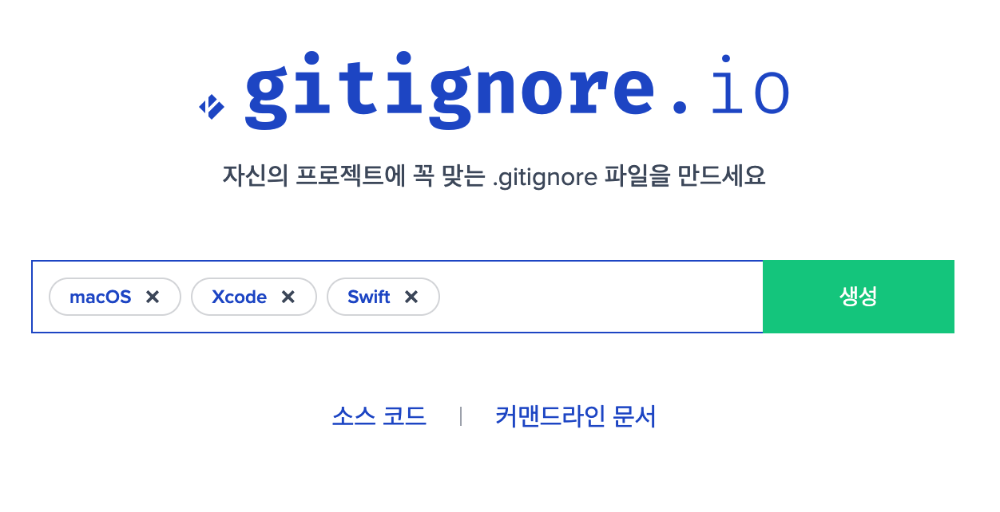

# 1장: Git & GitHub 사용법

## 목차

1. **Git 기본 개념**
    
    1.1 버전 관리의 필요성
    
    1.2 로컬 저장소와 원격 저장소
    
    1.3 Git 이전의 버전 관리 도구와의 차이점
    
2. **Git의 원리와 저장소 구조**
    
    2.1 Git의 분산형 버전 관리 시스템(DVCS)
    
    2.2 스냅샷 방식과 변경점 추적 방식 비교
    
    2.3 Git의 주요 저장소 구조
    
3. **Git 설치 및 초기 설정**
    
    3.1 Git 설치
    
    3.2 사용자 정보 설정
    
    3.3 Git 설정 파일
    
4. **Git 명령어 기초**
    
    4.1 로컬 저장소 생성 및 초기화
    
    4.2 기본 Git 명령어
    
    4.3 원격 저장소와 동기화
    
5. **GitHub와 원격 저장소 연결**
    
    5.1 GitHub 계정 생성
    
    5.2 GitHub에서 원격 저장소 생성
    
    5.3 GitHub의 주요 기능
    
6. **브랜치와 협업 워크플로우 이해**
    
    6.1 브랜치의 개념과 역할
    
    6.2 병합 충돌 해결
    
    6.3 협업 시 브랜치 관리 전략
    
7. **GitHub Actions를 활용한 CI/CD 설정**
    
    7.1 GitHub Actions 설정 방법
    
    7.2 기본 Workflow 생성
    
8. **고급 Git 기능**
    
    8.1 Rebase와 Cherry-pick
    
    8.2 Tag와 Release
    
9. **실습: Swift 프로젝트 GitHub에 업로드 및 관리**
    
    9.1 로컬 Swift 프로젝트 생성 및 Git 관리
    
    9.2 원격 저장소 연결 및 푸시
    
    9.3 GitHub Actions 설정
    
10. **협업 실습: 팀 단위 프로젝트 관리**
    
    10.1 팀 저장소 생성 및 관리
    
    10.2 협업을 위한 브랜치 활용
    
11. **부록:** 자주 사용하는 Git 명령어 정리
12. **단원 평가:** 이론 문제, 실습 문제,도전 문제

---

## **학습 목표:**

협업 도구인 Git과 GitHub의 기초를 학습하여 소스 코드 관리를 체계적으로 수행하고, 실질적인 프로젝트 협업 환경에서 효율적으로 활용할 수 있는 능력을 배양합니다.

1. **버전 관리 시스템의 중요성**을 이해하고, 코드 변경 이력 관리의 필요성을 학습합니다.
2. Git이 **로컬 저장소**와 **원격 저장소**를 통해 소스 코드를 효율적으로 관리하는 방식을 이해합니다.
3. Git과 **기존 버전 관리 도구(CVS, SVN)**의 차이점을 비교하고, Git이 도입된 이유를 설명할 수 있습니다.
4. Git의 **분산형 버전 관리 시스템(DVCS) 구조**를 파악하고, 각 저장소(Working Directory, Staging Area, Repository)의 역할을 이해합니다.
5. **스냅샷 방식**과 **변경점 추적 방식**의 차이점을 학습하여 Git이 효율적인 버전 관리를 제공하는 원리를 이해합니다.
6. Git을 사용하여 **코드 변경 사항을 추적하고 관리**하며, 협업 과정에서 발생할 수 있는 **충돌 상황을 해결**하는 방법을 학습합니다.

---

# **1. Git 기본 개념**

### **1.1 버전 관리의 필요성**

### **코드 관리에서 버전 관리 시스템의 역할**

버전 관리 시스템(VCS, Version Control System)은 코드와 프로젝트의 변경 사항을 추적하고 관리하는 도구입니다. 이를 통해 다음과 같은 이점을 제공합니다:

- **변경 사항 추적:** 프로젝트의 모든 변경 내역을 기록하여 이전 버전으로 되돌아가거나 변경 사항을 비교할 수 있습니다.
- **협업 지원:** 여러 개발자가 동일한 프로젝트에서 충돌 없이 동시에 작업할 수 있도록 지원합니다.
- **백업 역할:** 로컬 저장소와 원격 저장소에 데이터를 저장해 프로젝트 데이터를 안전하게 보호합니다.
- **효율적인 문제 해결:** 특정 버전에서 발생한 문제를 빠르게 파악하고 수정할 수 있습니다.

### **로컬 저장소와 원격 저장소의 개념**

- **로컬 저장소(Local Repository):**
각 개발자의 컴퓨터에 저장된 프로젝트 복사본으로, 인터넷 연결 없이도 작업이 가능합니다.
- **원격 저장소(Remote Repository):**
GitHub, GitLab, Bitbucket 같은 서버에 호스팅된 저장소로, 여러 사용자가 프로젝트를 공유하고 협업할 수 있도록 합니다.

로컬 저장소와 원격 저장소의 상호작용은 다음 과정을 따릅니다:

- **Pull:** 원격 저장소의 최신 데이터를 로컬 저장소로 가져오기
- **Push:** 로컬 저장소의 변경 사항을 원격 저장소에 반영하기

### **Git 이전의 버전 관리 도구와의 차이점**

Git이 등장하기 전, 주로 **CVS**(Concurrent Versions System)와 **SVN**(Apache Subversion) 같은 중앙집중형 버전 관리 시스템(CVCS)이 사용되었습니다.

- **CVS, SVN의 한계:**
    - 중앙 서버에 의존적이어서 서버 장애 시 모든 작업 중단.
    - 변경 사항을 서버에 직접 기록하며, 작업 속도가 느림.
- **Git의 개선점:**
    - 분산형 구조로, 로컬에서도 모든 작업 가능.
    - 스냅샷 기반 저장 방식으로 더 빠르고 효율적.

---

### **1.2 Git의 원리**

### **Git의 분산형 버전 관리 시스템(DVCS) 구조 이해**

Git은 분산형 버전 관리 시스템으로, 모든 개발자가 프로젝트의 전체 기록을 자신의 로컬 저장소에 복사해 작업합니다.

- **장점:**
    - 인터넷 없이도 히스토리 검색, 수정 작업 가능.
    - 중앙 서버에 문제가 생겨도 로컬 저장소로 복구 가능.
- **구조:**
    - 로컬 저장소와 원격 저장소가 독립적으로 존재하며, 필요에 따라 데이터 동기화.

### **스냅샷 방식과 변경점 추적 방식 비교**

- **변경점 추적 방식(Diff Tracking):**
    - CVS와 SVN이 사용하는 방식.
    - 각 파일의 변경 내역(차이점)만 기록.
    - 파일이 많아지면 성능 저하.
- **스냅샷 방식(Snapshot):**
    - Git은 프로젝트 전체 상태를 스냅샷으로 저장.
    - 변경 사항이 없으면 이전 스냅샷을 참조하여 저장 공간 효율화.
    - 빠른 속도와 데이터 복원 용이성 제공.

### **Git의 주요 저장소 구조**

Git은 세 가지 주요 저장소로 구성되어 있습니다:

1. **Working Directory (작업 디렉토리):**
    - 실제 파일 작업이 이루어지는 공간.
    - 파일을 추가, 수정, 삭제하면 이곳에서 반영됩니다.
2. **Staging Area (스테이징 영역):**
    - 커밋 전 변경 사항을 임시로 저장하는 공간.
    - `git add` 명령어를 사용해 변경 사항을 추가.
    - 커밋하기 전에 어떤 파일을 포함할지 선택 가능.
3. **Repository (저장소):**
    - 커밋된 모든 변경 사항의 스냅샷이 저장되는 공간.
    - 로컬 저장소와 원격 저장소로 나뉘며, `git commit`으로 스테이징 영역의 데이터를 저장.

---

### **요약**

- 버전 관리 시스템은 협업, 변경 사항 추적, 문제 해결을 효과적으로 지원하며, Git은 이전 VCS의 한계를 극복한 분산형 도구입니다.
- Git의 스냅샷 기반 저장 방식은 빠른 작업 속도와 효율성을 제공하며, Working Directory, Staging Area, Repository로 구성된 저장소 구조는 개발자들에게 유연성과 명확한 작업 흐름을 제공합니다.

---

# **2. Git 설치 및 초기 설정**

### **2.1 Git 설치**

### **macOS에서 Git 설치 방법**

이 단원에서는 Git을 설치하는 방법과 기본적인 설정을 수행하는 방법을 소개합니다.

1. **macOS에서 Git 설치:**
    - macOS: Homebrew를 사용하여 `brew install git` 명령어로 설치
    
    ```bash
    brew install git
    ```
    
2. 설치 후 버전을 확인하여 정상적으로 설치되었는지 확인:
    
    ```bash
    git --version
    ```
    

---

### **2.2 사용자 정보 설정**

### **1. 사용자 이름과 이메일 설정**

Git은 커밋 기록에 작성자 정보를 포함합니다. 이를 설정하기 위해 다음 명령어를 사용합니다:

- 사용자 이름 설정:
    
    ```bash
    git config --global user.name "Your Name"
    
    ```
    
- 이메일 설정:
    
    ```bash
    git config --global user.email "your.email@example.com"
    
    ```
    

### **2. 기본 텍스트 에디터 설정**

커밋 메시지를 입력하거나 Git 관련 설정 파일을 편집할 때 사용할 텍스트 에디터를 지정합니다.

- Vim 기본 설정:
    
    ```bash
    git config --global core.editor "vim"
    
    ```
    
- VS Code를 기본 에디터로 설정:
    
    ```bash
    git config --global core.editor "code --wait"
    
    ```
    

---

### **2.3 Git 설정 파일**

### **1. `.gitconfig` 파일의 역할 및 확인 방법**

- **역할:**`.gitconfig`는 Git 설정 정보를 저장하는 파일입니다. 사용자 이름, 이메일, 별칭(alias) 등을 포함합니다.
- **확인 방법:**
또는 Git 명령어를 통해 확인:
    
    ```bash
    cat ~/.gitconfig
    
    ```
    
    ```bash
    git config --list
    
    ```
    

### **2. 설정 파일에 alias(별칭) 추가 예제**

- Git 명령어를 짧게 사용할 수 있도록 별칭(alias)을 설정합니다.
- 예제:
    
    ```bash
    git config --global alias.st status
    git config --global alias.co checkout
    git config --global alias.br branch
    
    ```
    
- `.gitconfig` 파일의 결과 예시:
    
    ```
    [user]
        name = Your Name
        email = your.email@example.com
    [alias]
        st = status
        co = checkout
        br = branch
    
    ```
    

---

## gitignore.io 에서 .gitignore 파일 생성

웹 브라우저로  gitignore.io 접속.
[https://www.toptal.com/developers/gitignore](https://www.toptal.com/developers/gitignore)

### gitignore.io

- **gitignore.io 웹 사이트에서 .gitignore파일 자동 생성**
    
    생성 input 창에 운영체제, 개발 환경(IDE), 프로그래밍 언어를 검색해서 자동 생성 가능.
    
    생성된  내용을  프로젝트  루트에  .gitignore  파일로  저장한다.
    
    gitignore  파일에  기록된  파일들은  버전  관리  추적  대상에서  제외된다.
    
1. **.gitignore 파일 작성:**
    - 특정 파일과 디렉토리 제외: 예시로 `node_modules/`, `.log`, `.env`
    - 주석 추가 및 예외 규칙 작성 방법
2. **.gitignore 파일 적용:**
    - 이미 추적 중인 파일 무시하기: `git rm --cached <file>`



---

# **3. Git 명령어 기초**

### **3.1 로컬 저장소 생성 및 초기화**

### **1. `git init` 명령어로 로컬 저장소 초기화**

Git 저장소를 초기화하면 해당 프로젝트 디렉토리가 버전 관리 대상이 됩니다. 초기화 후 다음 단계로 넘어 갑니다.

### **2. `.git` 폴더 구조 살펴보기**

- `.git` 폴더는 기본적으로 숨겨져 있습니다. 폴더 구조를 확인하려면 다음 명령어를 사용합니다:

주요 폴더와 파일:
    
    ```bash
    ls -a .git
    ```
    
    - **HEAD:** 현재 브랜치 정보를 저장.
    - **objects:** 커밋, 블롭(blob), 트리(tree) 데이터를 저장.
    - **refs:** 브랜치와 태그 정보를 저장.
    - **config:** 프로젝트 수준 설정 파일.


---

### **3.2 기본적인 Git 명령어**

### **1. 파일 추가 및 상태 확인**

- Git은 변경 사항을 추적하기 위해 파일을 **Staging Area**에 추가해야 합니다.
- 상태 확인:
    
    ```bash
    git status
    ```
    
    - 현재 작업 디렉토리의 상태를 보여줍니다.
- 파일 추가:
    
    ```bash
    git add <filename>
    ```
    
    - 특정 파일 추가.
    
    ```bash
    git add .
    ```
    
    - 모든 변경 사항 추가.

### **2. 변경 사항 커밋**

- 변경 사항을 저장소에 기록하려면 `git commit`을 사용합니다.
    - `m` 옵션은 커밋 메시지를 작성할 때 사용됩니다.
    
    ```bash
    git commit -m "Initial commit"
    ```
    

### **3. 이력 확인**

- 프로젝트의 모든 커밋 이력을 확인합니다:
    - 기본 출력: 커밋 해시, 작성자, 날짜, 메시지.
    
    ```bash
    git log
    git log --oneline
    ```
    

---

### **3.3 원격 저장소와 동기화**

### **1. 원격 저장소 연결**

- 원격 저장소를 로컬 저장소에 연결합니다:
    - `<repository-url>`은 GitHub, GitLab, Bitbucket 등에서 제공하는 HTTPS 또는 SSH URL.
    
    ```bash
    git remote add origin <repository-url>
    git remote -v
    ```
    

### **2. 로컬 커밋을 원격 저장소에 푸시**

- 초기 푸시:
    
    ```bash
    git push -u origin main
    ```
    
    - `u` 옵션은 로컬 브랜치를 원격 브랜치에 연결합니다. 이후에는 `git push`로 간단히 푸시 가능.

### **3. 원격 저장소의 변경 사항 가져오기**

- 원격 저장소의 최신 변경 사항을 로컬 저장소로 가져옵니다:
    
    ```bash
    git pull
    ```
    
    - 변경 사항이 로컬과 충돌할 경우 수동으로 해결해야 합니다.

---

# **4. GitHub와 원격 저장소 연결**


### **4.1 GitHub 계정 생성**

### **1. GitHub 계정 생성 및 기본 설정**

1. **GitHub 가입 절차**
    - [GitHub 공식 웹사이트](https://github.com/)에 접속하여 "Sign Up" 버튼 클릭.
    - 이메일, 비밀번호, 사용자 이름 입력 후 계정 생성.
    - 이메일 인증 과정을 완료하여 계정 활성화.
2. **프로필 설정**
    - "Profile" 섹션에서 이름, 프로필 사진, 간단한 소개 등 사용자 정보를 추가.
    - "Settings"에서 2단계 인증(2FA)을 설정하여 계정 보안을 강화.

### **2. Public/Private 저장소의 차이점**

- **Public 저장소**:
    - 누구나 저장소 내용을 볼 수 있음.
    - 오픈소스 프로젝트나 공개 협업에 적합.
- **Private 저장소**:
    - 저장소 내용을 초대받은 사용자만 열람 가능.
    - 비공개 프로젝트나 민감한 데이터 관리에 적합.
    - GitHub Free 계정에서도 Private 저장소 생성 가능.

---

### **4.2 GitHub에서 원격 저장소 생성**

### **1. 웹에서 새로운 저장소 생성하기**

1. GitHub에 로그인 후 "Repositories" 탭에서 "New" 버튼 클릭.
2. 저장소 이름 입력 (예: `my_first_repo`).
3. Public 또는 Private 옵션 선택.
4. "Add a README file" 옵션 선택(선택 사항).
5. "Create repository" 버튼 클릭하여 저장소 생성.

### **2. 로컬 Git 저장소와 원격 GitHub 저장소 연결**

1. GitHub에서 생성된 저장소 URL 복사 (HTTPS 또는 SSH).
    
    예:
    
    ```
    https://github.com/username/my_first_repo.git
    ```
    
2. 로컬 저장소에서 원격 저장소 연결:
    
    ```bash
    git remote add origin https://github.com/username/my_first_repo.git
    ```
    
3. 연결된 원격 저장소 확인:
    
    ```bash
    git remote -v
    ```
    

---

### **4.3 기본 GitHub 사용법**

### **1. 저장소 README 파일 작성**

1. 로컬에서 README.md 파일 생성:
    
    ```bash
    echo "# My First Repository" > README.md
    git add README.md
    git commit -m "Add README file"
    git push -u origin main
    ```
    
2. GitHub 웹 UI에서 README 파일 편집:
    - 저장소 페이지에서 README.md 클릭 후 "Edit" 버튼 사용.

### **2. GitHub Issues, Wiki, Pull Requests의 기본 개념**

- **Issues**:
    - 프로젝트의 버그, 기능 요청, 아이디어 등을 관리.
    - 각 Issue는 제목, 설명, 라벨, 담당자를 포함.
- **Wiki**:
    - 프로젝트와 관련된 문서를 관리하는 공간.
    - 설치 방법, 사용 가이드, 프로젝트 개요 등을 작성 가능.
- **Pull Requests (PR)**:
    - 브랜치 간 변경 사항을 병합할 때 사용.
    - 코드 리뷰와 논의를 통해 협업 강화.

---

# **5. 브랜치와 협업 워크플로우 이해**

## 새로운 브랜치 생성과 작업

### 1. 새 브랜치 생성 및 전환

```bash
# 새 브랜치를 생성합니다. 이 브랜치는 최근의 커밋을 가리킵니다.
git branch 새브랜치
# 새로 생성된 브랜치로 전환합니다.
git checkout 새브랜치
```

### 2. 파일 수정 및 커밋

```bash
# 모든 변경된 파일을 스테이지에 추가합니다.
git add --all
# 스테이지에 추가된 변경사항을 커밋합니다.
git commit -m "커밋내용"
```

### 3. 원래 브랜치로 돌아가기

```bash
# master 브랜치로 다시 전환합니다.
git checkout master
```

### 4. 브랜치 목록 조회

```bash
# 로컬 브랜치 목록을 조회합니다.
git branch
# 원격 브랜치 목록을 조회합니다.
git branch -r
# 모든 브랜치 목록을 조회합니다.
git branch -a
```

## 브랜치 병합

### 브랜치 병합(Merge) 과정

Git에서 브랜치를 병합하는 과정은 여러 브랜치에서 작업한 내용을 하나로 통합하는 중요한 단계입니다. 아래는 Git에서 브랜치를 병합하는 과정과 주의 사항에 대한 설명입니다.

### 1. 병합하기 전에 마스터 브랜치로 전환

병합을 수행하기 전에 병합 대상이 되는 브랜치로 전환해야 합니다. 예를 들어, `master` 브랜치로 병합을 원할 경우, 먼저 `master` 브랜치로 전환합니다.

```bash
git checkout master

```

### 2. 작업 브랜치 병합

전환한 브랜치(`master`)에 다른 브랜치(예: `feature`)를 병합합니다. 이 때, `master` 브랜치가 `feature` 브랜치의 내용을 병합하게 됩니다.

```bash
git merge 작업브랜치

```

- **Fast-Forward 병합**: `master` 브랜치에 새로운 커밋이 없고, `feature` 브랜치에서 추가된 커밋만 있을 경우, Git은 `master` 브랜치를 단순히 `feature` 브랜치의 마지막 커밋으로 이동(Fast-Forward)시킵니다. 이 경우, 별도의 병합 커밋이 생성되지 않습니다.

### 3. 병합 후 작업 브랜치 삭제

병합이 완료된 후, 더 이상 필요하지 않은 작업 브랜치는 삭제해도 됩니다.

```bash
git branch -D 작업브랜치

```

### 4. 일반 병합 (Fast-Forward가 아닌 병합)

Fast-Forward 병합이 불가능한 경우, Git은 병합 커밋을 생성합니다. 이는 서로 다른 브랜치에서 동시에 작업이 이루어졌을 때 발생합니다.

```bash
git merge 작업브랜치

```

이 과정에서는 새로운 병합 커밋이 생성되어 두 브랜치의 작업 내용을 하나로 통합합니다.

### 병합 시 유의 사항

1. **병합은 브랜치 레벨에서만 가능**: 병합은 반드시 브랜치 간에 수행됩니다. 특정 파일이나 디렉토리만 병합할 수는 없습니다.
2. **현재 브랜치에 없는 커밋만 병합 가능**: 병합 시 현재 브랜치에 없는 커밋만 병합됩니다. 이미 포함된 커밋을 중복해서 병합할 수 없습니다.
3. **변경 대상 브랜치로 전환 후 병합**: 병합하려는 브랜치로 먼저 전환한 후에 병합을 수행해야 합니다.
4. **충돌 처리**:
    - 병합할 두 브랜치가 동일 파일의 동일 부분을 수정한 경우 충돌이 발생할 수 있습니다.
    - 충돌이 발생하면 Git은 병합을 중단하고, 충돌된 파일을 수정한 후 다시 커밋해야 합니다.
    - 충돌 해결 방법은 충돌이 발생한 파일을 열어 직접 수정하거나, Git에서 제공하는 충돌 해결 도구를 사용할 수 있습니다.

이 과정을 통해 Git에서 브랜치를 안전하게 병합할 수 있으며, 충돌이 발생할 경우 이를 해결하는 방법도 익힐 수 있습니다. 병합 후에는 항상 병합된 결과를 잘 검토하고, 필요한 경우 테스트를 수행하여 병합이 올바르게 이루어졌는지 확인하는 것이 중요합니다.

## Fast-Forward 병합

**Fast-forward 병합**은 현재 브랜치가 병합하려는 브랜치의 팁(tip) 뒤에 있고, 브랜치 간에 다른 변경 사항이 없을 때 사용할 수 있는 간단한 병합 방법입니다. 두 브랜치 사이에 발산하는 변경사항이 없다면 Git은 단순히 포인터를 최신 커밋으로 이동시킬 수 있습니다.

- **예시**: `feature` 브랜치가 `master`에서 분기된 후 `master`에 아무런 변경이 없었다면, `feature`를 `master`에 병합하는 것은 `master`의 헤드를 `feature`의 헤드로 단순히 이동시킬 수 있습니다.
    
    ```bash
    git checkout master
    git merge feature  # master에 feature 이후 새로운 커밋이 없는 경우에만
    
    ```
    

이 경우 병합이 fast-forward로 해결될 수 있다면 새로운 커밋은 생성되지 않습니다.

### 명시적인 병합 커밋 없이 변경사항 적용

병합 커밋을 명시적으로 생성하지 않으면서 다른 브랜치의 변경사항을 적용하는 방법입니다. 이는 Git의 전형적인 '병합'이 아니지만 유사한 결과를 달성할 수 있습니다:

1. **체리픽(Cherry-picking)**: 하나의 브랜치에서 특정 커밋의 변경사항만 선택하여 다른 브랜치에 적용합니다.
    
    ```bash
    git checkout master
    git cherry-pick <커밋해시>
    ```
    
2. **리베이스(Rebase)**: 한 브랜치를 다른 브랜치에 리베이스하여 기능 브랜치의 각 커밋을 master 브랜치에 다시 적용합니다. 리베이스를 완료한 후 fast-forward 옵션으로 병합하면 병합 커밋을 피할 수 있습니다.
    
    ```bash
    git checkout feature
    git rebase master
    git checkout master
    git merge feature  
    # 이제 master에 추가적인 커밋이 없다면 fast-forward 병합이 가능합니다.
    ```
    
3. **패치 적용**: 한 브랜치에서 패치를 생성하고 다른 브랜치에 적용합니다. 이 수동 방법은 형식적인 Git 병합을 피합니다.
    
    ```bash
    git checkout feature
    git format-patch master --stdout > feature.patch
    git checkout master
    git apply feature.patch
    git add .
    git commit -m "feature 브랜치의 변경사항을 패치로 적용"
    ```
    

### 병합 커밋 없이 병합 준비

- `-no-commit` 플래그를 사용하여 병합을 준비하지만 즉시 커밋하지는 않습니다. 이는 워킹 디렉토리에 병합 결과를 스테이지 상태로 두어 수정하거나 검토할 수 있게 합니다.

```bash
git checkout master
git merge --no-commit feature
# 병합 결과를 검토하거나 수정
git commit  # 최종적으로 수동 커밋
```

## 병합 취소

### 1. `git reset` 사용하기

- **Soft Reset**: HEAD를 이전 커밋으로 리셋하지만 작업 디렉토리와 스테이징 영역은 그대로 유지.
    
    ```bash
    git reset --soft HEAD^
    ```
    
- **Mixed Reset** (기본값): HEAD를 이전 커밋, 스테이징 영역도 리셋, 작업 디렉토리는 그대로 유지.
    
    ```bash
    git reset --mixed HEAD^  # 또는 간단히 git reset HEAD^
    ```
    
- **Hard Reset**: 병합을 완전히 취소하고 스테이징 영역과 작업 디렉토리 모두 리셋.
    
    ```bash
    git reset --hard HEAD^
    ```
    

### 2. `git revert` 사용하기

- **병합 커밋 되돌리기**:
Git revert를 사용할 때는 병합 커밋의 부모 중 하나를 지정해야 합니다.
    
    ```bash
    git revert -m 1 <병합_커밋_해시>
    ```
    

### 3. Reflog로 복구하기

병합 후 다른 작업을 수행한 경우. Git reflog는 저장소에서 수행한 모든 작업의 로그를 보관.  합 이전의 상태로 리셋 가능.

```bash
git reflog
# 병합 이전 커밋 찾기
git reset --hard <병합_이전_커밋>
```

### 고려 사항

- **리셋 전에 백업하기**: `git reset --hard`와 같은 명령을 수행하기 전에 백업 브랜치를 생성하는 것이 좋은 관행입니다:
    
    ```bash
    git branch backup-branch
    ```
    
- **통신**: 병합이 공유되어 있다면, 병합을 취소할 필요가 있다는 사실을 팀과 소통해야 합니다.

## Git에서 제공하는 다양한 병합 방법

| **병합 방법** | **특징** | **사용 경우** | **명령 예시** |
| --- | --- | --- | --- |
| Fast-Forward | 별도의 병합 커밋 없이 HEAD 이동 | 변경사항이 선형적일 때 | `git merge feature` |
| Squash | 여러 커밋을 하나의 커밋으로 압축 | 히스토리를 깔끔하게 유지하고 싶을 때 | `git merge --squash feature` |
| Rebase | 브랜치의 기점 변경, 히스토리 선형 유지 | 병합 충돌 최소화, 히스토리 정리 필요시 | `git rebase master` 후 `git merge feature` |
| Cherry-Pick | 특정 커밋만 선택적으로 적용 | 특정 기능만 현재 브랜치에 추가하고 싶을 때 | `git cherry-pick <commit-hash>` |
| Subtree | 다른 프로젝트를 서브디렉토리로 병합 | 복잡한 프로젝트 또는 서브모듈 통합 시 | `git subtree add --prefix=<path> <repo>` |
| Octopus | 세 개 이상의 브랜치를 한번에 병합 | 여러 개발 팀 또는 기능을 동시에 병합 필요 시 | `git merge branch1 branch2 branch3` |

## 파일 상태 구분

| **파일 상태** | **설명** | **관련 Git 명령어** |
| --- | --- | --- |
| Untracked | 파일이 Git에 의해 추적되지 않음. 리포지토리에 새로 추가된 파일. | `git add <file>` (Untracked -> Staged) |
| Unmodified | 파일이 변경되지 않음. 최근 커밋 이후 수정되지 않은 파일. | 없음 (변경이 없으므로) |
| Modified | 파일이 수정됨. 최근 커밋 이후 내용이 변경된 파일. | `git add <file>` (Modified -> Staged) |
|  |  | `git checkout -- <file>` (변경 사항 버리기) |
| Staged | 파일이 스테이지 영역에 추가됨. 다음 커밋에 포함될 준비가 된 파일. | `git commit -m "message"` (Staged -> Committed) |
|  |  | `git reset HEAD <file>` (Staged -> Modified) |

## 커밋 수정하기

1. **변경할 파일 편집 후 스테이지에 추가하기**
    
    ```bash
    git add <수정된 파일>
    ```
    
2. **커밋 수정**:
    
    ```bash
    git commit --amend
    
    ```
    
    이 명령을 실행하면 기본 텍스트 편집기가 열리고 (이 예에서는 `vi`), 여기서 커밋 메시지를 수정할 수 있습니다.
    
    - `vi`에서는 `i` 키를 눌러 삽입 모드로 전환하고 메시지를 편집할 수 있습니다.
    - 편집을 완료한 후 `esc` 키를 눌러 명령 모드로 돌아간 다음, `:wq`를 입력하여 저장하고 편집기를 종료합니다.
3. **커밋 로그 확인**:
    
    ```bash
    git log
    ```
    
    이 명령을 통해 최근 커밋의 내용이 업데이트된 것을 확인할 수 있습니다.
    
4. **브랜치 전환**:
    - 수정 전 상태로 돌아가기 위해:
        
        ```bash
        git checkout master
        ```
        
    - 수정 후의 내용으로 다시 돌아가기 위해:
        
        ```bash
        git checkout newbranch
        ```
        

### 주의사항

- **공개된 커밋 수정 주의**: `git commit --amend`는 커밋 히스토리를 변경합니다. 이미 공개된(즉, 원격 저장소에 푸시된) 커밋을 이 방법으로 수정하면 문제가 발생할 수 있습니다. 공개된 커밋을 수정한 후에는 강제 푸시(`git push --force`)가 필요할 수 있지만, 다른 사람과 협업하는 프로젝트에서는 주의해서 사용해야 합니다.

## Git Stash로 작업 내용 임시 저장 및 복원

Git Stash는 작업 중인 변경사항을 임시로 저장해두고, 나중에 다시 복원할 수 있는 유용한 기능입니다. 이 기능은 여러 브랜치에서 작업하거나, 현재 작업을 중단하고 다른 작업을 처리해야 할 때 유용하게 사용할 수 있습니다.

### 1. 새로운 작업 브랜치 생성

작업을 위한 새 브랜치를 생성하고 해당 브랜치로 전환합니다.

```bash
git branch new_work
git checkout new_work

```

이제 새로 생성한 `new_work` 브랜치에서 작업을 진행할 수 있습니다.

### 2. 작업 내용을 Stash로 임시 저장

작업 도중에 현재 상태를 저장해두고 다른 브랜치로 전환하거나 다른 작업을 처리해야 할 때 `git stash` 명령어를 사용하여 변경사항을 임시 저장합니다.

```bash
git stash

```

이 명령어를 실행하면 현재 브랜치에서 작업하던 내용이 Stash에 임시로 저장됩니다. 이때, 작업하던 브랜치는 깨끗한 상태로 돌아가며, `master` 브랜치로 전환할 수 있습니다.

### 3. Stash에 저장된 내용 복원하기

작업을 마치고 다시 Stash에 저장된 내용을 복원하려면 다음 명령어를 사용할 수 있습니다:

- **Stash에서 내용 복원 후 제거**:
    
    ```bash
    git stash pop
    
    ```
    
    이 명령어는 Stash에 저장된 내용을 복원하고, 복원된 Stash 항목을 제거합니다. 즉, Stash에서 해당 항목이 사라집니다.
    
- **Stash에서 내용 복원만**:
    
    ```bash
    git stash apply
    
    ```
    
    이 명령어는 Stash에 저장된 내용을 복원하지만, Stash 항목은 여전히 남아있습니다. 여러 브랜치에서 동일한 작업을 적용하고자 할 때 유용합니다.
    

### Stash 사용의 유용성

- **브랜치 전환**: 작업 중에 다른 브랜치로 전환해야 할 때, 변경사항을 커밋하지 않고도 안전하게 임시로 저장할 수 있습니다.
- **실험적인 작업**: 실험적인 작업을 시작하기 전에, 현재 작업 상태를 유지하기 위해 Stash를 사용할 수 있습니다.
- **충돌 해결**: 병합 또는 리베이스 중 충돌이 발생했을 때, 현재 상태를 Stash로 저장해두고 충돌을 해결한 후 다시 적용할 수 있습니다.

Stash를 활용하면 여러 작업을 효율적으로 관리할 수 있으며, 작업 내용을 잃지 않고 쉽게 저장하고 복원할 수 있습니다.

## Git에서 Stash된 변경사항을 특정 브랜치에만 적용

### 1. Stash된 변경사항 확인하기

먼저 Stash에 저장된 변경사항 목록을 확인합니다.

```bash
git stash list
```

이 명령어는 Stash에 저장된 모든 변경사항의 목록을 보여줍니다. 각 Stash 항목은 고유의 식별자를 가집니다(예: `stash@{0}`, `stash@{1}` 등).

### 2. 특정 브랜치로 전환

Stash된 변경사항을 적용하고자 하는 특정 브랜치로 전환합니다.

```bash
git checkout branch-name
```

여기서 `<branch-name>`을 변경사항을 적용하고자 하는 브랜치 이름으로 대체합니다.

### 3. Stash 적용

특정 브랜치에 Stash된 변경사항을 적용하려면, 다음 중 하나의 명령어를 사용합니다:

- **Stash 항목 적용 후 삭제**:
    
    ```bash
    git stash pop stash@{0}
    ```
    
    이 명령어는 `stash@{0}`에 저장된 변경사항을 현재 브랜치에 적용하고, 해당 Stash 항목을 제거합니다.
    
- **Stash 항목 적용만**:
    
    ```bash
    git stash apply stash@{0}
    ```
    
    이 명령어는 `stash@{0}`에 저장된 변경사항을 현재 브랜치에 적용하지만, Stash 항목은 그대로 유지됩니다. 여러 브랜치에 동일한 변경사항을 적용할 때 유용합니다.
    

### 4. 선택적으로 Stash 항목 삭제

`git stash apply` 명령어를 사용한 경우, 해당 Stash 항목을 수동으로 삭제할 수 있습니다.

```bash
git stash drop stash@{0}
```

또는 Stash에 저장된 모든 항목을 삭제하려면:

```bash
git stash clear
```

## Git에서 Stash 목록을 삭제하는 방법

### 1. 특정 Stash 항목 삭제

특정 Stash 항목을 삭제하려면 `git stash drop` 명령어를 사용합니다. 먼저 Stash 목록을 확인하고, 삭제하려는 항목을 선택합니다.

1. **Stash 목록 확인**:
    
    ```bash
    git stash list
    
    ```
    
    이 명령어는 Stash 목록을 출력합니다. 각 Stash 항목은 `stash@{0}`, `stash@{1}` 등의 식별자를 가집니다.
    
2. **특정 항목 삭제**:
    
    ```bash
    git stash drop stash@{0}
    
    ```
    
    이 명령어는 `stash@{0}`에 해당하는 Stash 항목을 삭제합니다. 원하는 항목의 번호를 정확히 입력하여 삭제합니다.
    

### 2. 모든 Stash 항목 삭제

모든 Stash 항목을 한 번에 삭제하고 싶다면, `git stash clear` 명령어를 사용합니다.

```bash
git stash clear

```

이 명령어는 Stash에 저장된 모든 항목을 한 번에 삭제합니다. 이 작업은 되돌릴 수 없으므로, 주의해서 사용해야 합니다.

### 요약

- **특정 Stash 항목 삭제**: `git stash drop stash@{번호}` 명령어를 사용하여 특정 항목만 삭제합니다.
- **모든 Stash 항목 삭제**: `git stash clear` 명령어를 사용하여 모든 Stash 항목을 한 번에 삭제합니다.

이 명령어들을 통해 필요에 따라 Stash 목록을 정리하고 관리할 수 있습니다.

### **5.1 브랜치 생성 및 활용**

### **브랜치의 개념과 역할**

- **브랜치란?**
브랜치는 코드의 독립적인 작업 공간입니다. 새로운 기능을 개발하거나 버그를 수정할 때 기존 코드에 영향을 주지 않고 작업할 수 있습니다.
    - 기본 브랜치: `main` 또는 `master`.
    - 새 브랜치를 생성하면 작업 내역이 독립적으로 관리됩니다.

### **브랜치 생성 및 전환**

- **새 브랜치 생성**:
    
    ```bash
    git branch feature/new-feature
    ```
    
    - `feature/new-feature`라는 이름의 새 브랜치를 생성합니다.
- **브랜치 전환**:
    
    ```bash
    git checkout feature/new-feature
    ```
    
    - 작업 중인 브랜치를 `feature/new-feature`로 변경합니다.
- **브랜치 생성과 동시에 전환**:
    
    ```bash
    git checkout -b feature/new-feature
    ```
    
- **브랜치 목록 확인**:
    
    ```bash
    git branch
    ```
    

### **브랜치 병합**

- **브랜치를 `main` 브랜치에 병합**:
    1. `main` 브랜치로 전환:
        
        ```bash
        git checkout main
        ```
        
    2. 병합 실행:
        
        ```bash
        git merge feature/new-feature
        ```
        
    - 변경 사항이 병합됩니다.

---

## **5.2 병합 충돌 해결**

Git에서 두 브랜치가 동일한 파일의 동일한 위치를 수정한 후 병합할 때, 충돌이 발생할 수 있습니다. 이 경우, Git은 자동으로 병합할 수 없기 때문에 사용자가 수동으로 충돌을 해결해야 합니다. 아래는 이 과정에 대한 자세한 설명입니다.

### 1. 두 브랜치에서 동일한 위치 수정 및 커밋

먼저 두 개의 브랜치에서 동일한 파일의 동일한 부분을 수정하고 각각 커밋합니다.

먼저 두 브랜치에서 동일한 파일의 동일한 위치를 수정하여 충돌 상황을 만들어 봅니다.

- **브랜치 A에서 작업**:
    
    ```bash
    git checkout -b 브랜치A
    echo "라인 1" > 파일.txt
    echo "라인 2" >> 파일.txt
    git add 파일.txt
    git commit -m "브랜치A에서 파일 수정"
    ```
    
- **브랜치 B에서 작업**:
    
    ```bash
    git checkout -b 브랜치B
    echo "라인 1" > 파일.txt
    echo "라인 3" >> 파일.txt
    git add 파일.txt
    git commit -m "브랜치B에서 파일 수정"
    ```
    

### 2. 병합 시도

`브랜치B`의 내용을 `브랜치A`에 병합합니다.

```bash
git checkout 브랜치A
git merge 브랜치B
```

이 시점에서 Git은 병합 충돌을 감지하고 병합이 자동으로 완료되지 않으며, 충돌이 발생한 파일을 알려줍니다.

### 3. 충돌 해결하기

충돌이 발생한 부분에 다음과 같은 표시가 생깁니다.

```
<<<<<<< HEAD
라인 2
=======
라인 3
>>>>>>> 브랜치B
```

- `<<<<<<< HEAD`와 `=======` 사이에 있는 내용은 현재 브랜치(브랜치A)의 변경사항입니다.
- `=======`와 `>>>>>>> 브랜치B` 사이에 있는 내용은 병합하려는 브랜치(브랜치B)의 변경사항입니다.
1. **한쪽의 변경사항만 수락**:
    - `라인 2`만 유지하려면 `라인 3` 부분을 삭제합니다.
    - `라인 3`만 유지하려면 `라인 2` 부분을 삭제합니다.
2. **두 변경사항 모두 수락**: 두 변경사항을 모두 유지하려면 두 줄을 모두 남겨둡니다:
    
    ```
    라인 2
    라인 3
    ```
    
3. **수동 편집**: 상황에 따라 두 변경사항을 결합하여 새로운 내용을 만들 수도 있습니다:
    
    ```
    라인 2 및 3
    ```
    

충돌 해결 검토

- 병합이 완료된 후에는 반드시 병합 결과를 검토하여 코드가 올바르게 작동하는지 확인해야 합니다. 테스트를 통해 병합이 잘 이루어졌는지 확인하는 것이 중요합니다.

### 병합 완료 후 커밋

- 충돌을 해결한 후, 병합을 완료하기 위해 다시 커밋해야 합니다.
    
    ```bash
    git add 수정된파일
    git commit -m "병합 충돌 해결"
    ```
    
- 또는 변경된 모든 파일을 자동으로 추가하고 커밋하려면
    
    ```bash
    git commit -a -m "병합 충돌 해결 및 커밋"
    ```
    

## 5.3 병합 충돌 예방

팀 협업 환경에서 특히 유용하며, 코드 변경을 보다 원활하게 통합

### 1. 자주 푸시하고 풀(Push & Pull)하기

- **자주 Pull 하기**: 작업을 시작하기 전에 항상 최신 상태의 코드를 원격 저장소로부터 가져옵니다(`git pull`). 이렇게 하면 다른 팀원이 이미 푸시한 변경사항을 로컬에 반영할 수 있습니다.
- **자주 Push 하기**: 변경사항을 작게 나누어 자주 푸시하는 것이 좋습니다. 이를 통해 큰 규모의 변경사항이 한 번에 병합되는 상황을 줄일 수 있습니다.

### 2. 작은 단위로 작업 분리

- **기능 브랜치 사용**: 기능별, 버그 수정별로 작은 단위의 브랜치를 만들어 작업합니다. 이렇게 하면 병합할 때 충돌이 발생할 가능성이 줄어듭니다.
- **작은 커밋**: 커밋을 작고 자주 하여 변경사항을 세밀하게 관리합니다. 작은 단위의 변경사항은 병합할 때 충돌이 발생할 가능성이 낮습니다.

### 3. 충돌 가능성이 높은 파일 피하기

- **중앙집중식 파일 관리**: 충돌이 자주 발생하는 파일(예: 구성 파일이나 상수 파일 등)은 중앙에서 관리하고, 가능한 한 여러 사람이 동시에 수정하지 않도록 조정합니다.
- **코드 구조화**: 코드베이스를 모듈화하여 충돌 가능성이 높은 부분을 분리합니다. 예를 들어, 특정 기능은 한 명의 개발자가 관리하는 등 분업을 통해 충돌을 최소화할 수 있습니다.

### 4. Rebase 활용

- **Rebase를 통한 히스토리 정리**: 작업 중인 브랜치를 최신의 `master` 브랜치로 자주 리베이스합니다. 이를 통해 브랜치 간의 차이를 줄이고, 병합 시 충돌을 예방할 수 있습니다.
    
    ```bash
    git checkout feature-branch
    git fetch origin
    git rebase origin/master
    ```
    
    이 방법은 새로운 커밋을 현재 브랜치의 맨 위로 재적용하여 병합 시점에 발생할 수 있는 충돌을 미리 해결하는 데 유용합니다.
    

### 5. 코드 리뷰 및 커뮤니케이션

- **코드 리뷰**: 병합 전, 코드 리뷰를 통해 서로의 작업 내용을 미리 파악하고, 충돌 가능성을 줄일 수 있습니다.
- **팀 간 커뮤니케이션**: 팀원 간의 원활한 소통은 같은 파일이나 기능을 동시에 수정하는 상황을 줄이는 데 도움이 됩니다. 중요한 파일을 수정할 때는 팀과 상의하는 것이 좋습니다.

### 6. 병합 전략 사용

- **피쳐 플래그(Feature Flags)**: 새로운 기능을 구현할 때, 완전히 병합되기 전까지는 기능을 숨겨 두고 필요에 따라 활성화할 수 있는 플래그를 사용합니다. 이를 통해 코드 충돌을 예방할 수 있습니다.
- **Fast-Forward 병합 전략**: 브랜치를 병합할 때 Fast-Forward 병합을 이용하여 불필요한 병합 커밋을 생성하지 않도록 합니다. 이것은 브랜치 간의 차이가 크지 않을 때 유용합니다.

### 7. 파일 잠금(Locking) 사용 (특정 도구 사용 시)

- **파일 잠금 기능**: 협업 도구 중에는 특정 파일을 잠금(Locking)하여 다른 사용자가 동시에 수정하지 못하도록 하는 기능이 있는 경우가 있습니다. 이런 기능을 활용하면 중요한 파일에 대해 충돌을 방지할 수 있습니다.

### 8. CI/CD 파이프라인 활용

- **자동 테스트 및 빌드**: CI/CD 파이프라인을 사용하여 병합 전에 자동으로 테스트 및 빌드를 수행합니다. 이를 통해 병합 전 잠재적 충돌이나 오류를 미리 감지할 수 있습니다.

### **병합 충돌(Merge Conflict) 이해 및 해결 방법**

- 병합 중 같은 파일의 동일한 부분이 다른 브랜치에서 수정된 경우 발생.
- Git이 자동으로 병합하지 못하고 충돌 상태가 됩니다.

---

## **5.4 협업 워크플로우**

### **Fork와 Pull Request 활용**

- **Fork**:
    - 다른 사용자의 저장소를 복제하여 독립적인 작업 공간 생성.
    - Fork한 저장소에서 작업 후 Pull Request로 원본 저장소에 병합 요청.
- **Pull Request(PR)**:
    - 다른 브랜치 또는 저장소의 변경 사항을 병합 요청.
    - 코드 리뷰와 논의를 통해 협업을 강화.
    - GitHub에서 PR 생성 후 리뷰어를 지정하여 코드 검토 요청 가능.

### **협업 시 브랜치 관리 전략**

- **Git Flow**:
    - 장기적인 프로젝트에 적합.
    - 주요 브랜치: `main`, `develop`, `feature`, `hotfix`.
- **GitHub Flow**:
    - 단순하고 빠른 협업에 적합.
    - `main` 브랜치에서 새 브랜치를 생성하고 작업 후 PR로 병합.

---

# **6. 실습: Swift 프로젝트 GitHub에 업로드 및 관리**

### **6.1 Swift 프로젝트 생성 및 Git 관리**

### **로컬에서 간단한 Swift 프로젝트 생성 (Xcode 사용)**

1. **새 프로젝트 생성**:
    - Xcode 실행 후 "Create a new Xcode project" 선택.
    - 템플릿 선택: "App" 템플릿을 선택하고 "Next" 클릭.
    - 프로젝트 이름 입력 (예: `MyFirstSwiftApp`) 및 Team 설정.
    - Interface: `SwiftUI`, Language: `Swift` 선택.
    - 저장 위치 지정 및 프로젝트 생성 완료.
2. **프로젝트 구성 확인**:
    - Xcode 왼쪽 패널에서 `ContentView.swift` 및 `MyFirstSwiftAppApp.swift` 파일 확인.
    - `ContentView`에 간단한 코드를 추가:
        
        ```swift
        import SwiftUI
        
        struct ContentView: View {
            var body: some View {
                Text("Hello, Git and GitHub!")
                    .padding()
            }
        }
        
        @main
        struct MyFirstSwiftAppApp: App {
            var body: some Scene {
                WindowGroup {
                    ContentView()
                }
            }
        }
        ```
        

### **Git으로 프로젝트 초기화 및 파일 커밋**

1. **로컬 저장소 초기화**:
    - 프로젝트 디렉토리로 이동:
        
        ```bash
        cd /path/to/MyFirstSwiftApp
        git init
        ```
        
2. **Git 기본 설정**:
    - 사용자 정보 설정:
        
        ```bash
        git config --global user.name "Your Name"
        git config --global user.email "your.email@example.com"
        ```
        
3. **프로젝트 파일 추가 및 커밋**:
    - 파일 상태 확인:
        
        ```bash
        git status
        ```
        
    - 변경 사항 추가 및 커밋:
        
        ```bash
        git add .
        git commit -m "Initial commit: Create Swift project"
        ```
        

---

### **6.2 GitHub 업로드**

### **원격 저장소 연결 및 프로젝트 푸시**

1. **GitHub에서 원격 저장소 생성**
    - GitHub에 로그인 후 "**New Repository**" 버튼 클릭.
    - 저장소 이름 입력 (예: `MyFirstSwiftApp`), Public 또는 Private 선택, "Create Repository" 클릭.
2. **로컬 저장소와 원격 저장소 연결**
    - GitHub에서 제공하는 URL 복사 (HTTPS 또는 SSH).
    - 로컬 저장소 연결:
    
    ```bash
    git remote add origin https://github.com/username/MyFirstSwiftApp.git
    ```
    
3. **로컬 프로젝트 푸시**:
    
    ```bash
    git push -u origin main
    ```
    

### **GitHub Actions를 활용한 CI/CD 기본 흐름 소개**

1. **GitHub Actions 설정**:
    - GitHub 저장소에서 "Actions" 탭 클릭 후 "Set up a workflow yourself" 선택.
2. **기본 Workflow 생성**:
    - `.github/workflows/ci.yml` 파일 생성 및 내용 추가:
    
    ```yaml
    name: Swift CI
    
    on:
      push:
        branches:
          - main
    
    jobs:
      build:
        runs-on: macos-latest
    
        steps:
        - uses: actions/checkout@v3
        - name: Build Swift project
          run: xcodebuild -scheme MyFirstSwiftApp
    ```
    
3. **Workflow 저장 및 실행 확인**:
    - 파일을 커밋하고 푸시하면 Actions 탭에서 CI가 실행됩니다.

---

### **6.3 팀 단위 프로젝트 관리**

### **팀 저장소 생성 및 초대**

1. **GitHub에서 팀 저장소 생성**:
    - GitHub Organization을 통해 팀 저장소 생성.
    - Collaborators 초대 및 권한 설정.

### **팀 협업을 위한 브랜치 활용**

1. **팀 브랜치 전략 설정**:
    - 브랜치를 기능 단위로 분리 (예: `feature/login`, `feature/signup`).
    - Pull Request(PR)와 코드 리뷰 프로세스 사용.
2. **브랜치 생성 및 병합**:
    - 새로운 브랜치 생성:
        
        ```bash
        git checkout -b feature/login
        ```
        
    - 작업 완료 후 `main` 브랜치에 병합:
        
        ```bash
        git checkout main
        git merge feature/login
        ```
        

---

# 고급 Git 기능

Git은 다양한 고급 기능을 제공하여 소스 코드의 히스토리를 관리하고, 버전 관리를 효율적으로 수행할 수 있도록 돕습니다. 여기서는 `git rebase`와 `git cherry-pick` 명령어를 통해 히스토리를 보다 세련되게 관리하는 방법과, `Tag` 및 `Release`를 사용하여 소프트웨어 버전을 관리하는 방법에 대해 설명합니다.

---

### **Rebase와 Cherry-pick**

**1. Rebase:**

`git rebase`는 브랜치의 히스토리를 변경하여 보다 깔끔한 히스토리를 유지할 수 있도록 돕는 명령어입니다. Rebase는 주로 다음과 같은 상황에서 사용됩니다:

- **브랜치 통합**: 여러 브랜치의 변경사항을 통합하면서 병합 커밋을 없애고, 히스토리를 선형적으로 만듭니다.
- **커밋 정리**: 오래된 브랜치나 병합하기 전에 커밋을 정리하고 히스토리를 깔끔하게 만듭니다.

**Rebase 사용법:**

```bash
# feature 브랜치를 master 브랜치 위로 재배치
git checkout feature
git rebase master
```

이 명령어는 `feature` 브랜치의 커밋들을 `master` 브랜치의 최신 커밋 위로 이동시킵니다. Rebase는 브랜치를 병합할 때 병합 커밋을 생성하지 않고, 커밋들이 `master` 브랜치의 최신 커밋 이후에 추가된 것처럼 보이게 합니다.

**2. Cherry-pick:**

`git cherry-pick`은 다른 브랜치의 특정 커밋을 선택하여 현재 브랜치에 적용하는 명령어입니다. 이 명령어는 특정 커밋만 선택적으로 가져오고자 할 때 유용합니다.

**Cherry-pick 사용법:**

```bash
# 특정 커밋을 현재 브랜치에 적용
git cherry-pick <커밋 해시>
```

예를 들어, `feature` 브랜치에서 유용한 커밋이 있는데 이를 `master` 브랜치에도 반영하고 싶다면, 해당 커밋의 해시를 사용하여 `master` 브랜치에서 `git cherry-pick` 명령어를 실행하면 됩니다.

---

### **Tag와 Release**

**1. Tag:**

`git tag`는 특정 커밋에 "이름표"를 달아 그 커밋을 식별할 수 있게 하는 기능입니다. 태그는 보통 소프트웨어의 특정 버전을 표시하기 위해 사용됩니다. 태그는 `lightweight` 태그와 `annotated` 태그 두 가지 종류가 있습니다.

- **Lightweight 태그**: 단순히 특정 커밋에 이름을 붙이는 것입니다.
- **Annotated 태그**: 메타데이터(작성자, 날짜, 메시지 등)를 포함하며, 일반적으로 소프트웨어 버전을 관리할 때 사용됩니다.

**Tag 사용법:**

```bash
# Lightweight 태그 생성
git tag v1.0

# Annotated 태그 생성
git tag -a v1.0 -m "버전 1.0 릴리스"
```

**2. Release:**

`Release`는 GitHub에서 제공하는 기능으로, 특정 태그를 기반으로 소프트웨어의 릴리스 정보를 관리합니다. 릴리스는 소프트웨어의 배포 버전과 관련된 설명, 릴리스 노트, 바이너리 파일 등을 포함할 수 있습니다.

**GitHub에서 Release 생성 방법:**

1. **GitHub에서 리포지토리로 이동**: 프로젝트의 리포지토리 페이지로 이동합니다.
2. **Release 섹션으로 이동**: "Releases" 탭을 클릭합니다.
3. **새 Release 생성**:
    - "Draft a new release" 버튼을 클릭하여 새로운 릴리스를 생성합니다.
    - 태그를 선택하거나 새로 생성합니다.
    - 릴리스 제목과 설명을 입력하고, 필요하면 파일을 첨부합니다.
    - "Publish release" 버튼을 클릭하여 릴리스를 공개합니다.

릴리스는 팀원이나 사용자에게 특정 버전의 소프트웨어를 명확하게 제공할 수 있는 방법을 제공합니다.

---

### 요약

- **Rebase와 Cherry-pick**:
    - `git rebase`: 히스토리를 선형으로 정리하여 병합 커밋을 없애고, 깔끔한 커밋 히스토리를 유지합니다.
    - `git cherry-pick`: 특정 커밋을 선택적으로 다른 브랜치에 적용할 때 사용합니다.
- **Tag와 Release**:
    - `git tag`: 특정 커밋에 이름을 붙여 버전 관리를 쉽게 합니다.
    - **Release**: GitHub에서 태그를 기반으로 릴리스를 관리하며, 소프트웨어 배포 버전과 관련된 정보를 포함할 수 있습니다.

이러한 고급 Git 기능을 통해 프로젝트의 히스토리와 버전 관리를 보다 체계적으로 수행할 수 있습니다.

# **단원 요약**

- Git의 원리와 기본 사용법을 이해하고 GitHub와 원격 저장소를 연결하여 프로젝트를 관리.
- 브랜치와 협업 워크플로우를 통해 팀 단위로 효율적인 소스 코드 관리를 경험.
- Swift 프로젝트를 GitHub에 업로드하고, 실제 협업 환경에서의 워크플로우를 체험.

---

# 단원 평가: **Git & GitHub 활용하기**

## **이론 문제**

1. **Git과 SVN의 주요 차이점**은 무엇인가요?
    
    a) Git은 중앙집중형 버전 관리 시스템이고 SVN은 분산형이다.
    
    b) SVN은 분산형 버전 관리 시스템이고 Git은 중앙집중형이다.
    
    c) Git은 분산형이며 로컬 저장소와 원격 저장소가 독립적으로 존재한다.
    
    d) Git은 모든 데이터가 서버에만 저장된다.
    
2. **Git에서 변경 사항을 임시로 저장하는 공간**을 무엇이라고 하나요?
    
    a) Working Directory
    
    b) Staging Area
    
    c) Repository
    
    d) Commit History
    
3. **다음 중 Git에서 새로운 브랜치를 생성하고 해당 브랜치로 전환하는 명령어는?**
    
    a) `git branch new-branch`
    
    b) `git checkout -b new-branch`
    
    c) `git init new-branch`
    
    d) `git push origin new-branch`
    
4. **GitHub에서 Pull Request(PR)의 주요 목적**은 무엇인가요?
    
    a) 파일을 원격 저장소에 업로드하는 것
    
    b) 코드 리뷰 및 병합 요청을 통해 협업을 지원하는 것
    
    c) 저장소의 상태를 확인하는 것
    
    d) 프로젝트의 브랜치를 삭제하는 것
    
5. **GitHub에서 Private 저장소와 Public 저장소의 차이**는 무엇인가요?
    
    a) Private 저장소는 누구나 볼 수 있고 Public 저장소는 초대된 사용자만 볼 수 있다.
    
    b) Private 저장소는 초대된 사용자만 볼 수 있고 Public 저장소는 누구나 볼 수 있다.
    
    c) 둘 다 누구나 볼 수 있다.
    
    d) 둘 다 초대된 사용자만 볼 수 있다.
    

---

### 이론 문제 정답:

**1답:** c, **2답:** b, **3답:** b, **4답:** b, **5답:** b

---

## **실습 문제**

1. **Git 초기화 및 사용자 정보 설정**
- 다음 명령어를 사용하여 로컬 저장소를 초기화하고 사용자 정보를 설정하세요.

```bash
# 프로젝트 디렉토리 생성 및 이동
mkdir MyGitProject
cd MyGitProject

# Git 초기화
git init

# 사용자 정보 설정
git config --global user.name "Beomjoon Kim"
git config --global user.email "beomjoon@example.com"

```

1. **GitHub에서 새로운 원격 저장소를 생성하고 로컬 프로젝트와 연결하세요.**
- GitHub에서 `MyFirstSwiftApp`이라는 새로운 저장소를 생성하고, 로컬 저장소와 연결한 후 변경 사항을 푸시하세요.

```bash
# 원격 저장소 연결
git remote add origin https://github.com/username/MyFirstSwiftApp.git

# 파일 추가 및 커밋
echo "Hello GitHub" > README.md
git add README.md
git commit -m "Initial commit"

# 원격 저장소로 푸시
git push -u origin main

```

1. **다음 명령어를 사용하여 브랜치를 생성하고 전환하세요.**

```bash
# 새로운 브랜치 생성 및 전환
git checkout -b feature/login

```

1. **충돌 상황을 시뮬레이션하고 이를 해결하는 과정을 설명하세요.**
- 두 개의 브랜치에서 같은 파일을 수정한 후 병합 시도 시 충돌이 발생합니다. 이 충돌을 해결하는 과정을 설명하세요.
1. **Swift 프로젝트를 생성하고 GitHub에 업로드하는 과정을 단계별로 설명하세요.**

---

## **도전 문제**

### **문제: GitHub Actions를 사용하여 CI/CD 워크플로우 설정하기**

1. **목표:**
    
    Swift 프로젝트를 GitHub에 업로드한 후, GitHub Actions를 사용하여 **자동 빌드 및 테스트**를 설정하세요.
    
2. **조건:**
    - `.github/workflows/ci.yml` 파일을 생성하고, 다음 내용을 추가하세요.

```yaml
name: Swift CI

on:
  push:
    branches:
      - main

jobs:
  build:
    runs-on: macos-latest

    steps:
    - uses: actions/checkout@v3
    - name: Build Swift project
      run: xcodebuild -scheme MyFirstSwiftApp

```

1. **결과:**
    - GitHub 저장소에서 "Actions" 탭을 클릭하여 자동으로 실행되는 워크플로우를 확인합니다.
    - 빌드가 성공적으로 완료되었는지 결과를 확인하세요.

---

# 부록

### **자주 사용하는 Git 명령어 정리**

### **기본 명령어**

- **git init**: 새로운 Git 저장소를 초기화합니다.
    
    ```bash
    git init
    
    ```
    
- **git clone <repository-url>**: 원격 저장소를 로컬로 복제합니다.
    
    ```bash
    git clone <https://github.com/user/repository.git>
    
    ```
    
- **git status**: 현재 작업 디렉토리의 상태를 확인합니다.
    
    ```bash
    git status
    
    ```
    
- **git add <file>**: 변경된 파일을 스테이징합니다.
    
    ```bash
    git add file.txt
    
    ```
    
- **git commit -m "<message>"**: 스테이징된 변경사항을 커밋합니다.
    
    ```bash
    git commit -m "Initial commit"
    
    ```
    
- **git push <remote> <branch>**: 로컬 커밋을 원격 저장소에 푸시합니다.
    
    ```bash
    git push origin master
    
    ```
    
- **git pull**: 원격 저장소의 최신 변경사항을 가져와 로컬 브랜치에 병합합니다.
    
    ```bash
    git pull origin master
    
    ```
    
- **git fetch**: 원격 저장소의 최신 커밋을 가져오지만 병합하지는 않습니다.
    
    ```bash
    git fetch origin
    
    ```
    

### **브랜치 관련 명령어**

- **git branch**: 로컬 브랜치 목록을 확인합니다.
    
    ```bash
    git branch
    
    ```
    
- **git checkout -b <branch-name>**: 새로운 브랜치를 생성하고 그 브랜치로 전환합니다.
    
    ```bash
    git checkout -b feature/awesome-feature
    
    ```
    
- **git merge <branch>**: 다른 브랜치를 현재 브랜치에 병합합니다.
    
    ```bash
    git merge feature/awesome-feature
    
    ```
    
- **git branch -d <branch-name>**: 브랜치를 삭제합니다.
    
    ```bash
    git branch -d feature/old-feature
    
    ```
    

### **Rebase와 Cherry-pick**

- **git rebase <branch>**: 현재 브랜치를 다른 브랜치 위로 재배치합니다.
    
    ```bash
    git rebase master
    
    ```
    
- **git cherry-pick <commit-hash>**: 특정 커밋을 현재 브랜치에 적용합니다.
    
    ```bash
    git cherry-pick 1a2b3c4d
    
    ```
    

### **태그 관련 명령어**

- **git tag**: 현재 커밋에 태그를 추가합니다.
    
    ```bash
    git tag v1.0
    
    ```
    
- **git tag -a <tag-name> -m "<message>"**: 주석이 있는 태그를 생성합니다.
    
    ```bash
    git tag -a v1.0 -m "Release version 1.0"
    
    ```
    
- **git push origin <tag-name>**: 태그를 원격 저장소로 푸시합니다.
    
    ```bash
    git push origin v1.0
    
    ```
    

---

### **문제 해결 가이드**

### **1. 충돌 해결**

**문제**: 병합 또는 리베이스 중 충돌이 발생했습니다.

**해결 방법**:

1. Git은 충돌이 발생한 파일을 알려줍니다.
2. 충돌된 파일을 열고, Git이 생성한 `<<<<<<<`, `=======`, `>>>>>>>` 마커를 확인합니다.
3. 충돌된 부분을 수동으로 수정하고, 마커를 제거합니다.
4. 수정된 파일을 스테이징합니다.
    
    ```bash
    git add <file>
    
    ```
    
5. 충돌을 해결한 후 커밋합니다.
    
    ```bash
    git commit -m "충돌 해결"
    
    ```
    

### **2. 원격 저장소에서 Push 거부됨**

**문제**: 로컬에서 원격 저장소로 `git push`를 시도했으나 거부되었습니다.

**해결 방법**:

1. 원격 저장소의 변경사항을 먼저 로컬로 가져옵니다.
    
    ```bash
    git fetch origin
    
    ```
    
2. 로컬 브랜치와 원격 브랜치를 병합합니다.
    
    ```bash
    git merge origin/master
    
    ```
    
3. 충돌이 발생하면 충돌을 해결하고, 다시 커밋합니다.
4. 병합 후 푸시를 다시 시도합니다.
    
    ```bash
    git push origin master
    
    ```
    

### **3. 잘못된 커밋 메시지 수정**

**문제**: 최근 커밋 메시지가 잘못되었습니다.

**해결 방법**:

1. 최근 커밋 메시지를 수정하려면 `git commit --amend` 명령어를 사용합니다.
    
    ```bash
    git commit --amend -m "올바른 메시지"
    
    ```
    
2. 수정 후 원격 저장소로 푸시합니다(강제 푸시가 필요할 수 있습니다).
    
    ```bash
    git push --force
    
    ```
    

### **4. 원격 브랜치 삭제**

**문제**: 원격 저장소에서 더 이상 필요하지 않은 브랜치를 삭제하고 싶습니다.

**해결 방법**:

1. 원격 브랜치를 삭제하려면 다음 명령어를 사용합니다.
    
    ```bash
    git push origin --delete <branch-name>
    
    ```
    

### **5. 리베이스 중단**

**문제**: 리베이스 도중 문제가 발생하여 중단하고 싶습니다.

**해결 방법**:

1. 리베이스 도중 중단하려면 다음 명령어를 사용합니다.
    
    이 명령어는 리베이스를 중단하고, 원래의 브랜치 상태로 되돌립니다.
    
    ```bash
    git rebase --abort
    ```
    

---

## 참고

- git 작업순서 정리(김범준) https://docs.google.com/document/d/1BWTM83JX0UJE3Zs2zNMatFVXGxSFKKd-/edit?usp=sharing&ouid=117151158930899135707&rtpof=true&sd=true

[https://docs.google.com/document/d/1BWTM83JX0UJE3Zs2zNMatFVXGxSFKKd-/edit?usp=sharing&ouid=117151158930899135707&rtpof=true&sd=true](https://docs.google.com/document/d/1BWTM83JX0UJE3Zs2zNMatFVXGxSFKKd-/edit?usp=sharing&ouid=117151158930899135707&rtpof=true&sd=true)

- [책]알잘딱깔센 GitHub 핵심정리

[https://www.notion.so/GitHub-138e622122f18069a14aef5536540f6c](https://www.notion.so/GitHub-138e622122f18069a14aef5536540f6c?pvs=21)