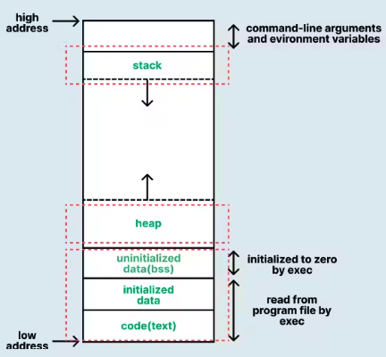

# 2장: Swift 언어 기초와 문법

https://docs.google.com/forms/d/e/1FAIpQLSd8XZ1kL_Et74LkMdoA6EmT4AnrsEGSD6nUjOypslcmuY1y6A/viewform?usp=dialog (본 수업 시작 전)

## 목차

1. Swift 소개
2. 상수와 변수
- Tip: **키보드 입력을 받는 readLine() 함수**
1. 데이터타입과 타입 추론
2. 조건문
3. 반복문
4. 함수와 클로저, 고차함수
5. 클래스와 구조체
- Tip:SOLID원칙의 이해
1. 옵셔널과 옵셔널체이닝
2. 배열, 딕셔너리, 셋

단원평가

- 이론문제, 실습문제, 도전문제

---

## **학습 목표:**

Swift 언어의 기초 문법을 익혀 **안정적이고 효율적인 앱 개발 역량**을 확보하는 것이 목표입니다. 데이터 처리, 조건문, 반복문, 함수, 객체 지향 프로그래밍을 이해하고 **실무에서 안전하고 재사용 가능한 코드**를 작성할 수 있도록 합니다.

### **1. Swift 주요 개념과 문법 이해**

- Swift의 **상수와 변수**를 이해하고, **타입 안전성**과 **타입 추론**을 활용하여 오류를 줄입니다.
- **데이터 타입(Int, String, Bool)**을 사용해 코드를 더 **간결하고 가독성 있게** 작성합니다.

### **2. 조건문과 반복문 활용**

- **if, switch** 같은 조건문과 **for, while** 같은 반복문을 사용하여 다양한 로직을 구현합니다.
- **readLine() 함수**로 **사용자 입력**을 처리하여 동적인 앱 개발에 활용합니다.

### **3. 함수와 클로저 이해**

- **함수 정의, 호출, 반환값** 처리 방법을 익혀 코드 재사용성을 높입니다.
- **클로저(Closure)**와 **고차 함수(map, filter, reduce)**를 활용해 코드를 **최적화**합니다.

### **4. 객체 지향 프로그래밍 적용**

- **클래스(Class)**와 **구조체(Struct)**의 차이를 이해하고 상황에 맞게 적용합니다.
- **SOLID 원칙**을 통해 **유지보수와 확장성**이 높은 코드를 작성합니다.

### **5. 안전한 프로그래밍 기법**

- **옵셔널(Optional)**과 **옵셔널 체이닝(Optional Chaining)**을 통해 **데이터 접근 시 오류**를 방지합니다.
- **옵셔널 바인딩**과 **nil** 병합 연산자(**??**)를 활용해 안정적인 코드를 작성합니다.

### **6. 컬렉션 활용 능력 강화**

- **배열(Array)**, **딕셔너리(Dictionary)**, **셋(Set)**을 활용해 데이터를 **저장, 검색, 정렬**합니다.
- 컬렉션과 반복문을 결합하여 **효율적인 데이터 처리 로직**을 구현합니다.

### **7. 실습과 문제 해결 능력 향상**

- 예제 코드와 실습 문제로 **Swift 문법을 실습**하며 **문제 해결 능력**을 강화합니다.
- **도전 문제**를 통해 **논리적 사고력과 코드 응용력**을 키워 실무에 활용합니다.

---

# **1. Swift 소개**

**Swift**는 **Apple**에서 2014년 **WWDC(WorldWide Developers Conference)**에서 처음 발표한 **프로그래밍 언어**입니다.

Swift는 기존의 **Objective-C** 언어를 대체하기 위해 개발되었으며, 주로 **iOS**, **macOS**, **watchOS**, **tvOS**와 같은 **Apple 플랫폼 생태계(애플 에코시스템)**의 앱 개발에 사용됩니다.

Swift는 **현대적인 문법**과 **안전성**을 갖춘 언어로, 개발자가 더 쉽게 읽고 유지보수할 수 있는 코드를 작성할 수 있도록 돕습니다. 또한, **빠른 실행 속도**와 **메모리 관리 자동화** 등의 기능을 통해 성능과 안전성 모두를 강화했습니다.

---

## **Swift의 주요 특징**

Swift는 개발자들에게 **안전하고 효율적인 코딩 환경**을 제공합니다. 

1. **Apple 에코시스템**: Swift를 사용하면 iOS, macOS, watchOS, tvOS 등 Apple의 다양한 플랫폼에서 개발을 할 수 있슴. 이는 Apple 제품의 높은 인기와 시장 점유율을 고려할 때 큰 이점 임.
2. **성능**: Swift는 높은 성능을 자랑하며, 이는 사용자 경험을 향상시키고, 서버 비용을 절감할 수 있슴.
3. **개발 속도와 유지보수**: Swift의 모던한 문법은 개발 속도를 높이고, 유지보수를 쉽게 해줍니다. 이는 개발 비용을 절감하는 데 도움이 됨. (일반적으로 개발 비용보다 유지보수 비용이 더 높다)
4. **타입 안전성과 메모리 관리**: 이러한 기능은 버그를 줄이고, 따라서 테스트와 디버깅 시간을 줄여 줌.
5. **커뮤니티와 지원**: Swift는 강력한 커뮤니티 지원과 라이브러리가 있어, 개발을 더욱 쉽고 빠르게 할 수 있슴.

## 경제적 이점과 소득

1. **시장 수요**: 시장 수요가 높아 연봉과 직업의 안정성이 좋음.
2. **다양한 기회**: Swift를 알면 모바일 앱 뿐만 아니라 다양한 분야에서도 활용 가능.(애플 에코시스템)
3. **프리미엄 앱 스토어**: Apple 앱 스토어에서 높은 수익 가능. 전 세계적으로 널리 쓰여 해외에서도 수익 창출.
4. **글로벌 시장**: 다른 언어에 비해 Apple 에코시스템에서 더 높은 수익과 직업 안정성.

다른 기술에 비해 Swift의 성능과 편의성으로 개발 비용 절감 및 경제적 이익 높음.

## Kotlin과 Swift의 생태계 비교

| 항목 | **Kotlin** | **Swift** |
| --- | --- | --- |
| **장점** | • Android 개발에 강점
• 다양한 플랫폼 지원• Java와 호환 | • Apple 에코시스템에서 강점
• 높은 성능과 안정성 |
| **단점** | • 수익성 상대적으로 낮음
• 경쟁 치열 | • 플랫폼 제한적
• 시장 점유율 상대적으로 낮음 |
| **경제적 수익/연봉** | • 안정적인 직업 가능
• 수익성 일반적으로 낮음 | • 높은 수익률과 연봉 가능 (상대적)
• Apple 사용자의 높은 결제 의사 |

데이터는 [개발자 경력별 평균 연봉 비교](https://moneypicker.kr/%EA%B0%9C%EB%B0%9C%EC%9E%90-%EA%B2%BD%EB%A0%A5%EB%B3%84-%ED%8F%89%EA%B7%A0-%EC%97%B0%EB%B4%89/)에서 가져왔습니다.

맞습니다. **iOS 개발자가 Android 개발자보다 평균 연봉이 더 높은 이유 중 하나는 개발자 수급의 불균형 때문**입니다. 다음과 같은 이유로 **iOS 개발자 인력은 부족**하고, 이로 인해 **평균 연봉이 더 높게 책정**되는 경향이 있습니다.

---

## **Android 개발자에 비해** i**OS 개발자 부족의 원인과 영향**

- iOS 개발을 위해선 **Objective-C 또는 Swift**를 잘 다루어야 하며, 이는 상대적으로 배우기 어렵고 시장에서 **개발자 풀이 적음**.
- **Android 개발자는 Java, Kotlin**과 같은 언어를 사용(자료와 개발자가 많음)
- **iOS 개발자는** 반드시 **macOS 기기**를 사용해야 하며, 이는 **초기 비용 부담이 큼.**

---

- **Android 개발은** 다양한 운영체제에서 개발 환경을 설정할 수 있어 **진입 장벽이 낮음.**
- iOS 앱은 Android 앱보다 **앱스토어 수익률이 높고**, 사용자의 **결제 전환율**이 더 높음.
- 기업 입장에서 **iOS 개발자 확보의 중요성**이 크며, 이에 따라 **연봉 인상**으로 이어짐.

---

- **iOS 개발자 부족** → **수요 증가** → **평균 연봉 상승**.
- 특히 **프리랜서 iOS 개발자**의 경우, 프로젝트당 보수가 **Android 개발자보다 상대적으로 더 높게 책정**되는 경향이 뚜렷합니다.

---

### 🔗 관련 URL:

- [링크드인 iOS 개발자 채용 공고](https://www.linkedin.com/)
- [로켓펀치 채용 공고](https://www.rocketpunch.com/)
- [잡코리아 연봉 데이터](https://www.jobkorea.co.kr/)

---

### 1️⃣ **타입 안전성 (Type Safety)**

Swift는 **타입 안전성**을 제공하여 변수나 상수에 잘못된 타입의 값을 할당하는 것을 방지합니다.

**타입 안전성**이란?

- 변수의 타입을 명확하게 정의하고, 정의된 타입 외의 값을 할당할 경우 컴파일 단계에서 오류를 발생시킵니다.
- 예를 들어, 정수 타입 변수에 문자열 값을 할당하려고 하면 오류가 발생합니다.

**예제 코드:**

```swift
var age: Int = 25   // Int 타입 변수
age = "25"          // 오류 발생: 문자열을 정수 타입에 할당할 수 없음
```

타입 안전성 덕분에 개발자는 **코드의 안정성**을 높이고 **런타임 오류**를 줄일 수 있습니다.

---

### 2️⃣ **빠른 실행 속도 (High Performance)**

**Swift**는 실행 속도가 **빠르고** 개발이 **쉽다.**

Apple은 Swift의 성능을 최적화하기 위해 **LLVM(컴파일러 인프라)**을 사용하여 코드를 더 효율적으로 실행하도록 만들었습니다.

**Swift**는 **C 언어**, **C++**, **Objective-C**와 비슷한 성능을 자랑하면서도 더 안전하고 쉬운 문법을 제공합니다.

- Swift와 Python의 간단한 반복문 비교

**Python 코드: Python, Javascript 같은 경우 스크립트 언어이기 때문에 인터프리터의 특징으로 실행 속도가 상대적으로 느리다.**

```python
# 콜론과 탭으로 바디 블럭을 지정하기 때문에 가독성이 떨어진다.
# range(1, 1000000) 문법은 Python 문접이기 때문에 지금 당장 공부 할 필요가 없습니다.
total = 0
for i in range(1, 1000000):
    total += i
print(total)
```

**Swift 코드: 문법적으로 간결 하면서도 실행 속도가 인터프리터 언어에 비해서 상대적으로 빠르고 문법도 간결하다.**

➡️ Swift는 **컴파일러 최적화** 덕분에 Python보다 훨씬 더 빠르게 실행됩니다.

```swift
// 자바나 자바스크립트 처럼 중괄호로 바디 블럭을 지정하기 때문에 가독성이 좋다.
// 1..<1000000 연산자의 의미는 뒷부분에 더 상세히 설명 하겠습니다.
var total = 0
for i in 1..<1000000 {
    total += i
}
print(total)
```

---

### 3️⃣ **현대적인 문법 (Modern Syntax)**

Swift는 기존의 Objective-C에 비해 **간결하고 현대적인 문법**을 제공합니다.

이로 인해 코드를 작성할 때 가독성이 높아지고, 개발 속도가 빨라집니다.

**Swift의 현대적인 문법 특징:**

1. **세미콜론(;) 생략 가능**
2. **타입 추론(Type Inference) 지원**
3. **간결한 클로저(Closure) 문법 제공**
4. **옵셔널(Optional) 지원**
5. **안전한 문자열 처리**

**예제 코드 (간결한 문법):**

Objective-C 코드: 

```
NSString *name = @"Swift";
NSLog(@"Hello, %@", name);
```

Swift 코드:

```swift
let name = "Swift"
print("Hello, \(name)")
```

➡️ Swift 코드는 **더 간결하고 읽기 쉬우며**, 에러 발생 가능성이 낮습니다.

## 스티브잡스

- [Apple](https://namu.wiki/w/Apple), [NeXT](https://namu.wiki/w/NeXT), [Pixar](https://namu.wiki/w/%ED%94%BD%EC%82%AC%20%EC%95%A0%EB%8B%88%EB%A9%94%EC%9D%B4%EC%85%98%20%EC%8A%A4%ED%8A%9C%EB%94%94%EC%98%A4)의 공동 창업주이다. Apple의 제2대 · 6대 이사회 의장이자 제6대 [CEO](https://namu.wiki/w/CEO)를 역임했으며 **21세기 혁신의 아이콘**이라 평가받는다.

](img/25753717-b41c-497d-ac28-4eccf36bc382.png)

출처: [https://namu.wiki/w/스티브 잡스](https://namu.wiki/w/%EC%8A%A4%ED%8B%B0%EB%B8%8C%20%EC%9E%A1%EC%8A%A4)

---

### 4️⃣ **메모리 관리 자동화 (Automatic Reference Counting, ARC)**

참고: 자바의 가비시컬렉션 기능과 유사 함. (소멸자 없이도 참조 객체가 관리 된다는 의미)



**Swift**는 **ARC(Automatic Reference Counting)**라는 메모리 관리 시스템을 사용합니다.

**ARC란?**

- 객체가 더 이상 필요하지 않을 때 **자동으로 메모리를 해제**하는 기능을 말합니다.
- 개발자가 직접 메모리를 관리할 필요가 없어 메모리 **누수(Memory Leak)**를 방지할 수 있습니다.

**예제 코드:**

```swift
// 관례상 클래스의 첫글자는 대문자로 시작.
class Person {
    var name: String

    init(name: String) {
        self.name = name
    }
}

var person1: Person? = Person(name: "James")
person1 = nil  // ARC에 의해 메모리가 자동으로 해제됨
```

➡️ Swift는 C/C++과 달리 개발자가 메모리 해제를 직접 호출할 필요가 없습니다. 대신 **ARC**가 이를 자동으로 관리하여 **안전한 메모리 관리**를 보장합니다.


---

## **Swift의 주요 사용처**

Swift는 Apple 생태계에서 다양한 플랫폼의 앱 개발에 사용됩니다.

| 플랫폼 | 설명 |
| --- | --- |
| iOS | 아이폰, 아이패드 앱 개발 |
| macOS | 맥 컴퓨터용 앱 개발 |
| watchOS | 애플 워치 앱 개발 |
| tvOS | 애플 TV 앱 개발 |
| visionOS | 애플의 혼합현실 플랫폼 앱 개발 |

➡️ **한 번 배우면 여러 플랫폼에 활용 가능**하기 때문에 Swift는 Apple 개발자에게 매우 유용한 언어입니다.

---

## **Swift의 발전 과정**

- 참고: 현재 2025년 시점에서 경력 5년이상의 SwiftUI 개발자는 거의 없다.

| 연도 | 주요 이벤트 |
| --- | --- |
| 2014 | WWDC에서 Swift 최초 발표 |
| 2015 | Swift 2.0 발표 |
| 2016 | Swift 3.0 발표 (대규모 문법 변경) |
| 2017 | Swift 4.0 발표 (String 개선) |
| 2019 | Swift 5.1 발표 (SwiftUI 도입) |
| 2023 | 최신 Swift 버전 (Swift 5.9) |

➡️ Swift는 꾸준히 발전하면서 **더 강력하고 사용하기 쉬운 언어**로 진화하고 있습니다.

---

## **Swift를 사용하는 이유**

1. **Apple 플랫폼 전용 개발 언어**
2. **안전하고 안정적인 코드 작성 가능**
3. **빠른 실행 속도와 최적화된 성능**
4. **현대적인 문법으로 가독성과 생산성 향상**
5. **오픈소스 프로젝트**로 계속해서 개선되고 있음

---

## **Swift의 미래**

Apple은 Swift를 적극적으로 발전시키고 있으며, 새로운 **SwiftUI** 프레임워크와 함께 **인터페이스 개발**도 더 쉽게 할 수 있도록 지원하고 있습니다.

➡️ Swift는 앞으로도 Apple 개발자에게 필수적인 언어로 자리 잡을 것입니다.

**Swift**를 익히면 **iOS, macOS, watchOS, tvOS** 등 다양한 앱을 개발할 수 있습니다.

---

# **2. 상수와 변수**

Swift에서는 데이터를 저장할 때 **상수(Constant)**와 **변수(Variable)**를 사용합니다.

상수와 변수는 앱 개발 시 **데이터를 안전하게 관리**하고 **효율적으로 사용**할 수 있도록 돕습니다.

---

## **🔐 1️⃣ 상수(Constant)**

### **상수란?**

- 한 번 값을 설정하면 **변경할 수 없는 데이터**입니다.
- `let` 키워드를 사용하여 선언합니다.
- 프로그램 실행 중에 변경되지 않아야 하는 데이터를 저장할 때 사용합니다.

### **예제 코드:**

```swift
let pi = 3.14
print(pi)  // 출력: 3.14
```

위 예제에서 `pi`는 **원주율**을 나타내는 상수로, 값을 **절대 변경할 수 없습니다.**

### **상수를 사용하는 이유**

1. **데이터 안정성 향상:** 잘못된 값 변경을 방지하여 프로그램의 **안전성**을 높일 수 있습니다.
2. **코드 가독성 향상:** 변경되지 않는 값을 상수로 선언하면, 해당 값이 **불변임을 명확하게 나타낼 수 있습니다.**

### **상수를 변경하려고 하면 오류가 발생합니다:**

```swift
let pi = 3.14
pi = 3.15  // 오류 발생: Cannot assign to value: 'pi' is a 'let' constant
```

---

## **✏️ 2️⃣ 변수(Variable)**

### **변수란?**

- 값을 **필요에 따라 변경할 수 있는 데이터**입니다.
- `var` 키워드를 사용하여 선언합니다.
- 프로그램 실행 중에 **값이 변경될 가능성이 있는 데이터**를 저장할 때 사용합니다.

### **예제 코드:**

```swift
var age = 25
age = 26
print(age)  // 출력: 26
```

위 예제에서 `age`는 **사용자의 나이**를 나타내는 변수로, 시간이 지나면서 **변경될 수 있는 값**입니다.

---

## **📚 상수와 변수의 차이점**

| **특징** | **상수 (Constant)** | **변수 (Variable)** |
| --- | --- | --- |
| 선언 키워드 | `let` | `var` |
| 값 변경 여부 | 변경 불가능 | 변경 가능 |
| 사용 목적 | 변경되지 않는 값 저장 | 변경될 가능성이 있는 값 저장 |
| 예시 | `let pi = 3.14` | `var name = "Alice"` |

---

## **🛠️ 예제 실습: 상수와 변수**

다음 코드를 직접 작성해 보고 출력 결과를 확인하세요.

- 상수는 실행이 끝날때까지 값을 변경 하지 못합니다.

```swift
// city는 상수이기 때문에 실행 중 값을 변경 할 수 없습니다. (테스트 추천)
let city = "Seoul"
print("City: \(city)")

var temperature = 25
print("Temperature: \(temperature)°C")

// 변수는 실행중에 값을 변경 할 수 있습니다. 
temperature = 30
print("Updated Temperature: \(temperature)°C")
```

**출력 결과:**

```
City: Seoul
Temperature: 25°C
Updated Temperature: 30°C
```

---

# **Tip: Swift `print()` 함수 사용법**

Swift의 `print()` 함수는 콘솔에 메시지를 출력하는 데 사용됩니다. 기본적으로 줄바꿈과 함께 출력되며, 다양한 옵션을 통해 출력 형식을 제어할 수 있습니다.

---

## **1️⃣ 기본 사용법**

```swift
print("Hello, World!") // 자동으로 라인이 변경 됨.
```

**출력:**

```
Hello, World! 

```

- 기본적으로 **줄바꿈(\n)**이 포함되어 출력됩니다.

---

## **2️⃣ 여러 값을 한 번에 출력하기**

여러 값을 쉼표(`,`)로 구분하여 `print()` 함수에 전달하면 자동으로 공백을 추가하여 출력합니다.

```swift
let name = "Alice"
let age = 25
print("Name:", name, "Age:", age)
```

**출력:**

```
Name: Alice Age: 25

```

---

## **3️⃣ `separator` 매개변수**

- `separator`는 여러 값 사이에 구분자 값 삽입.
- 기본값은 공백(`" "`)입니다.

### **예제: 쉼표로 구분**

```swift
print("Alice", "Bob", "Charlie", separator: ", ")
```

**출력:**

```
Alice, Bob, Charlie

```

---

## **4️⃣ `terminator` 매개변수**

- `terminator`는 **출력 후 삽입할 문자열**을 지정합니다.
- 기본값은 **줄바꿈 문자(`"\n"`)**입니다.

### **예제: 줄바꿈 없이 출력**

```swift
// 줄이 바뀌지 않고 World가 옆에 붙어서 출력.
print("Hello,", terminator: " ")
print("World!")
```

**출력:**

```
Hello, World!

```

---

## **5️⃣ 문자열 보간(String Interpolation)**

Swift의 `print()` 함수는 **문자열 보간**을 지원하여 변수나 표현식을 출력할 수 있습니다.

- 더하기(+) 문자열 결합 연산자를 이용하면 문장이 복잡해 집니다.
- 그리고 콤마를 이용하면 자동으로 seperator가 적용 되어서 매끄럽지 않습니다.
- 보간 (Interpolatrion)을 사용하면 읽기 쉽고 사용하기 편합니다.

```swift
let score = 95
print("Your score is \(score).")
```

**출력:**

```
Your score is 95.

```

### **보간을 사용한 표현식 출력**

```swift
let a = 5
let b = 10
print("Sum of \(a) and \(b) is \(a + b).")
```

**출력:**

```
Sum of 5 and 10 is 15.

```

---

## **6️⃣ `print()`와 `debugPrint()` 차이**

- **`print()`**: 사람이 읽기 쉽게 출력
- **`debugPrint()`**: 디버깅 시 유용한 정보를 더 자세히 출력

```swift
let string = "Hello\nWorld"
print(string)
debugPrint(string)
```

**출력:**

```
Hello
World
"Hello\nWorld"

```

---

## **7️⃣ `rint()` 함수 요약 표**

| 매개변수 | 설명 | 기본값 |
| --- | --- | --- |
| `separator` | 여러 값 사이에 삽입할 문자열 | `" "` |
| `terminator` | 출력 후 삽입할 문자열 | `"\n"` |
| `to` | 출력 대상을 지정 (기본은 콘솔) | `stdout` |
|  |  |  |

---

# **실습 문제**

1️⃣ **문제 1: 상수 선언하기**

- 상수를 사용하여 **원주율** 값을 저장하고 출력하는 프로그램을 작성하세요.

```swift
let pi = 3.14
print("Pi: \(pi)")
```

2️⃣ **문제 2: 변수 값 변경하기**

- 변수를 사용하여 **사용자의 나이**를 저장하고, **나이를 업데이트**한 후 출력하는 프로그램을 작성하세요.

```swift
var userAge = 20
print("Current Age: \(userAge)")

userAge = 21
print("Updated Age: \(userAge)")
```

3️⃣ **문제 3: 상수와 변수 혼합 사용**

- 다음 코드를 작성하고, 상수와 변수의 차이를 직접 확인하세요.

```swift
let birthYear = 2000
var currentYear = 2024

print("올해 연도를 입력 하세요: ", )

let age = currentYear - birthYear
print("Age: \(age)")

currentYear = 2025
let updatedAge = currentYear - birthYear
print("Updated Age: \(updatedAge)")
```

---

## **🔍 주의할 점**

1. **상수는 값을 변경할 수 없습니다.**
2. **변수는 선언 후 언제든지 값을 변경할 수 있습니다.**
3. 변수와 상수를 적절히 사용하면 **코드의 가독성**과 **안정성**이 향상됩니다.

---

## **💡 언제 상수와 변수를 사용해야 할까?**

- **변하지 않는 값:**
    - 예: 사용자 ID, 원주율(π), 출생년도 → `let`
- **변할 가능성이 있는 값:**
    - 예: 나이, 온도, 사용자 입력 값 → `var`

---

# Tip: **💻 키보드 입력을 받는 `readLine()` 함수**

Swift에서는 **키보드 입력**을 받을 때 **`readLine()`** 함수를 사용할 수 있습니다.

이 함수는 콘솔에서 **사용자의 입력을 기다리고**, 입력된 값을 문자열로 반환합니다.

이를 활용하면 **실제 사용자 입력을 받아 처리하는 프로그램**을 작성할 수 있습니다.

---

## **기본 사용법**

```swift
print("이름을 입력하세요:")
if let name = readLine() {
    print("안녕하세요, \(name)님!")
}

```

---

## **💡 Tip: `readLine()` 사용 시 주의할 점**

1. **`readLine()`은 옵셔널 값을 반환**하므로 반드시 `if let` 또는 `guard let`을 사용하여 안전하게 언래핑해야 합니다.
2. **숫자 입력 처리 시 `Int()`를 사용하여 변환**해야 합니다.
    
    사용자가 문자열을 입력할 수 있으므로 항상 **옵셔널 바인딩**을 통해 처리하는 것이 안전합니다.
    

---

# **3. 데이터 타입과 타입 추론**

Swift는 다양한 데이터 타입을 지원하며, 변수나 상수를 선언할 때 **초기값을 기반으로 타입을 자동으로 추론**합니다. 그러나 **명시적으로 타입을 지정할 수도** 있습니다.

---

## **🧱 주요 데이터 타입**

정수와 실수로 크게 나뉘어 진다. 실수는 부동 소수점을 갖는 데이터 타입니다. 

부동은 움직이지 않는다는것이 아니라 둥둥떠서 움직인다는 의미. (뜰 부, 움직일 동)

| 데이터 타입 | 설명 | 예제 값 |
| --- | --- | --- |
| `Int` | 정수형 데이터 | 10, -50 |
| `Double` | 실수형 데이터 | 3.14, -2.7 |
| `String` | 문자열 데이터 | "Hello" |
| `Bool` | 논리형 데이터 | true, false |

---

### **🔧 `Int` (정수형)**

- 정수 값을 저장합니다.
    
    ```swift
    let age: Int = 30
    print(age) // 출력: 30
    
    ```
    

---

### **🔧 `Double` (실수형)**

- 소수점을 포함한 숫자를 저장합니다.
    
    ```swift
    let pi: Double = 3.14159
    print(pi) // 출력: 3.14159
    
    ```
    

---

### **🔧 `String` (문자열형)**

- 문자열 값을 저장합니다.
    
    ```swift
    let message: String = "Hello, Swift!"
    print(message) // 출력: Hello, Swift!
    
    ```
    

---

### **🔧 `Bool` (논리형) - 중요**

- 참(`true`) 또는 거짓(`false`) 값을 저장합니다. 논리적이지 않으면 프로그래머가 될 수 없다.
    
    ```swift
    let isSwiftFun: Bool = true
    print(isSwiftFun) // 출력: true
    
    ```
    
- 수학자 부울(1815년 ~ 1864년)이 정립한 기호논리학에 근거 한다. 아버지가 구두 수선공이었던 가난한 수학자. 논리대수인 불 대수를 창안해, 기호논리학 분야에 큰 업적을 남겼다.


---

## **🧠 타입 추론**

Swift는 **초기값을 기반으로 변수 또는 상수의 타입을 자동으로 추론**합니다. 따라서 **타입을 생략해도** Swift가 타입을 올바르게 판단합니다. 

타입이란 무엇일까요? 컴퓨터는 데이터의 종류와 크기에 맞게 메모리를 관리 해야 합니다. 데이터 타입이란 데이터의 종류와 크기 맞춰서 구분 시켜 둔 미리 정의라고 할 수 있습니다. 변수를 흔히 그릇에 비유 합니다. 마트에서 껌하나 사려고 하는데 카트를 끌 필요는 없겠지요?

### **예제: 타입 추론**

- 현대적인 언어들의 대표적인 특징입니다. 타입추론의 기원은 자바스크립트와 같은 스크립트 언어에서 먼저 사용 한 기술입니다.
    
    ```swift
    let message = "Hello, Swift!" // 타입 추론: String
    let score = 95                // 타입 추론: Int
    let pi = 3.14                 // 타입 추론: Double
    let isFun = true              // 타입 추론: Bool
    
    ```
    

### **💡 주의점**

타입 추론을 사용할 때도 **코드의 가독성을 위해 타입을 명시하는 것이 좋을 때가 있습니다**.

예를 들어, 정수형을 `Int`로, 실수형을 `Double`로 명시적으로 선언할 수 있습니다.

---

## **🛠️ 실습 문제 1: 데이터 타입 사용하기**

사용자로부터 이름과 나이를 입력받아 출력하는 프로그램을 작성하세요.

```swift
print("이름을 입력하세요:")
let name = readLine() ?? "Unknown"

print("나이를 입력하세요:")
if let ageInput = readLine(), let age = Int(ageInput) {
    print("안녕하세요, \(name)님! 나이는 \(age)세입니다.")
} else {
    print("올바른 나이를 입력해주세요.")
}

```

---

## **🛠️ 실습 문제 2: 타입 추론 활용**

아래의 코드에서 각 변수의 타입을 추론해보세요. 어떤 타입으로 추론될까요?

```swift
let number = 42
let temperature = 36.5
let isRaining = false
let greeting = "Good Morning"

```

**정답:**

- `number`: `Int`
- `temperature`: `Double`
- `isRaining`: `Bool`
- `greeting`: `String`

---

## **🛠️ 실습 문제 3: 타입 변환 (Type Casting)**

사용자로부터 **두 개의 숫자를 입력받아 합계를 출력**하는 프로그램을 작성하세요.

```swift
print("첫 번째 숫자를 입력하세요:")
if let firstInput = readLine(), let firstNumber = Int(firstInput) {
    print("두 번째 숫자를 입력하세요:")
    if let secondInput = readLine(), let secondNumber = Int(secondInput) {
        let sum = firstNumber + secondNumber
        print("두 숫자의 합은 \(sum)입니다.")
    } else {
        print("올바른 숫자를 입력해주세요.")
    }
} else {
    print("올바른 숫자를 입력해주세요.")
}

```

---

## **🧩 정리**

Swift의 데이터 타입은 크게 **정수형(Int)**, **실수형(Double)**, **문자열형(String)**, **논리형(Bool)**로 나뉩니다.

타입 추론을 통해 **변수와 상수의 타입을 자동으로 결정**할 수 있지만, 가독성을 위해 **명시적으로 타입을 선언**하는 것이 좋을 때도 있습니다.

---

## 스위프트 연산자

### **1. 산술 연산자 (Arithmetic Operators)**

- **덧셈 (`+`)**: 두 값을 더합니다.
    
    ```swift
    let sum = 5 + 3 // 결과: 8
    
    ```
    
- **뺄셈 (`-`)**: 두 값을 뺍니다.
    
    ```swift
    let difference = 5 - 3 // 결과: 2
    
    ```
    
- **곱셈 (`*`)**: 두 값을 곱합니다.
    
    ```swift
    let product = 5 * 3 // 결과: 15
    
    ```
    
- **나눗셈 (`/`)**: 두 값을 나눕니다.
    
    ```swift
    let quotient = 5 / 3 // 결과: 1 (정수 나눗셈)
    
    ```
    
- **나머지 (`%`)**: 두 값의 나머지를 구합니다.
    
    ```swift
    let remainder = 5 % 3 // 결과: 2
    
    ```
    

---

### **2. 비교 연산자 (Comparison Operators)**

- **같음 (`==`)**: 두 값이 같은지 비교.
    
    ```swift
    let isEqual = 5 == 3 // 결과: false
    
    ```
    
- **같지 않음 (`!=`)**: 두 값이 다른지 비교.
    
    ```swift
    let isNotEqual = 5 != 3 // 결과: true
    
    ```
    
- **크다 (`>`)**, 작다 (`<`)**: 두 값의 크기 비교.
    
    ```swift
    let isGreater = 5 > 3 // 결과: true
    let isLess = 5 < 3 // 결과: false
    
    ```
    
- **크거나 같다 (`>=`)**, 작거나 같다 (`<=`)**: 두 값의 크기 비교.
    
    ```swift
    let isGreaterOrEqual = 5 >= 3 // 결과: true
    let isLessOrEqual = 5 <= 3 // 결과: false
    
    ```
    

---

### **3. 논리 연산자 (Logical Operators)**

- **AND (`&&`)**: 두 조건이 모두 true일 때 true.
    
    ```swift
    let result = true && false // 결과: false
    
    ```
    
- **OR (`||`)**: 두 조건 중 하나라도 true일 때 true.
    
    ```swift
    let result = true || false // 결과: true
    
    ```
    
- **NOT (`!`)**: 값을 반전.
    
    ```swift
    let isFalse = !true // 결과: false
    
    ```
    

---

### **4. 할당 연산자 (Assignment Operators)**

- **단순 할당 (`=`)**: 값을 변수나 상수에 저장.
    
    ```swift
    var a = 5
    
    ```
    
- **복합 할당 (`+=`, `=`, `=`, `/=`, `%=`)**: 값에 산술 연산을 수행하고 저장.
    
    ```swift
    var a = 5
    a += 3 // a = 8
    
    ```
    

---

### **5. 범위 연산자 (Range Operators)**

- **닫힌 범위 (`...`)**: 시작값과 끝값을 포함하는 범위.
    
    ```swift
    for i in 1...5 { print(i) } // 출력: 1, 2, 3, 4, 5
    
    ```
    
- **반닫힌 범위 (`..<`)**: 시작값은 포함하고 끝값은 제외.
    
    ```swift
    for i in 1..<5 { print(i) } // 출력: 1, 2, 3, 4
    ```
    
- 배열에서 특정 범위를 추출하거나 반복문과 결합하여 활용
    
    ```swift
    // 예제 1: 닫힌 범위(...)를 사용한 배열 추출 예제
    let numbers = [10, 20, 30, 40, 50]
    
    // 배열의 첫 번째 요소부터 세 번째 요소까지 가져오기 (인덱스 0...2)
    let subArray = numbers[0...2]
    
    print("원본 배열: \(numbers)") // 출력: [10, 20, 30, 40, 50]
    print("추출된 배열: \(subArray)") // 출력: [10, 20, 30]
    
    // 예제 2: 반닫힌 범위(..<)를 사용한 배열 추출
    let fruits = ["Apple", "Banana", "Cherry", "Date", "Fig"]
    
    // 배열의 첫 번째 요소부터 네 번째 요소 직전까지 가져오기 (인덱스 0..<3)
    let subArray = fruits[0..<3]
    
    print("원본 배열: \(fruits)") // 출력: ["Apple", "Banana", "Cherry", "Date", "Fig"]
    print("추출된 배열: \(subArray)") // 출력: ["Apple", "Banana", "Cherry"]
    
    // 예제 3: 특정 범위의 요소 합계 계산
    let scores = [85, 90, 78, 92, 88]
    
    // 2번째 요소부터 마지막 요소까지의 합계 (인덱스 2...4)
    let selectedScores = scores[2...4]
    let total = selectedScores.reduce(0, +)
    
    print("선택된 점수: \(selectedScores)") // 출력: [78, 92, 88]
    print("점수 합계: \(total)") // 출력: 258
    
    // 예제 4: 범위와 for-in 반복문 사용
    let names = ["Alice", "Bob", "Charlie", "David", "Eve"]
    
    // 인덱스 1부터 3까지의 이름 출력 (인덱스 1...3)
    for name in names[1...3] {
        print("이름: \(name)")
    }
    
    // 출력:
    // 이름: Bob
    // 이름: Charlie
    // 이름: David
    
    ```
    

---

### **6. 삼항 조건 연산자 (Ternary Conditional Operator)**

- **형식:** `condition ? value1 : value2`
조건에 따라 다른 값을 반환.
    
    ```swift
    let isPositive = (5 > 0) ? "Positive" : "Negative" // 결과: "Positive"
    
    ```
    

---

### **7. nil 병합 연산자 (Nil-Coalescing Operator)**

- **형식:** `a ?? ba`가 nil이 아니면 `a`를 반환하고, nil이면 `b`를 반환.
    
    ```swift
    let name: String? = nil
    let displayName = name ?? "Unknown" // 결과: "Unknown"
    
    ```
    

---

### **8. 고급 연산자 (Advanced Operators)**

- **식별 연산자 (`===`, `!==`)**: 참조 타입의 메모리 주소 비교.
    
    ```swift
    class MyClass {}
    let obj1 = MyClass()
    let obj2 = obj1
    let isSame = obj1 === obj2 // 결과: true
    
    ```
    
- **비트 연산자 (`&`, `|`, `^`, `~`)**: 정수의 비트 수준 연산.
    
    ```swift
    let bitwiseAnd = 5 & 3 // 결과: 1
    
    ```
    

---

### **9. 사용자 정의 연산자**

- Swift는 연산자를 사용자 정의 가능. 예를 들어 `+++` 같은 커스텀 연산자를 정의 가능.
    
    ```swift
    prefix operator +++
    prefix func +++(value: Int) -> Int {
        return value + 1
    }
    let result = +++5 // 결과: 6
    
    ```
    

---

## 체크타임 연습 문제: 연산자

### **문제 1: 원의 넓이와 둘레 계산하기**

### 문제 설명:

반지름을 입력받아 **원의 넓이**와 **원의 둘레**를 계산하세요.

원의 넓이는 `π * 반지름^2`으로 계산하고, 원의 둘레는 `2 * π * 반지름`으로 계산됩니다.

여기서 `π`는 3.14로 가정합니다.

### 힌트:

- 곱셈(``) 연산자를 사용하여 넓이와 둘레를 계산하세요.
- 제곱은 같은 값을 곱하면 됩니다. 예: `반지름 * 반지름`.

### 입력/출력 예시:

```swift
입력: 5 (반지름)
출력: 원의 넓이: 78.5, 원의 둘레: 31.4
```

### 풀이 예제 코드:

```swift
let radius = 5.0 // 반지름
let pi = 3.14

let area = pi * radius * radius // 원의 넓이
let circumference = 2 * pi * radius // 원의 둘레

print("원의 넓이: \(area)")
print("원의 둘레: \(circumference)")

```

---

### **문제 2: 평을 제곱미터로 환산하기**

### 문제 설명:

한 평은 약 3.3058㎡입니다.

평을 입력받아 **제곱미터(㎡)**로 환산한 값을 출력하세요.

### 힌트:

- 곱셈(``) 연산자를 사용하여 평을 제곱미터로 변환합니다.

### 입력/출력 예시:

```swift
입력: 10 (평)
출력: 33.058㎡
```

### 풀이 예제 코드:

```swift
let pyeong = 10.0 // 평
let squareMeterPerPyeong = 3.3058

let squareMeters = pyeong * squareMeterPerPyeong // 평을 제곱미터로 환산
print("\(pyeong)평은 \(squareMeters)㎡입니다.")

```

---

# **4. 조건문 (Conditional Statements)**

조건문은 **특정 조건에 따라 코드의 실행 흐름을 제어**할 수 있는 중요한 문법입니다. Swift에서는 **if** 조건문과 **switch** 조건문을 주로 사용합니다.

---

## **🔧 if 조건문**

`if` 조건문은 특정 조건을 만족할 때 코드를 실행하고, 조건을 만족하지 않으면 **else** 또는 **else if** 블록을 통해 대체 실행 경로를 제공합니다.

### **기본 문법**

```swift
if 조건 {
    // 조건이 참일 때 실행할 코드
} else if 다른 조건 {
    // 다른 조건이 참일 때 실행할 코드
} else {
    // 모든 조건이 거짓일 때 실행할 코드
}

```

---

### **🖋 예제 1: 간단한 if 조건문**

```swift
let temperature = 30

if temperature > 25 {
    print("날씨가 덥습니다.")
} else {
    print("날씨가 선선합니다.")
}

```

---

### **🖋 예제 2: 여러 조건을 검사하는 if-else 문**

```swift
let score = 85

if score >= 90 {
    print("A등급")
} else if score >= 80 {
    print("B등급")
} else {
    print("C등급")
}

```

---

### **🛠️ 실습 문제: if 조건문 활용하기**

사용자로부터 숫자를 입력받아 **짝수인지 홀수인지 판별**하는 프로그램을 작성하세요.

```swift
print("숫자를 입력하세요:")
if let input = readLine(), let number = Int(input) {
    if number % 2 == 0 {
        print("\(number)은 짝수입니다.")
    } else {
        print("\(number)은 홀수입니다.")
    }
} else {
    print("올바른 숫자를 입력해주세요.")
}

```

---

## **🔧 switch 조건문**

`switch` 조건문은 **여러 가지 경우의 수를 처리**할 때 유용합니다. **case** 키워드를 사용해 각 조건을 나열하고, 조건에 맞는 코드를 실행합니다.

### **기본 문법**

```swift
switch 값 {
case 조건1:
    // 조건1이 참일 때 실행할 코드
case 조건2:
    // 조건2가 참일 때 실행할 코드
default:
    // 모든 조건이 거짓일 때 실행할 코드
}

```

---

### **🖋 예제 1: 문자열 비교**

```swift
let fruit = "Apple"

switch fruit {
case "Apple":
    print("사과입니다.")
case "Banana":
    print("바나나입니다.")
default:
    print("알 수 없는 과일입니다.")
}

```

---

### **🖋 예제 2: 범위 조건 처리**

```swift
let age = 25

switch age {
case 0...12:
    print("어린이입니다.")
case 13...19:
    print("청소년입니다.")
case 20...64:
    print("성인입니다.")
default:
    print("노인입니다.")
}

```

---

### **🖋 예제 3: 튜플 비교**

튜플을 사용하여 **복합 조건**을 처리할 수 있습니다.

```swift
let coordinates = (x: 2, y: 3)

switch coordinates {
case (0, 0):
    print("원점입니다.")
case (let x, 0):
    print("x축 위에 있습니다. x: \(x)")
case (0, let y):
    print("y축 위에 있습니다. y: \(y)")
case (let x, let y):
    print("좌표는 (\(x), \(y))입니다.")
}

```

---

### **🛠️ 실습 문제: switch 조건문 활용하기**

사용자로부터 요일을 입력받아 **주말인지 평일인지** 판별하는 프로그램을 작성하세요.

```swift
print("요일을 입력하세요:")
if let day = readLine() {
    switch day.lowercased() {
    case "saturday", "sunday":
        print("주말입니다.")
    case "monday", "tuesday", "wednesday", "thursday", "friday":
        print("평일입니다.")
    default:
        print("올바른 요일을 입력해주세요.")
    }
}

```

---

## **🧩 if 조건문 vs switch 조건문**

| **구분** | **if 조건문** | **switch 조건문** |
| --- | --- | --- |
| 사용 용도 | 단일 또는 여러 조건 처리 | 여러 경우의 수를 효율적으로 처리 |
| 조건 검사 방식 | 논리 연산자를 사용하여 복잡한 조건 처리 | 각 case에 대해 단일 조건 검사 |
| 가독성 | 간단한 조건문에 적합 | 여러 경우의 수를 처리할 때 가독성이 좋음 |

---

## **📚 요약**

- **if 조건문**은 특정 조건을 검사하고 해당 조건이 참일 때 코드를 실행합니다.
- **switch 조건문**은 여러 가지 경우의 수를 처리할 때 가독성이 좋습니다.
- Swift의 조건문을 활용하여 **유연하고 효율적인 코드**를 작성할 수 있습니다.

---

## **🛠️ 추가 실습 문제**

1. **숫자 입력 후 등급 출력 프로그램**
    
    사용자에게 숫자를 입력받아, **90점 이상이면 A, 80~89점이면 B, 그 외는 C**를 출력하세요.
    
2. **요일별 메시지 출력 프로그램**
    
    사용자로부터 **요일을 입력받아**, 월요일에는 "새로운 한 주가 시작됩니다!", 금요일에는 "주말이 다가옵니다!" 등의 메시지를 출력하는 프로그램을 작성하세요.
    

---

# **5. 반복문 (Loops)**

반복문은 특정 조건을 만족하는 동안 **동일한 코드를 여러 번 실행**할 수 있도록 도와줍니다. Swift에서는 **for-in**, **while**, 그리고 **repeat-while** 반복문을 제공합니다.

---

## **🔧 for-in 반복문**

`for-in` 반복문은 **컬렉션(배열, 딕셔너리 등)의 각 요소를 순회**할 때 사용합니다.

### **기본 문법**

```swift
for item in 컬렉션 {
    // 각 요소에 대해 실행할 코드
}

```

---

### **🖋 예제 1: 배열 순회**

```swift
let names = ["John", "Jane", "Jim"]

for name in names {
    print("Hello, \(name)!")
}

```

**출력:**

```
Hello, John!
Hello, Jane!
Hello, Jim!

```

---

### **🖋 예제 2: 숫자 범위 순회**

```swift
for number in 1...5 {
    print("숫자: \(number)")
}

```

**출력:**

```
숫자: 1
숫자: 2
숫자: 3
숫자: 4
숫자: 5

```

---

### **🖋 예제 3: 딕셔너리 순회**

```swift
let scores = ["John": 90, "Jane": 85, "Jim": 95]

for (name, score) in scores {
    print("\(name)의 점수는 \(score)점입니다.")
}

```

**출력:**

```
John의 점수는 90점입니다.
Jane의 점수는 85점입니다.
Jim의 점수는 95점입니다.

```

---

## **🔧 while 반복문**

`while` 반복문은 **조건이 참인 동안 코드 블록을 반복 실행**합니다.

### **기본 문법**

```swift
while 조건 {
    // 조건이 참일 때 실행할 코드
}

```

---

### **🖋 예제 1: 간단한 while 반복문**

```swift
var number = 5

while number > 0 {
    print(number)
    number -= 1
}

```

**출력:**

```
5
4
3
2
1

```

---

### **🖋 예제 2: 사용자 입력을 받을 때 사용**

```swift
print("정수를 입력하세요 (0을 입력하면 종료):")

while let input = readLine(), let number = Int(input), number != 0 {
    print("입력한 숫자: \(number)")
    print("정수를 입력하세요 (0을 입력하면 종료):")
}

```

---

## **🔧 repeat-while 반복문**

`repeat-while` 반복문은 **코드를 한 번 실행한 후 조건을 검사**합니다. 조건을 나중에 검사하기 때문에 최소 한 번은 코드가 실행됩니다.

### **기본 문법**

```swift
repeat {
    // 실행할 코드
} while 조건

```

---

### **🖋 예제 1: 간단한 repeat-while 반복문**

```swift
var count = 3

repeat {
    print("Count: \(count)")
    count -= 1
} while count > 0

```

**출력:**

```
Count: 3
Count: 2
Count: 1

```

---

### **🛠️ 실습 문제**

1. **문제 1: for-in 반복문 사용하기**
배열에 저장된 숫자들의 **합을 계산**하는 프로그램을 작성하세요.

```swift
let numbers = [10, 20, 30, 40, 50]
var sum = 0

for number in numbers {
    sum += number
}

print("합계: \(sum)")

```

---

1. **문제 2: while 반복문 사용하기**
사용자가 입력한 숫자가 **양수일 때만 출력**하고, **0 또는 음수를 입력하면 반복을 종료**하는 프로그램을 작성하세요.

```swift
print("숫자를 입력하세요:")

while let input = readLine(), let number = Int(input), number > 0 {
    print("입력한 숫자: \(number)")
    print("숫자를 입력하세요:")
}

print("프로그램 종료")

```

---

1. **문제 3: repeat-while 반복문 사용하기**
사용자가 **패스워드를 맞출 때까지 계속 입력**하게 하고, 맞으면 종료하는 프로그램을 작성하세요.

```swift
let correctPassword = "1234"
var userInput: String?

repeat {
    print("비밀번호를 입력하세요:")
    userInput = readLine()
} while userInput != correctPassword

print("비밀번호가 맞았습니다.")

```

---

## **📚 요약**

| 반복문 | 설명 | 특징 |
| --- | --- | --- |
| for-in | 컬렉션의 요소를 순회 | 정해진 범위 또는 컬렉션 사용 |
| while | 조건이 참인 동안 코드 실행 | 조건을 먼저 검사 |
| repeat-while | 코드를 한 번 실행한 후 조건을 검사 | 최소 한 번은 실행됨 |

---

### **✅ 팁: 언제 어떤 반복문을 사용할까?**

| 상황 | 적합한 반복문 |
| --- | --- |
| 배열, 딕셔너리, 범위 순회 | for-in |
| 종료 조건이 명확할 때 | while |
| 최소 한 번은 실행해야 할 때 | repeat-while |

---

### **🛠️ 추가 실습 문제**

1. **문제 4: 짝수만 출력하는 프로그램**
    
    1부터 20까지의 숫자 중 짝수만 출력하는 프로그램을 작성하세요.
    
2. **문제 5: 구구단 출력 프로그램**
    
    사용자가 입력한 숫자의 구구단을 출력하는 프로그램을 작성하세요.
    

```swift
print("출력할 구구단의 숫자를 입력하세요:")

if let input = readLine(), let number = Int(input) {
    for i in 1...9 {
        print("\(number) x \(i) = \(number * i)")
    }
} else {
    print("올바른 숫자를 입력하세요.")
}

```

---

# **6. 함수와 클로저, 고차함수**

---

## **📌 함수(Function)**

함수는 **코드의 재사용성**을 높이고, **반복되는 작업을 효율적으로 처리**할 수 있도록 도와줍니다.

---

### **🔧 함수 정의 및 호출**

함수는 `func` 키워드를 사용해 정의하고, 필요할 때 호출합니다.

```swift
func 함수이름(매개변수: 타입) -> 반환타입 {
    // 함수의 실행 코드
    return 반환값
}

```

---

### **🖋 예제 1: 기본 함수**

```swift
func greet(name: String) {
    print("Hello, \(name)!")
}

greet(name: "Alice")  // 출력: Hello, Alice!

```

**설명:**

- `func greet(name: String)` → **`greet`*라는 함수를 정의하고 `name`이라는 매개변수를 받습니다.
- `greet(name: "Alice")` → 함수를 호출할 때 **매개변수 값**을 전달합니다.

---

### **🖋 예제 2: 반환값이 있는 함수**

```swift
func add(a: Int, b: Int) -> Int {
    return a + b
}

let sum = add(a: 5, b: 3)
print("합계: \(sum)")  // 출력: 합계: 8

```

**설명:**

- `add` 함수는 두 개의 `Int` 값을 받아 합계를 반환합니다.
- 함수의 결과를 변수 `sum`에 저장하고, 이를 출력합니다.

---

### **🖋 예제 3: 기본값이 있는 매개변수**

```swift
func greet(name: String = "Guest") {
    print("Hello, \(name)!")
}

greet()  // 출력: Hello, Guest!
greet(name: "Bob")  // 출력: Hello, Bob!

```

**설명:**

- 매개변수에 기본값을 설정하면, 호출 시 값을 생략할 수 있습니다.

---

### **🖋 예제 4: 다중 반환값 함수**

```swift
func getUserInfo() -> (name: String, age: Int) {
    return ("Alice", 25)
}

let userInfo = getUserInfo()
print("이름: \(userInfo.name), 나이: \(userInfo.age)")  // 출력: 이름: Alice, 나이: 25

```

**설명:**

- 함수가 여러 값을 **튜플** 형태로 반환할 수 있습니다.

---

### **🖋 예제 5: 옵셔널 반환값 함수**

```swift
func findSquareRoot(of number: Int) -> Int? {
    if number >= 0 {
        return Int(sqrt(Double(number)))
    } else {
        return nil
    }
}

if let result = findSquareRoot(of: 16) {
    print("제곱근: \(result)")  // 출력: 제곱근: 4
} else {
    print("유효하지 않은 숫자입니다.")
}

```

**설명:**

- 함수가 **옵셔널 타입**을 반환하여 **nil 처리**를 안전하게 할 수 있습니다.

---

## **📌 클로저(Closure)**

클로저는 **익명 함수(이름이 없는 함수)**로, 주로 **고차 함수**와 함께 사용됩니다. 클로저는 다음과 같은 형태로 정의됩니다.

```swift
{ (매개변수) -> 반환타입 in
    실행 코드
}

```

---

### **🖋 예제 1: 기본 클로저**

```swift
let multiply = { (a: Int, b: Int) -> Int in
    return a * b
}

print(multiply(3, 4))  // 출력: 12

```

**설명:**

- `multiply`는 두 개의 정수를 받아 곱한 값을 반환하는 클로저입니다.
- 클로저는 변수나 상수에 저장할 수 있고, 저장한 후 호출할 수 있습니다.

---

### **🖋 예제 2: 배열 정렬 시 클로저 사용**

```swift
let numbers = [5, 2, 8, 1, 4]
let sortedNumbers = numbers.sorted { $0 < $1 }
print(sortedNumbers)  // 출력: [1, 2, 4, 5, 8]

```

**설명:**

- `sorted` 함수는 **클로저를 매개변수로** 받아 배열을 정렬합니다.
- `$0`, `$1`은 클로저의 **약식 매개변수 이름**으로 첫 번째, 두 번째 매개변수를 의미합니다.

---

### **🖋 예제 3: 고차 함수와 함께 사용하기**

고차 함수는 **다른 함수를 매개변수로 받거나 반환**하는 함수입니다.

```swift
let numbers = [1, 2, 3, 4, 5]
let doubledNumbers = numbers.map { $0 * 2 }
print(doubledNumbers)  // 출력: [2, 4, 6, 8, 10]

```

**설명:**

- `map` 함수는 배열의 각 요소에 클로저를 적용하여 새로운 배열을 반환합니다.
- 클로저 내부에서 `$0`은 배열의 각 요소를 나타냅니다.

---

### **🖋 예제 4: 클로저 축약**

클로저는 다음과 같이 **축약형**으로 표현할 수 있습니다.

```swift
let add = { $0 + $1 }
print(add(3, 5))  // 출력: 8

```

---

### **📚 요약**

| 구분 | 설명 | 예제 코드 |
| --- | --- | --- |
| 함수 | 코드의 재사용을 위해 정의하는 코드 블록 | `func greet(name: String)` |
| 클로저 | 익명 함수로, 고차 함수와 함께 사용 | `{ (a: Int, b: Int) -> Int in` |
| 고차 함수 | 다른 함수를 매개변수로 받거나 반환하는 함수 | `numbers.map { $0 * 2 }` |

---

### **🛠️ 실습 문제**

1. **문제 1: 함수로 최대값 찾기**
두 개의 정수를 받아 **최대값을 반환**하는 함수를 작성하세요.

```swift
func findMax(a: Int, b: Int) -> Int {
    return a > b ? a : b
}

print(findMax(a: 10, b: 20))  // 출력: 20

```

---

1. **문제 2: 클로저로 배열 필터링**
주어진 배열에서 **짝수만 필터링**하는 클로저를 작성하세요.

```swift
let numbers = [1, 2, 3, 4, 5, 6, 7, 8, 9, 10]
let evenNumbers = numbers.filter { $0 % 2 == 0 }
print(evenNumbers)  // 출력: [2, 4, 6, 8, 10]

```

---

1. **문제 3: 클로저와 고차 함수 사용하기**
배열의 각 요소를 **제곱하여 새로운 배열**을 반환하는 프로그램을 작성하세요.

```swift
let numbers = [1, 2, 3, 4, 5]
let squaredNumbers = numbers.map { $0 * $0 }
print(squaredNumbers)  // 출력: [1, 4, 9, 16, 25]

```

---

### **🛠️ 추가 실습 문제**

1. 함수로 주어진 문자열이 **회문(앞뒤가 같은 단어)**인지 확인하는 함수를 작성하세요.
2. 클로저를 사용하여 배열에서 **5보다 큰 숫자만 필터링**하는 프로그램을 작성하세요.

---

### **✅ 팁: 클로저 사용 시 주의할 점**

1. **매개변수 이름 생략 가능**: `$0`, `$1` 등으로 간단히 표현할 수 있습니다.
2. **고차 함수와 함께 사용**: `map`, `filter`, `reduce`와 같은 함수에서 클로저를 자주 사용합니다.
3. **캡처 리스트 사용**: 클로저가 외부 변수를 **캡처**할 때, 메모리 관리를 위해 캡처 리스트를 사용하는 것이 중요합니다.

### **3.2 고차 함수 활용**

### **`map`: 배열 값을 변환하는 방법**

- 배열의 각 요소를 특정 방식으로 변환.

```swift
let scores = [70, 80, 90]
let adjustedScores = scores.map { $0 + 10 }
print(adjustedScores) // 출력: [80, 90, 100]

```

### **`filter`: 특정 조건에 맞는 값 추출**

- 조건을 만족하는 요소만 필터링.

```swift
let scores = [70, 80, 90, 60]
let passingScores = scores.filter { $0 >= 70 }
print(passingScores) // 출력: [70, 80, 90]

```

### **`reduce`: 배열 값의 총합 계산**

- 초기값을 설정하고, 배열의 요소를 순차적으로 처리.

```swift
let scores = [70, 80, 90]
let totalScore = scores.reduce(0) { $0 + $1 }
print(totalScore) // 출력: 240

```

### **예제: 학생 점수를 처리하여 총점과 평균을 계산하는 프로그램**

```swift
let studentScores = [85, 90, 78, 92]
let totalScore = studentScores.reduce(0, +)
let averageScore = Double(totalScore) / Double(studentScores.count)

print("총점: \(totalScore), 평균: \(averageScore)")
// 출력: 총점: 345, 평균: 86.25

```

---

# **7. 클래스와 구조체**

---

## **📌 클래스(Class)**

클래스는 **참조 타입(Reference Type)**으로, **상속(Inheritance)**이 가능하고, **동일한 인스턴스를 여러 변수에 참조**할 수 있습니다.

### **🔧 클래스 정의**

클래스는 `class` 키워드를 사용하여 정의합니다.

```swift
class Car {
    var brand: String
    var model: String

    // 초기화 메서드
    init(brand: String, model: String) {
        self.brand = brand
        self.model = model
    }

    // 정보 출력 메서드
    func displayInfo() {
        print("\(brand) \(model)")
    }
}

```

---

### **🖋 예제 1: 클래스 인스턴스 생성**

```swift
let car1 = Car(brand: "Hyundai", model: "Sonata")
car1.displayInfo()  // 출력: Hyundai Sonata

```

---

### **🖋 예제 2: 클래스의 참조 타입 특성**

```swift
let car2 = car1
car2.model = "Avante"

print(car1.model)  // 출력: Avante

```

**설명:**

- `car2`는 `car1`과 동일한 메모리 주소를 참조합니다.
- 따라서 `car2`의 값을 변경하면 `car1`의 값도 변경됩니다.

---

### **📚 클래스의 주요 특징**

| 특징 | 설명 |
| --- | --- |
| 참조 타입 | 변수에 할당 시 **참조**가 전달됩니다. |
| 상속 가능 | 다른 클래스가 상속받아 기능을 확장할 수 있습니다. |
| 소멸자 지원 | 메모리에서 객체가 해제될 때 **`deinit`** 메서드를 사용할 수 있습니다. |

---

## **📌 구조체(Struct)**

구조체는 **값 타입(Value Type)**으로, **상속이 불가능**하며, 변수나 상수에 할당할 때 **복사본**이 전달됩니다.

### **🔧 구조체 정의**

구조체는 `struct` 키워드를 사용하여 정의합니다.

```swift
struct Book {
    var title: String
    var author: String

    // 정보 출력 메서드
    func displayInfo() {
        print("\(title) by \(author)")
    }
}

```

---

### **🖋 예제 1: 구조체 인스턴스 생성**

```swift
let book1 = Book(title: "Swift Programming", author: "John Doe")
book1.displayInfo()  // 출력: Swift Programming by John Doe

```

---

### **🖋 예제 2: 구조체의 값 타입 특성**

```swift
var book2 = book1
book2.title = "Advanced Swift"

print(book1.title)  // 출력: Swift Programming
print(book2.title)  // 출력: Advanced Swift

```

**설명:**

- `book2`는 `book1`의 **복사본**을 생성합니다.
- 따라서 `book2`를 변경해도 `book1`은 영향을 받지 않습니다.

---

### **📚 구조체의 주요 특징**

| 특징 | 설명 |
| --- | --- |
| 값 타입 | 변수에 할당 시 **복사본**이 전달됩니다. |
| 상속 불가능 | 구조체는 **상속**이 불가능합니다. |
| 메모리 효율 | 작은 데이터의 경우 구조체가 더 **효율적**입니다. |

---

## **📌 클래스와 구조체의 차이점**

| 구분 | 클래스(Class) | 구조체(Struct) |
| --- | --- | --- |
| 타입 | 참조 타입 | 값 타입 |
| 상속 | 가능 | 불가능 |
| 소멸자 | 지원 (`deinit`) | 지원하지 않음 |
| 메모리 할당 | 힙(Heap) | 스택(Stack) |
| 데이터 공유 | 여러 변수에서 **참조** 공유 | 각 변수에서 **복사본** 생성 |

---

### **📖 실습 문제 1: 클래스와 구조체의 차이 확인**

아래 코드를 작성하고 실행하여 **클래스와 구조체의 차이점**을 확인하세요.

```swift
// 클래스 정의
class Person {
    var name: String

    init(name: String) {
        self.name = name
    }
}

// 구조체 정의
struct Animal {
    var type: String
}

// 클래스 인스턴스 생성
let person1 = Person(name: "Alice")
let person2 = person1
person2.name = "Bob"

print(person1.name)  // 출력: Bob (참조 타입)

// 구조체 인스턴스 생성
var animal1 = Animal(type: "Cat")
var animal2 = animal1
animal2.type = "Dog"

print(animal1.type)  // 출력: Cat (값 타입)
```

---

### **🖋 예제 3: 클래스와 구조체의 사용 시기**

### **✅ 클래스가 적합한 경우**

- 데이터가 **공유**되어야 할 때
- 상속이 필요한 경우
- *소멸자(deinit)**가 필요한 경우

### **✅ 구조체가 적합한 경우**

- 데이터가 **독립적**으로 유지되어야 할 때
- **상속이 필요 없는** 경우
- 작은 데이터 단위에서 **메모리 효율**이 중요할 때

---

### **📖 실습 문제 2: 자동차 클래스와 구조체**

1. **자동차 클래스를 정의**하고, 자동차의 **브랜드와 모델**을 출력하는 메서드를 추가하세요.
2. **도서 구조체를 정의**하고, 책의 **제목과 저자**를 출력하는 메서드를 작성하세요.

---

### **🛠️ 실습 문제 풀이**

### **문제 1: 자동차 클래스**

```swift
class Car {
    var brand: String
    var model: String

    init(brand: String, model: String) {
        self.brand = brand
        self.model = model
    }

    func displayInfo() {
        print("\(brand) \(model)")
    }
}

let car = Car(brand: "Hyundai", model: "Sonata")
car.displayInfo()  // 출력: Hyundai Sonata

```

---

### **문제 2: 도서 구조체**

```swift
struct Book {
    var title: String
    var author: String

    func displayInfo() {
        print("\(title) by \(author)")
    }
}

let book = Book(title: "Swift Programming", author: "John Doe")
book.displayInfo()  // 출력: Swift Programming by John Doe

```

---

### **✅ 클래스와 구조체 요약**

- 클래스는 **참조 타입**으로, **상속**이 가능하며 메모리에 **힙(Heap)** 영역을 사용합니다.
- 구조체는 **값 타입**으로, **상속이 불가능**하며 메모리에 **스택(Stack)** 영역을 사용합니다.
- Swift의 **UI 관련 요소**는 대부분 구조체로 구성되어 있어, **스레드 안정성**이 높습니다.

---

### **📖 추가 실습 문제**

1. 클래스를 사용하여 **학생 정보를 관리**하는 프로그램을 작성하세요.
    - 학생의 이름, 나이, 학년을 저장하고, 해당 정보를 출력하는 메서드를 작성하세요.
2. 구조체를 사용하여 **상품 정보를 관리**하는 프로그램을 작성하세요.
    - 상품의 이름과 가격을 저장하고, 해당 정보를 출력하는 메서드를 작성하세요.

---

# **Tip: 💻 SOLID 원칙 이해**

### **1. 단일 책임 원칙 (Single Responsibility Principle)**

### **핵심 개념**

- 클래스는 하나의 책임만 가져야 하며, 하나의 변경 이유만 가져야 합니다.
- 서로 다른 역할과 책임을 가진 코드는 별도의 클래스로 분리하여 유지보수성과 재사용성을 높입니다.

### **예제: 사용자 입력과 데이터 저장 분리**

```swift
class UserInput {
    func getUserName() -> String {
        print("Enter your name:")
        return readLine() ?? ""
    }
}

class UserDataStorage {
    private var data: [String] = []

    func saveData(_ name: String) {
        data.append(name)
        print("Data saved: \(name)")
    }

    func printData() {
        print("Stored data: \(data)")
    }
}

// 사용 예제
let input = UserInput()
let storage = UserDataStorage()

let name = input.getUserName()
storage.saveData(name)
storage.printData()

```

---

### **2. 개방-폐쇄 원칙 (Open-Closed Principle)**

### **핵심 개념**

- **확장에는 열려(Open)** 있어야 하지만, **수정에는 닫혀(Closed)** 있어야 합니다.
- 기존 코드를 수정하지 않고 새로운 기능을 추가할 수 있어야 합니다.

### **예제: 새로운 학생 추가 기능을 쉽게 추가**

```swift
protocol Student {
    var name: String { get }
    func getRole() -> String
}

class HighSchoolStudent: Student {
    var name: String

    init(name: String) {
        self.name = name
    }

    func getRole() -> String {
        return "High School Student"
    }
}

class CollegeStudent: Student {
    var name: String

    init(name: String) {
        self.name = name
    }

    func getRole() -> String {
        return "College Student"
    }
}

class StudentManager {
    private var students: [Student] = []

    func addStudent(_ student: Student) {
        students.append(student)
    }

    func printStudentRoles() {
        for student in students {
            print("\(student.name): \(student.getRole())")
        }
    }
}

// 사용 예제
let manager = StudentManager()
manager.addStudent(HighSchoolStudent(name: "Alice"))
manager.addStudent(CollegeStudent(name: "Bob"))
manager.printStudentRoles()

```

- 새로운 학생 유형을 추가할 때 기존 클래스를 수정하지 않고 새로운 클래스를 정의하여 확장 가능합니다.

---

### **3. 기타 SOLID 원칙 간단 소개**

### **리스코프 치환 원칙 (Liskov Substitution Principle)**

- 서브클래스는 부모 클래스의 행위를 대체할 수 있어야 합니다.
- 예제: `Shape` 클래스와 이를 상속받는 `Rectangle`, `Square` 클래스는 동일한 방식으로 작동해야 함.

### **인터페이스 분리 원칙 (Interface Segregation Principle)**

- 인터페이스는 사용하지 않는 메서드를 강요하지 않도록 작게 나누어야 합니다.
- 예제: `Flyable`, `Swimmable` 인터페이스를 분리하여 각각 필요한 클래스에만 적용.

### **의존성 역전 원칙 (Dependency Inversion Principle)**

- 상위 모듈은 하위 모듈에 의존하지 않아야 하며, 둘 다 추상화에 의존해야 합니다.
- 예제: `Service` 클래스가 구체적 구현이 아닌 `Protocol`에 의존하도록 설계.

---

### **실습: SOLID 원칙을 적용한 간단한 데이터 처리 앱 설계**

### **목표**

- 사용자 정보를 입력받아 저장하고 출력하는 간단한 앱을 설계.
- SOLID 원칙에 따라 클래스와 인터페이스를 분리.

### **코드 예제**

```swift
protocol Storage {
    func saveData(_ data: String)
    func printData()
}

class ConsoleInput {
    func getInput(prompt: String) -> String {
        print(prompt)
        return readLine() ?? ""
    }
}

class MemoryStorage: Storage {
    private var data: [String] = []

    func saveData(_ data: String) {
        self.data.append(data)
        print("Data saved: \(data)")
    }

    func printData() {
        print("Stored data: \(data)")
    }
}

class App {
    private let input: ConsoleInput
    private let storage: Storage

    init(input: ConsoleInput, storage: Storage) {
        self.input = input
        self.storage = storage
    }

    func run() {
        let name = input.getInput(prompt: "Enter your name:")
        storage.saveData(name)
        storage.printData()
    }
}

// 실행 예제
let app = App(input: ConsoleInput(), storage: MemoryStorage())
app.run()

```

### **설명**

1. **단일 책임 원칙**: 입력 처리와 데이터 저장을 분리하여 구현.
2. **개방-폐쇄 원칙**: `Storage` 프로토콜로 확장 가능한 설계.
3. **의존성 역전 원칙**: `App` 클래스는 구체적인 `MemoryStorage` 구현에 의존하지 않고 추상화된 `Storage`에 의존.

---

# **8. 옵셔널과 옵셔널 체이닝**

---

## **📌 8.1 옵셔널(Optional)**

### **옵셔널이란?**

- Swift에서 변수나 상수는 **반드시 값이 있어야** 합니다.
- 그러나 때로는 값이 **없을 수 있는 상황**을 처리해야 합니다.
- 이럴 때 **옵셔널(Optional)**을 사용합니다.

### **옵셔널 선언 방법**

옵셔널 변수는 변수 타입 뒤에 **`?`**를 붙여 선언합니다.

```swift
var name: String? = nil  // 값이 없을 수 있음
name = "Swift"
print(name)  // 출력: Optional("Swift")

```

---

### **옵셔널 값 추출 (Unwrapping)**

옵셔널 변수에 값이 있는지 확인하고 사용할 때 **값을 추출**해야 합니다.

### **1️⃣ 강제 추출 (Forced Unwrapping)**

- 옵셔널 변수 뒤에 **`!`*를 붙여 강제로 값을 추출합니다.
- 하지만 값이 없을 경우 **런타임 에러**가 발생할 수 있으므로 주의해야 합니다.

```swift
var number: Int? = 10
print(number!)  // 출력: 10

```

### **2️⃣ 안전한 추출 (Optional Binding)**

- **`if let`** 또는 **`guard let`** 구문을 사용하여 옵셔널 값을 안전하게 추출합니다.

```swift
var number: Int? = 10

if let unwrappedNumber = number {
    print("숫자는 \(unwrappedNumber)입니다.")  // 출력: 숫자는 10입니다.
} else {
    print("숫자가 없습니다.")
}

```

---

### **옵셔널의 기본값 설정 (Nil Coalescing Operator)**

- 옵셔널 변수에 값이 없을 경우, **기본값**을 설정할 수 있습니다.
- **`??`** 연산자를 사용합니다.

```swift
var name: String? = nil
print(name ?? "Unknown")  // 출력: Unknown

```

---

## **📌 8.2 옵셔널 체이닝(Optional Chaining)**

### **옵셔널 체이닝이란?**

- 옵셔널 속성에 안전하게 접근하는 방법입니다.
- *`?`*를 사용하여 **값이 있는 경우에만 속성이나 메서드에 접근**합니다.

```swift
struct Person {
    var name: String?
}

let person = Person(name: "Alice")
print(person.name?.uppercased() ?? "No Name")  // 출력: ALICE

```

---

### **옵셔널 체이닝 예제**

옵셔널 체이닝은 **중첩된 속성**이나 **메서드**에 접근할 때 유용합니다.

```swift
struct Address {
    var city: String
    var street: String
}

struct Person {
    var name: String
    var address: Address?
}

let person = Person(name: "Alice", address: Address(city: "Seoul", street: "Main St"))

if let city = person.address?.city {
    print("도시는 \(city)입니다.")  // 출력: 도시는 Seoul입니다.
} else {
    print("주소가 없습니다.")
}

```

---

## **📌 8.3 실습 문제**

### **실습 문제 1: 옵셔널 값 추출**

사용자로부터 나이를 입력받아 **옵셔널 변수**에 저장한 후, 해당 값을 안전하게 출력하는 프로그램을 작성하세요.

```swift
// 코드 작성 예시
var age: Int? = Int(readLine() ?? "")

if let unwrappedAge = age {
    print("나이는 \(unwrappedAge)살입니다.")
} else {
    print("잘못된 입력입니다.")
}

```

---

### **실습 문제 2: 옵셔널 체이닝**

다음과 같은 구조체를 사용하여 **옵셔널 체이닝**을 활용해 데이터를 출력하는 프로그램을 작성하세요.

```swift
struct Car {
    var brand: String
    var model: String?
}

let car = Car(brand: "Hyundai", model: nil)
print(car.model?.uppercased() ?? "모델 정보 없음")

```

---

### **실습 문제 3: 중첩된 옵셔널 체이닝**

다음 구조체를 사용하여 중첩된 옵셔널 체이닝을 활용해 **주소 정보**를 출력하는 프로그램을 작성하세요.

```swift
struct Address {
    var city: String
    var street: String
}

struct User {
    var name: String
    var address: Address?
}

let user = User(name: "John", address: Address(city: "Seoul", street: "Main St"))
print(user.address?.city ?? "주소 없음")

```

---

## **📌 8.4 체크타임 문제**

1. 옵셔널을 사용하는 이유는 무엇인가요?
    
    a) 값을 안전하게 처리하기 위해
    
    b) 모든 변수에 기본값을 설정하기 위해
    
    c) 함수 호출을 줄이기 위해
    
2. 다음 코드에서 출력되는 값은 무엇인가요?

```swift
var name: String? = "Swift"
print(name ?? "Unknown")

```

1. 옵셔널 체이닝을 사용할 때 어떤 연산자를 사용하나요?
a) `!`
b) `?`
c) `??`

---

## **📌 8.5 추가 실습 문제**

### **실습 문제 4: 고객 정보 관리 프로그램**

다음과 같은 구조체를 사용하여 고객 정보를 관리하는 프로그램을 작성하세요.

- 고객의 이름, 전화번호, 이메일이 옵셔널로 설정되어 있습니다.
- 각 정보를 안전하게 출력하는 함수를 작성하세요.

```swift
struct Customer {
    var name: String
    var phoneNumber: String?
    var email: String?
}

let customer = Customer(name: "Alice", phoneNumber: "010-1234-5678", email: nil)

func printCustomerInfo(_ customer: Customer) {
    print("이름: \(customer.name)")
    print("전화번호: \(customer.phoneNumber ?? "전화번호 없음")")
    print("이메일: \(customer.email ?? "이메일 없음")")
}

printCustomerInfo(customer)

```

---

### **실습 문제 5: 도서 관리 프로그램**

도서의 정보를 관리하는 프로그램을 작성하세요.

- 도서의 제목, 저자, 출판일이 옵셔널로 설정되어 있습니다.
- 도서 정보를 안전하게 출력하는 함수를 작성하세요.

```swift
struct Book {
    var title: String
    var author: String?
    var publicationDate: String?
}

let book = Book(title: "Swift Programming", author: "John Doe", publicationDate: nil)

func printBookInfo(_ book: Book) {
    print("제목: \(book.title)")
    print("저자: \(book.author ?? "저자 정보 없음")")
    print("출판일: \(book.publicationDate ?? "출판일 정보 없음")")
}

printBookInfo(book)

```

---

## **📌 8.6 요약**

| 개념 | 설명 |
| --- | --- |
| 옵셔널 | 값이 없을 수 있는 변수를 선언할 때 사용합니다. |
| 옵셔널 바인딩 | 옵셔널 값을 안전하게 추출하는 방법입니다. |
| 옵셔널 체이닝 | 중첩된 옵셔널 속성에 안전하게 접근할 때 사용합니다. |
| nil 병합 연산자 | 옵셔널 값이 `nil`일 경우 기본값을 설정하는 방법입니다. |

---

# **9. 배열, 딕셔너리, 셋**

이 단원에서는 Swift의 주요 데이터 컬렉션인 **배열(Array)**, **딕셔너리(Dictionary)**, **셋(Set)**을 다루며, 각 컬렉션의 특성과 활용 방법을 알아봅니다. 실습 문제와 체크타임 문제를 통해 개념을 확인하고 연습할 수 있도록 구성했습니다.

---

## **📌 9.1 배열 (Array)**

### **배열이란?**

- *배열(Array)**은 **순서가 있는 데이터 컬렉션**입니다.
- 배열에는 **같은 데이터 타입**의 값을 저장합니다.
- 배열은 **중복된 값**을 허용합니다.

---

### **배열 생성과 사용 방법**

```swift
// 배열 생성
var numbers = [1, 2, 3]

// 배열에 값 추가
numbers.append(4)

// 배열 출력
print(numbers)  // 출력: [1, 2, 3, 4]

```

---

### **배열의 주요 메서드**

| 메서드 | 설명 | 예제 |
| --- | --- | --- |
| `append(_:)` | 배열에 요소 추가 | `numbers.append(5)` |
| `remove(at:)` | 특정 인덱스의 요소 삭제 | `numbers.remove(at: 1)` |
| `contains(_:)` | 특정 값이 배열에 있는지 확인 | `numbers.contains(3)` |
| `count` | 배열의 요소 개수 반환 | `numbers.count` |
| `sort()` | 배열을 정렬 | `numbers.sort()` |

---

### **배열 예제**

```swift
var fruits = ["Apple", "Banana", "Cherry"]

// 값 추가
fruits.append("Mango")

// 값 삭제
fruits.remove(at: 1)

// 배열 출력
print(fruits)  // 출력: ["Apple", "Cherry", "Mango"]

```

---

## **📌 9.2 딕셔너리 (Dictionary)**

### **딕셔너리란?**

- *딕셔너리(Dictionary)**는 **키(Key)-값(Value) 쌍**으로 구성된 데이터 컬렉션입니다.
- 키는 **고유해야** 하며, 값은 중복될 수 있습니다.
- 딕셔너리는 **순서를 보장하지 않습니다**.

---

### **딕셔너리 생성과 사용 방법**

```swift
// 딕셔너리 생성
var capitals = ["Korea": "Seoul", "Japan": "Tokyo"]

// 값 추가
capitals["USA"] = "Washington, D.C."

// 값 삭제
capitals.removeValue(forKey: "Japan")

// 딕셔너리 출력
print(capitals)  // 출력: ["Korea": "Seoul", "USA": "Washington, D.C."]

```

---

### **딕셔너리의 주요 메서드**

| 메서드 | 설명 | 예제 |
| --- | --- | --- |
| `updateValue(_:forKey:)` | 키의 값을 업데이트 또는 추가 | `capitals.updateValue("Paris", forKey: "France")` |
| `removeValue(forKey:)` | 특정 키의 값을 삭제 | `capitals.removeValue(forKey: "Japan")` |
| `keys` | 딕셔너리의 모든 키 반환 | `capitals.keys` |
| `values` | 딕셔너리의 모든 값 반환 | `capitals.values` |

---

### **딕셔너리 예제**

```swift
var person = ["name": "John", "age": "30"]

// 값 업데이트
person["age"] = "31"

// 값 추가
person["city"] = "New York"

// 딕셔너리 출력
print(person)  // 출력: ["name": "John", "age": "31", "city": "New York"]

```

---

## **📌 9.3 셋 (Set)**

### **셋이란?**

- *셋(Set)**은 **중복되지 않는 유일한 값**을 저장하는 데이터 컬렉션입니다.
- 셋은 **순서를 보장하지 않습니다**.
- **집합 연산**(합집합, 교집합 등)을 사용할 수 있습니다.

---

### **셋 생성과 사용 방법**

```swift
// 셋 생성
var uniqueNumbers: Set = [1, 2, 3, 2]

// 셋 출력
print(uniqueNumbers)  // 출력: [1, 2, 3]

// 값 추가
uniqueNumbers.insert(4)

// 값 삭제
uniqueNumbers.remove(2)

// 셋 출력
print(uniqueNumbers)  // 출력: [1, 3, 4]

```

---

### **셋의 주요 메서드**

| 메서드 | 설명 | 예제 |
| --- | --- | --- |
| `insert(_:)` | 셋에 값 추가 | `uniqueNumbers.insert(5)` |
| `remove(_:)` | 특정 값을 삭제 | `uniqueNumbers.remove(3)` |
| `contains(_:)` | 특정 값이 셋에 있는지 확인 | `uniqueNumbers.contains(2)` |
| `union(_:)` | 두 셋의 합집합 반환 | `setA.union(setB)` |
| `intersection(_:)` | 두 셋의 교집합 반환 | `setA.intersection(setB)` |
| `subtracting(_:)` | 차집합 반환 | `setA.subtracting(setB)` |

---

### **셋 예제**

```swift
let setA: Set = [1, 2, 3]
let setB: Set = [3, 4, 5]

// 합집합
let unionSet = setA.union(setB)
print(unionSet)  // 출력: [1, 2, 3, 4, 5]

// 교집합
let intersectionSet = setA.intersection(setB)
print(intersectionSet)  // 출력: [3]

// 차집합
let differenceSet = setA.subtracting(setB)
print(differenceSet)  // 출력: [1, 2]
```

---

## **📌 9.4 실습 문제**

### **실습 문제 1: 배열 평균 계산**

사용자로부터 점수를 입력받아 배열에 저장하고, 배열의 평균 점수를 출력하세요.

```swift
// 사용자 입력을 받아 배열에 추가
var scores: [Int] = []

for _ in 1...5 {
    if let input = readLine(), let score = Int(input) {
        scores.append(score)
    }
}

// 평균 점수 계산
let sum = scores.reduce(0, +)
let average = sum / scores.count

print("평균 점수: \(average)")
```

---

### **실습 문제 2: 딕셔너리 검색**

사용자로부터 국가 이름을 입력받아 해당 국가의 수도를 출력하는 프로그램을 작성하세요.

```swift
// 딕셔너리 생성
let capitals = ["Korea": "Seoul", "Japan": "Tokyo", "USA": "Washington, D.C."]

// 사용자 입력
if let country = readLine() {
    if let capital = capitals[country] {
        print("\(country)의 수도는 \(capital)입니다.")
    } else {
        print("수도 정보를 찾을 수 없습니다.")
    }
}
```

---

### **실습 문제 3: 셋 집합 연산**

두 개의 숫자 셋을 입력받아 합집합, 교집합, 차집합을 출력하는 프로그램을 작성하세요.

```swift
let setA: Set = [1, 2, 3, 4, 5]
let setB: Set = [4, 5, 6, 7, 8]

print("합집합: \(setA.union(setB))")
print("교집합: \(setA.intersection(setB))")
print("차집합: \(setA.subtracting(setB))")

```

---

### **📌 체크타임 문제**

1. 배열과 셋의 차이점은 무엇인가요?
    
    a) 배열은 중복을 허용하지만 셋은 허용하지 않습니다.
    
    b) 배열은 순서를 보장하지만 셋은 순서를 보장하지 않습니다.
    
    c) 두 답 모두 맞습니다.
    
2. 다음 딕셔너리 코드에서 출력 결과는 무엇인가요?

```swift
var capitals = ["Korea": "Seoul", "Japan": "Tokyo"]
capitals["USA"] = "Washington, D.C."
print(capitals["USA"] ?? "Unknown")

```

1. 다음 셋 코드에서 출력 결과는 무엇인가요?

```swift
var uniqueNumbers: Set = [1, 2, 3, 2]
print(uniqueNumbers)

```

---

# **2장 요약**

- Swift의 기초 문법을 확실히 익히고, 데이터 타입과 로직 구현 능력을 배양.
- 객체지향 프로그래밍과 SOLID 원칙을 학습하여, 코드의 확장성과 유지보수를 고려한 설계를 경험.
- 실습과 미니 프로젝트를 통해 실질적인 문제 해결 능력을 키움.

---

# 단원 평가: **Swift 언어 기초와 문법**

---

## **이론 문제**

1. **변수와 상수의 차이점은 무엇인가요?**
    
    a) 변수는 값을 변경할 수 있지만, 상수는 변경할 수 없습니다.
    
    b) 변수는 숫자만 저장할 수 있고, 상수는 문자열만 저장할 수 있습니다.
    
    c) 변수와 상수는 동일하게 동작합니다.
    
    d) 변수는 메모리에 저장되지 않습니다.
    
    **정답:** a
    
2. **Swift에서 `if`, `switch`, `for`와 같은 문법은 무엇을 구현하기 위한 것인가요?**
    
    a) 함수 정의
    
    b) 데이터 타입 선언
    
    c) 제어 흐름 관리
    
    d) 오류 처리
    
    **정답:** c
    
3. **다음 중 Swift의 고차 함수가 아닌 것은 무엇인가요?**
    
    a) `map`
    
    b) `filter`
    
    c) `reduce`
    
    d) `switch`
    
    **정답:** d
    
4. **다음 코드의 출력 결과는 무엇인가요?**
    
    ```swift
    let score = 85
    if score >= 90 {
        print("A 학점")
    } else if score >= 80 {
        print("B 학점")
    } else {
        print("C 학점")
    }
    
    ```
    
    a) A 학점
    
    b) B 학점
    
    c) C 학점
    
    d) 아무 것도 출력되지 않음
    
    **정답:** b
    
5. **Swift에서 타입 추론이란 무엇을 의미하나요?**
    
    a) 변수나 상수를 선언할 때 반드시 타입을 명시해야 함
    
    b) 컴파일러가 변수나 상수의 초기값을 통해 자동으로 타입을 결정함
    
    c) 변수와 상수를 동시에 선언할 수 있음
    
    d) 자료형을 변경할 수 없음
    
    **정답:** b
    

---

## **실습 문제**

### **1. 조건문 활용 (난이도: 초급)**

사용자로부터 **점수**를 입력받아 **등급**을 출력하는 프로그램을 작성하세요.

점수 범위에 따라 A, B, C, D, F 등급을 부여합니다.

| 점수 범위 | 등급 |
| --- | --- |
| 90 ~ 100 | A |
| 80 ~ 89 | B |
| 70 ~ 79 | C |
| 60 ~ 69 | D |
| 0 ~ 59 | F |

---

**코딩 문제 예제 코드 (힌트):**

```swift
print("점수를 입력하세요:")
if let input = readLine(), let score = Int(input) {
    switch score {
    case 90...100:
        print("등급: A")
    case 80..<90:
        print("등급: B")
    case 70..<80:
        print("등급: C")
    case 60..<70:
        print("등급: D")
    default:
        print("등급: F")
    }
} else {
    print("잘못된 입력입니다.")
}

```

---

### **2. 배열과 반복문 (난이도: 초급)**

5명의 학생 점수를 **배열**에 저장하고, **평균 점수**를 출력하는 프로그램을 작성하세요.

---

**코딩 문제 예제 코드 (힌트):**

```swift
let scores = [85, 90, 78, 92, 88]
let totalScore = scores.reduce(0, +)
let averageScore = Double(totalScore) / Double(scores.count)
print("평균 점수: \(String(format: "%.1f", averageScore))")

```

---

### **3. 함수와 옵셔널 체이닝 (난이도: 중급)**

다음 요구 사항을 만족하는 프로그램을 작성하세요.

1. 학생 정보를 담은 **구조체(Student)**를 정의하세요.
2. 학생의 **이름(name)**과 **점수(score)**를 속성으로 가지며, **점수는 옵셔널 타입(Int?)**으로 선언하세요.
3. 학생의 점수를 안전하게 출력하는 **함수(printScore)**를 작성하세요.

---

**코딩 문제 예제 코드 (힌트):**

```swift
struct Student {
    var name: String
    var score: Int?
}

func printScore(for student: Student) {
    if let score = student.score {
        print("\(student.name)의 점수: \(score)")
    } else {
        print("\(student.name)의 점수가 없습니다.")
}

let student1 = Student(name: "홍길동", score: 85)
let student2 = Student(name: "이순신", score: nil)

printScore(for: student1)
printScore(for: student2)

```

---

### **4. 딕셔너리 활용 (난이도: 중급)**

학생들의 점수를 **딕셔너리**에 저장하고, 특정 학생의 점수를 출력하는 프로그램을 작성하세요.

---

**코딩 문제 예제 코드 (힌트):**

```swift
var studentScores: [String: Int] = [
    "홍길동": 90,
    "이순신": 85,
    "김유신": 88
]

print("학생 이름을 입력하세요:")
if let name = readLine() {
    if let score = studentScores[name] {
        print("\(name)의 점수: \(score)")
    } else {
        print("해당 학생이 없습니다.")
    }
}

```

---

### **5. Set 활용 (난이도: 중급)**

중복된 숫자를 제거하고, 유일한 숫자들만 출력하는 프로그램을 작성하세요.

---

**코딩 문제 예제 코드 (힌트):**

```swift
let numbers = [1, 2, 3, 2, 4, 5, 3, 6, 1]
let uniqueNumbers = Set(numbers)
print("유일한 숫자들: \(uniqueNumbers)")

```

---

### **6. 옵셔널 체이닝과 함수 (난이도: 중급)**

학생 정보를 담고 있는 클래스에 학생의 **성적표(ReportCard)**를 포함시키고, 옵셔널 체이닝을 통해 학생의 평균 점수를 출력하세요.

---

**코딩 문제 예제 코드 (힌트):**

```swift
struct ReportCard {
    var subjectScores: [Int]
}

class Student {
    var name: String
    var reportCard: ReportCard?

    init(name: String, reportCard: ReportCard? = nil) {
        self.name = name
        self.reportCard = reportCard
    }
}

let report = ReportCard(subjectScores: [85, 90, 88])
let student = Student(name: "홍길동", reportCard: report)

if let averageScore = student.reportCard?.subjectScores.reduce(0, +) {
    print("평균 점수: \(averageScore / student.reportCard!.subjectScores.count)")
} else {
    print("성적표가 없습니다.")
}

```

---

## **도전 문제**

**[Swift 언어를 활용한 미니 프로젝트]**

### **Swift 문법을 활용한 간단한 계산기와 데이터 관리 프로그램 구현**

---

### **프로젝트 1: 계산기 앱**

### **목표**

- Swift의 기본 문법과 옵셔널 처리, 조건문 및 반복문을 활용하여 간단한 계산기 앱을 구현합니다.

### **구현 기능**

1. **사칙연산**
    - 덧셈, 뺄셈, 곱셈, 나눗셈 구현
    - 사용자가 연산자와 두 숫자를 입력하면 결과 출력
2. **에러 방지 및 처리**
    - 잘못된 입력(예: 문자 입력)을 옵셔널 처리를 통해 방지
    - 나눗셈에서 0으로 나누기 방지

### **코드 예제**

```swift
import Foundation

func calculate() {
    print("Enter first number:")
    guard let firstInput = readLine(), let firstNumber = Double(firstInput) else {
        print("Invalid input. Please enter a valid number.")
        return
    }

    print("Enter an operator (+, -, *, /):")
    guard let operatorInput = readLine(), ["+", "-", "*", "/"].contains(operatorInput) else {
        print("Invalid operator. Please enter one of +, -, *, /.")
        return
    }

    print("Enter second number:")
    guard let secondInput = readLine(), let secondNumber = Double(secondInput) else {
        print("Invalid input. Please enter a valid number.")
        return
    }

    if operatorInput == "/" && secondNumber == 0 {
        print("Error: Cannot divide by zero.")
        return
    }

    let result: Double
    switch operatorInput {
    case "+":
        result = firstNumber + secondNumber
    case "-":
        result = firstNumber - secondNumber
    case "*":
        result = firstNumber * secondNumber
    case "/":
        result = firstNumber / secondNumber
    default:
        print("Invalid operation.")
        return
    }

    print("Result: \(result)")
}

// 실행
calculate()

```

---

### **프로젝트 2: 데이터 관리 앱**

### **목표**

- Swift의 컬렉션(`Array`, `Dictionary`)과 반복문을 활용하여 학생 점수를 저장하고 평균을 계산하는 프로그램을 구현합니다.

### **구현 기능**

1. **학생 점수 저장**
    - 학생 이름과 점수를 입력받아 저장
    - 딕셔너리(`Dictionary`)를 사용해 학생 데이터를 관리
2. **점수 조회 및 평균 계산**
    - 모든 학생의 점수를 출력
    - 전체 점수의 평균 계산 및 출력

### **코드 예제**

```swift
import Foundation

func manageStudentScores() {
    var studentScores: [String: Int] = [:]

    while true {
        print("\nChoose an option:")
        print("1. Add student score")
        print("2. View all scores")
        print("3. Calculate average score")
        print("4. Exit")

        guard let choice = readLine(), let option = Int(choice) else {
            print("Invalid choice. Please select a valid option.")
            continue
        }

        switch option {
        case 1:
            print("Enter student name:")
            guard let name = readLine(), !name.isEmpty else {
                print("Invalid name. Please try again.")
                continue
            }

            print("Enter student score:")
            guard let scoreInput = readLine(), let score = Int(scoreInput), score >= 0 && score <= 100 else {
                print("Invalid score. Please enter a number between 0 and 100.")
                continue
            }

            studentScores[name] = score
            print("\(name)'s score added.")

        case 2:
            print("\nStudent Scores:")
            for (name, score) in studentScores {
                print("\(name): \(score)")
            }

        case 3:
            let totalScore = studentScores.values.reduce(0, +)
            let averageScore = studentScores.isEmpty ? 0 : Double(totalScore) / Double(studentScores.count)
            print("Average Score: \(averageScore)")

        case 4:
            print("Exiting program.")
            return

        default:
            print("Invalid option. Please try again.")
        }
    }
}

// 실행
manageStudentScores()

```

---

### **프로젝트 학습 포인트**

1. **계산기 앱**
    - 조건문과 옵셔널 처리로 잘못된 입력을 방지하는 방법을 학습합니다.
    - 기본 자료형(`Int`, `Double`)과 문자열 입력/출력(`readLine()`)을 활용하여 계산 기능을 구현합니다.
2. **데이터 관리 앱**
    - 딕셔너리를 사용하여 키-값 기반의 데이터 관리 방법을 익힙니다.
    - `map`, `reduce`와 같은 고차 함수를 활용하여 점수 데이터를 처리합니다.
    - 반복문을 통해 데이터를 출력하고 상호작용하는 방법을 학습합니다.

---

### **실습 진행 방법**

1. 각 프로젝트를 단계별로 나누어 구현합니다.
2. 입력값과 출력값을 확인하며 디버깅 과정을 거칩니다.
3. 완성된 프로그램을 다른 학생들과 공유하여 피드백을 받습니다.

---

# 추가 학습 자료

- Swift 공식 사이트 : [https://www.swift.org/](https://www.swift.org/)
    
    [Swift.org](https://www.swift.org/)