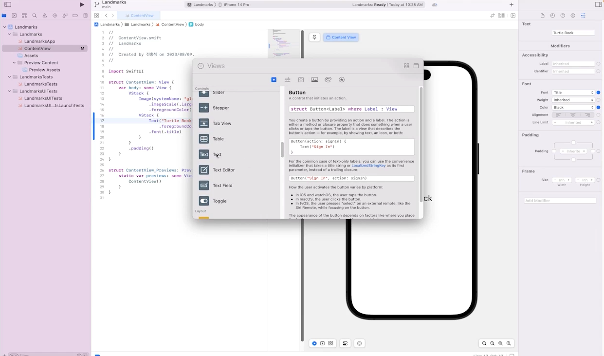

# 4장: SwiftUI 기본 뷰 컴포넌트

### 목차

**학습 목표:** SwiftUI의 기본 뷰 컴포넌트를 활용한 UI 구성 학습.

1. Text와 Image
    - Text 및 FontModifier 활용
    - Image 및 Asset 관리
2. 버튼과 사용자 입력 처리
    - Button과 액션 연결
    - TextField와 SecureField 사용
3. List와 Form
    - 정적 리스트 및 동적 리스트 생성
    - Form을 활용한 데이터 입력
4. Picker와 Toggle
    - 옵션 선택을 위한 Picker 활용
    - Toggle을 통한 상태 관리
5. 실습
    - 간단한 사용자 입력 및 데이터 저장 앱 제작

---

# **4장: SwiftUI 기본 뷰 컴포넌트**

### **학습 목표:**

SwiftUI의 기본 뷰 컴포넌트를 활용하여 사용자 인터페이스를 구성하고, 사용자 입력과 데이터 처리를 통합적으로 학습합니다.

---

# **1. Text와 Image**

- 우측 상단의 (+)를 누르면 열리는 Library 창에서 원하는 컴포넌트를 스크립트로 드래그 해서 추가 가능.
- 컴포넌트를 추가하고 우측 속성 설정 패널에서 속성 값을 변경 가능.



### **1.1 Text 컴포넌트**

- **기본 사용법**
    - `Text`는 SwiftUI에서 텍스트를 화면에 출력하는 기본 뷰 컴포넌트입니다.
        
        ```swift
        Text("Hello, SwiftUI!")
        ```
        
    - 다양한 스타일 속성 적용:
        
        ```swift
        Text("Hello, SwiftUI!")
            .font(.largeTitle)
            .foregroundColor(.blue)
        ```
        
- **FontModifier 활용**
    - 텍스트의 폰트 크기, 굵기, 색상을 쉽게 변경:
        
        ```swift
        Text("Important Notice")
            .font(.headline)
            .foregroundColor(.red)
        ```
        
- **다국어 지원과 Localization**
    - **Localizable.strings** 파일 생성 및 다국어 텍스트 관리.
    - 예제:
        
        ```swift
        Text(NSLocalizedString("welcome_message", comment: "Welcome message"))
        ```
        

---

### **1.2 Image 컴포넌트**

- **이미지 출력**
    - `Image` 컴포넌트를 사용하여 로컬 리소스나 시스템 아이콘 표시:
        
        ```swift
        Image("profile_picture")
            .resizable()
            .scaledToFit()
            .frame(width: 100, height: 100)
        ```
        
- **SF Symbols 활용**
    - 애플의 **SF Symbols** 라이브러리를 사용하여 다양한 아이콘 표시:
        
        ```swift
        Image(systemName: "star.fill")
            .foregroundColor(.yellow)
        ```
        
- **Asset Catalog로 이미지 관리**
    - 이미지를 `Assets.xcassets`에 추가하여 프로젝트에서 쉽게 접근 가능.

---

### **1.3 Text와 Image 결합**

- **Text와 Image 조합**
    - 텍스트와 이미지를 함께 배치하여 정보를 직관적으로 표시:
        
        ```swift
        VStack {
            Image(systemName: "person.circle.fill")
                .resizable()
                .scaledToFit()
                .frame(width: 100, height: 100)
            Text("John Doe")
                .font(.title)
                .padding()
        }
        
        ```
        
- **실제 사례**
    - 예제: 프로필 화면
        
        ```swift
        VStack {
            Image("profile_picture")
                .resizable()
                .scaledToFit()
                .frame(width: 150, height: 150)
                .clipShape(Circle())
                .shadow(radius: 10)
            Text("Jane Doe")
                .font(.largeTitle)
                .fontWeight(.bold)
            Text("iOS Developer")
                .font(.subheadline)
                .foregroundColor(.gray)
        }
        .padding()
        
        ```
        

---

### **실습: 사용자 이름과 프로필 이미지 추가**

### **실습 목표:**

사용자의 이름과 프로필 이미지를 표시하는 UI를 작성하며, SwiftUI의 Text와 Image 활용 방법을 익힙니다.

### **실습 가이드:**

1. **프로젝트 생성**
    - Xcode에서 새로운 SwiftUI 프로젝트를 생성합니다.
    - 이름을 "ProfileApp"으로 설정합니다.
2. **Text로 사용자 이름 표시**
    - 사용자 이름을 나타내는 `Text` 추가:
        
        ```swift
        Text("Alice Johnson")
            .font(.largeTitle)
            .foregroundColor(.blue)
        
        ```
        
3. **프로필 이미지 추가**
    - 이미지 파일을 **Assets.xcassets**에 추가합니다.
    - 프로필 이미지를 화면에 표시:
        
        ```swift
        Image("profile_picture")
            .resizable()
            .scaledToFit()
            .frame(width: 120, height: 120)
            .clipShape(Circle())
        
        ```
        
4. **Text와 Image 결합**
    - `VStack`을 사용하여 Text와 Image를 수직으로 배치합니다:
        
        ```swift
        VStack {
            Image("profile_picture")
                .resizable()
                .scaledToFit()
                .frame(width: 120, height: 120)
                .clipShape(Circle())
            Text("Alice Johnson")
                .font(.largeTitle)
                .fontWeight(.semibold)
        }
        .padding()
        
        ```
        
5. **실행 및 테스트**
    - 시뮬레이터에서 실행하여 프로필 화면이 정상적으로 표시되는지 확인합니다.

---

### **학습 결과**

- SwiftUI에서 Text와 Image 컴포넌트의 기본 사용법과 스타일링을 익힙니다.
- Text와 Image를 결합하여 실용적인 UI를 구성하는 방법을 학습합니다.
- 다국어 텍스트와 이미지 리소스를 효율적으로 관리하는 방법을 이해합니다.

---

# **2. 버튼과 사용자 입력 처리**

### **2.1 Button 컴포넌트**

- **Button 생성 및 동작 추가**
    - `Button`은 SwiftUI에서 클릭 가능한 요소를 생성하는 기본 컴포넌트입니다.
        
        ```swift
        Button("Click Me!") {
            print("Button clicked!")
        }
        ```
        
    - **Action Closure**를 통해 클릭 시 동작을 정의합니다.
- **ButtonStyle을 활용한 디자인 커스터마이징**
    - 버튼의 스타일을 변경하여 다양한 UI 연출 가능:
        
        ```swift
        Button("Save") {
            print("Save action triggered!")
        }
        	.buttonStyle(.borderedProminent)
        	.tint(.blue)
        ```
        
- **이미지 버튼**
    - 텍스트 대신 이미지를 사용:
        
        ```swift
        Button(action: {
            print("Image Button clicked!")
        }) {
            Image(systemName: "heart.fill")
                .font(.largeTitle)
                .foregroundColor(.red)
        }
        
        ```
        

---

### **2.2 TextField와 SecureField**

- **TextField로 사용자 입력 처리**
    - 텍스트 필드를 사용해 사용자로부터 입력값을 받습니다:
        
        ```swift
        TextField("Enter your name", text: $userName)
            .textFieldStyle(RoundedBorderTextFieldStyle())
            .padding()
        
        ```
        
    - **@State**를 통해 입력 데이터를 바인딩합니다.
- **SecureField로 비밀번호 입력**
    - 비밀번호나 민감한 데이터를 입력받을 때 사용:
        
        ```swift
        SecureField("Enter your password", text: $password)
            .textFieldStyle(RoundedBorderTextFieldStyle())
            .padding()
        
        ```
        
- **키보드 유형 설정**
    - 숫자, 이메일 등 입력값에 따라 키보드를 지정:
        
        ```swift
        TextField("Enter your phone number", text: $phoneNumber)
            .keyboardType(.numberPad)
            .padding()
        
        ```
        

---

### **2.3 상태 관리**

- **@State를 활용한 상태 연결**
    - SwiftUI에서 상태 변경을 통해 UI를 업데이트:
        
        ```swift
        @State private var userName: String = ""
        @State private var greeting: String = "Welcome!"
        
        var body: some View {
            VStack {
                TextField("Enter your name", text: $userName)
                    .textFieldStyle(RoundedBorderTextFieldStyle())
                    .padding()
        
                Button("Greet") {
                    greeting = "Hello, \(userName)!"
                }
                .buttonStyle(.borderedProminent)
        
                Text(greeting)
                    .font(.title)
                    .padding()
            }
            .padding()
        }
        
        ```
        

---

### **실습: 사용자 이름 입력과 버튼을 활용한 간단한 앱**

### **실습 목표**

1. 사용자가 이름을 입력하면 버튼을 눌러 입력된 이름을 화면에 표시.
2. TextField와 Button, 상태 관리(@State)를 활용.

---

### **실습 가이드**

1. **프로젝트 생성**
    - Xcode에서 SwiftUI 프로젝트를 생성합니다.
    - 이름은 "NameDisplayApp"으로 설정합니다.
2. **TextField 추가**
    - 사용자 이름 입력을 위한 `TextField`를 추가:
        
        ```swift
        @State private var userName: String = ""
        
        TextField("Enter your name", text: $userName)
            .textFieldStyle(RoundedBorderTextFieldStyle())
            .padding()
        
        ```
        
3. **Button 추가**
    - 버튼을 눌렀을 때 입력된 이름을 출력:
        
        ```swift
        @State private var displayName: String = ""
        
        Button("Submit") {
            displayName = "Hello, \(userName)!"
        }
        .buttonStyle(.borderedProminent)
        .padding()
        
        ```
        
4. **Text로 출력**
    - 버튼 클릭 후 이름을 화면에 표시:
        
        ```swift
        Text(displayName)
            .font(.title)
            .padding()
        
        ```
        
5. **전체 코드**
    
    ```swift
    import SwiftUI
    
    struct ContentView: View {
        @State private var userName: String = ""
        @State private var displayName: String = ""
    
        var body: some View {
            VStack(spacing: 20) {
                TextField("Enter your name", text: $userName)
                    .textFieldStyle(RoundedBorderTextFieldStyle())
                    .padding()
    
                Button("Submit") {
                    displayName = "Hello, \(userName)!"
                }
                .buttonStyle(.borderedProminent)
    
                Text(displayName)
                    .font(.title)
            }
            .padding()
        }
    }
    
    struct ContentView_Previews: PreviewProvider {
        static var previews: some View {
            ContentView()
        }
    }
    
    ```
    
6. **테스트**
    - 시뮬레이터를 실행하여 TextField에 이름을 입력하고, 버튼을 클릭하여 화면에 출력된 결과를 확인합니다.

---

### **학습 결과**

- 버튼 생성과 액션 추가 방법을 이해합니다.
- TextField와 SecureField를 활용해 사용자 입력 데이터를 처리할 수 있습니다.
- @State를 활용한 상태 관리를 통해 UI와 데이터를 동기화합니다.
- 간단한 사용자 인터페이스를 구성하는 능력을 습득합니다.

### 시뮬레이터 실행

- 작업 완료 후 좌측 상단의 플레이버튼을 누르면 자동으로 시뮬레이터가 실행 됩니다.


---

# **3. List와 Form**

### **3.1 List 컴포넌트**

**목표:** SwiftUI의 `List` 컴포넌트를 활용해 정적 및 동적 데이터를 표시하는 방법을 학습합니다.

- **정적 리스트 생성**
    - 정적 데이터를 사용해 간단한 리스트를 생성:
        
        ```swift
        List {
            Text("Task 1")
            Text("Task 2")
            Text("Task 3")
        }
        
        ```
        
- **동적 리스트 생성 및 ForEach 활용**
    - 배열 데이터를 기반으로 리스트 생성:
        
        ```swift
        let tasks = ["Buy groceries", "Clean the house", "Walk the dog"]
        
        List(tasks, id: \.self) { task in
            Text(task)
        }
        
        ```
        
- **리스트 셀 커스터마이징**
    - 각 셀에 추가적인 UI 구성 요소를 포함:
        
        ```swift
        struct Task: Identifiable {
            let id = UUID()
            let name: String
            let isCompleted: Bool
        }
        
        let tasks = [
            Task(name: "Buy groceries", isCompleted: true),
            Task(name: "Clean the house", isCompleted: false)
        ]
        
        List(tasks) { task in
            HStack {
                Text(task.name)
                Spacer()
                if task.isCompleted {
                    Image(systemName: "checkmark.circle")
                        .foregroundColor(.green)
                } else {
                    Image(systemName: "circle")
                        .foregroundColor(.red)
                }
            }
        }
        
        ```
        

---

### **3.2 Form 컴포넌트**

**목표:** Form 컴포넌트를 활용하여 사용자 입력 화면을 구현합니다.

- **Form을 활용한 데이터 입력 UI 구성**
    - 사용자 데이터를 입력받는 `Form` 생성:
        
        ```swift
        Form {
            TextField("Enter your task", text: $taskName)
            DatePicker("Due Date", selection: $dueDate, displayedComponents: .date)
        }
        
        ```
        
- **Section으로 Form 분리 및 정렬**
    - 섹션을 활용해 입력 필드 그룹화:
        
        ```swift
        Form {
            Section(header: Text("Task Details")) {
                TextField("Task Name", text: $taskName)
            }
        
            Section(header: Text("Due Date")) {
                DatePicker("Select Date", selection: $dueDate, displayedComponents: .date)
            }
        }
        
        ```
        

---

### **3.3 리스트와 Form 통합**

**목표:** Form에서 데이터를 입력받아 리스트에 실시간으로 반영합니다.

- **사용자 입력 데이터를 리스트에 추가**
    - 입력받은 데이터를 리스트에 추가하는 기능:
        
        ```swift
        @State private var tasks: [String] = []
        @State private var newTask: String = ""
        
        var body: some View {
            VStack {
                Form {
                    TextField("Enter task", text: $newTask)
                    Button("Add Task") {
                        tasks.append(newTask)
                        newTask = ""
                    }
                }
        
                List(tasks, id: \.self) { task in
                    Text(task)
                }
            }
        }
        
        ```
        

---

### **실습: To-Do 앱 구현**

**실습 목표:**

- 사용자가 입력한 작업(Task)을 리스트에 추가하고 관리하는 간단한 To-Do 앱을 구현합니다.
- `Form`을 활용한 입력 UI와 `List`를 활용한 데이터 표시를 통합합니다.

---

**실습 단계:**

1. **프로젝트 생성**
    - Xcode에서 새로운 SwiftUI 프로젝트를 생성합니다.
    - 프로젝트 이름은 "ToDoApp"으로 설정합니다.
2. **Form으로 입력 필드 구현**
    - 작업 이름과 마감일을 입력받는 Form 생성:
        
        ```swift
        @State private var taskName: String = ""
        @State private var dueDate: Date = Date()
        
        Form {
            Section(header: Text("Task Details")) {
                TextField("Enter task name", text: $taskName)
                DatePicker("Due Date", selection: $dueDate, displayedComponents: .date)
            }
        }
        
        ```
        
3. **리스트와 데이터 추가 기능 구현**
    - 입력된 작업을 리스트에 추가:
        
        ```swift
        @State private var tasks: [(name: String, date: Date)] = []
        
        Button("Add Task") {
            tasks.append((name: taskName, date: dueDate))
            taskName = ""
            dueDate = Date()
        }
        
        ```
        
4. **리스트에 작업 표시**
    - 입력받은 작업을 리스트에 동적으로 표시:
        
        ```swift
        List(tasks, id: \.name) { task in
            VStack(alignment: .leading) {
                Text(task.name)
                    .font(.headline)
                Text("Due: \(task.date, formatter: dateFormatter)")
                    .font(.subheadline)
                    .foregroundColor(.gray)
            }
        }
        
        ```
        
5. **전체 코드**
    
    ```swift
    import SwiftUI
    
    struct ContentView: View {
        @State private var tasks: [(name: String, date: Date)] = []
        @State private var taskName: String = ""
        @State private var dueDate: Date = Date()
    
        let dateFormatter: DateFormatter = {
            let formatter = DateFormatter()
            formatter.dateStyle = .short
            return formatter
        }()
    
        var body: some View {
            NavigationView {
                VStack {
                    Form {
                        Section(header: Text("Task Details")) {
                            TextField("Enter task name", text: $taskName)
                            DatePicker("Due Date", selection: $dueDate, displayedComponents: .date)
                        }
    
                        Button("Add Task") {
                            tasks.append((name: taskName, date: dueDate))
                            taskName = ""
                            dueDate = Date()
                        }
                        .buttonStyle(.borderedProminent)
                    }
    
                    List(tasks, id: \.name) { task in
                        VStack(alignment: .leading) {
                            Text(task.name)
                                .font(.headline)
                            Text("Due: \(task.date, formatter: dateFormatter)")
                                .font(.subheadline)
                                .foregroundColor(.gray)
                        }
                    }
                }
                .navigationTitle("To-Do List")
            }
        }
    }
    
    struct ContentView_Previews: PreviewProvider {
        static var previews: some View {
            ContentView()
        }
    }
    
    ```
    
6. **결과 확인**
    - 시뮬레이터에서 앱 실행 후 작업 이름과 마감일을 입력해 리스트에 추가됩니다.

---

### **학습 결과**

- `List`와 `Form`을 활용한 사용자 입력과 데이터 표시 기술을 습득합니다.
- 실시간 데이터 추가 및 UI 업데이트를 구현합니다.
- To-Do 리스트를 통해 SwiftUI의 기본 컴포넌트를 통합적으로 학습합니다.

---

# **4. Picker와 Toggle**

## **4.1 Picker 컴포넌트**

**내용 요약:**

- `Picker`는 사용자가 선택할 수 있는 목록을 제공하는 UI 컴포넌트입니다.
- `@State`를 활용하여 사용자 선택 값을 동적으로 관리합니다.

**학습 포인트:**

1. **Picker 생성 및 기본 사용법**:
    
    ```swift
    @State private var selectedOption = "Option 1"
    let options = ["Option 1", "Option 2", "Option 3"]
    
    Picker("Select an option", selection: $selectedOption) {
        ForEach(options, id: \.self) { option in
            Text(option)
        }
    }
    .pickerStyle(.wheel) // 기본 스타일 변경 가능
    
    ```
    
2. **Picker 스타일 변경**:
    - `.wheel`: 휠 스타일 Picker
    - `.segmented`: 세그먼트 스타일 Picker
    - `.menu`: 드롭다운 메뉴 Picker
3. **Picker에서 선택된 값 사용**:
    
    ```swift
    Text("Selected: \(selectedOption)")
        .padding()
    
    ```
    

---

## **4.2 Toggle 컴포넌트**

**내용 요약:**

- `Toggle`은 ON/OFF 상태를 처리하는 UI 컴포넌트입니다.
- `@State`를 활용하여 상태 변화를 관리하고 화면을 동적으로 변경합니다.

**학습 포인트:**

1. **Toggle 생성 및 상태 관리**:
    
    ```swift
    @State private var isOn = false
    
    Toggle("Enable Feature", isOn: $isOn)
        .padding()
    
    ```
    
2. **Toggle와 조건문 연동**:
    - 상태 값에 따라 동적 UI 변경:
        
        ```swift
        if isOn {
            Text("Feature Enabled")
                .foregroundColor(.green)
        } else {
            Text("Feature Disabled")
                .foregroundColor(.red)
        }
        
        ```
        

---

## **4.3 Picker와 Toggle 통합**

**목표:** `Picker`와 `Toggle`을 조합하여 설정 화면을 구현합니다.

1. **옵션 선택과 상태 변경 통합**:
    
    ```swift
    @State private var selectedOption = "Option 1"
    @State private var isEnabled = false
    
    let options = ["Option 1", "Option 2", "Option 3"]
    
    VStack {
        Picker("Choose an option", selection: $selectedOption) {
            ForEach(options, id: \.self) { option in
                Text(option)
            }
        }
        .pickerStyle(.segmented)
    
        Toggle("Enable \(selectedOption)", isOn: $isEnabled)
    
        if isEnabled {
            Text("\(selectedOption) is enabled!")
                .foregroundColor(.green)
        } else {
            Text("\(selectedOption) is disabled.")
                .foregroundColor(.red)
        }
    }
    .padding()
    
    ```
    

---

## **실습: 사용자 설정 화면 제작**

**실습 목표:**

옵션 선택과 상태 변경을 처리하는 설정 화면을 제작합니다.

**실습 단계:**

1. **Picker와 Toggle 컴포넌트 추가**:
    - 옵션 선택 Picker와 상태 변경 Toggle 생성.
2. **선택된 옵션과 상태 표시**:
    - Picker에서 선택한 옵션을 Toggle로 활성화/비활성화.
3. **전체 코드 구현**:
    
    ```swift
    import SwiftUI
    
    struct SettingsView: View {
        @State private var selectedOption = "Option 1"
        @State private var isEnabled = false
    
        let options = ["Option 1", "Option 2", "Option 3"]
    
        var body: some View {
            VStack {
                Picker("Choose an option", selection: $selectedOption) {
                    ForEach(options, id: \.self) { option in
                        Text(option)
                    }
                }
                .pickerStyle(.segmented)
                .padding()
    
                Toggle("Enable \(selectedOption)", isOn: $isEnabled)
                    .padding()
    
                if isEnabled {
                    Text("\(selectedOption) is currently enabled!")
                        .font(.headline)
                        .foregroundColor(.green)
                } else {
                    Text("\(selectedOption) is currently disabled.")
                        .font(.headline)
                        .foregroundColor(.red)
                }
            }
            .navigationTitle("Settings")
            .padding()
        }
    }
    
    struct SettingsView_Previews: PreviewProvider {
        static var previews: some View {
            SettingsView()
        }
    }
    
    ```
    
4. **결과 확인**:
    - 시뮬레이터에서 실행하여 옵션 선택과 상태 변경 동작 확인.

---

### **학습 결과**

- `Picker`와 `Toggle`을 활용한 사용자 인터페이스 개발 방법을 익힙니다.
- 상태 관리(`@State`)를 활용하여 UI를 동적으로 변경하는 기술을 습득합니다.
- 설정 화면 제작을 통해 SwiftUI의 기본 뷰 컴포넌트를 통합적으로 활용합니다.

---

# **5. 실습: 사용자 입력 및 데이터 저장 앱 제작**

### **실습 목표:**

SwiftUI의 기본 뷰 컴포넌트(TextField, Picker, Toggle)를 활용하여 사용자 입력을 처리하고, `UserDefaults`를 통해 데이터를 저장하고 복원하는 앱을 제작합니다. 이 실습을 통해 입력 폼, 리스트 표시, 데이터 저장 기능을 통합적으로 구현합니다.

---

### **1. 사용자 입력 폼 구현**

1. **TextField로 이름 입력**
    - 사용자 이름을 입력받는 TextField 구현:
        
        ```swift
        @State private var name: String = ""
        
        TextField("Enter your name", text: $name)
            .textFieldStyle(RoundedBorderTextFieldStyle())
            .padding()
        
        ```
        
2. **Picker로 선호 색상 선택**
    - 사용자가 선호하는 색상을 선택할 수 있는 Picker 구성:
        
        ```swift
        @State private var selectedColor: String = "Red"
        let colors = ["Red", "Blue", "Green"]
        
        Picker("Select your favorite color", selection: $selectedColor) {
            ForEach(colors, id: \.self) { color in
                Text(color)
            }
        }
        .pickerStyle(SegmentedPickerStyle())
        .padding()
        
        ```
        
3. **Toggle로 알림 설정 관리**
    - 알림 설정을 관리하는 Toggle 추가:
        
        ```swift
        @State private var notificationsEnabled: Bool = false
        
        Toggle("Enable Notifications", isOn: $notificationsEnabled)
            .padding()
        
        ```
        

---

### **2. 리스트에 사용자 데이터 표시**

1. **입력 데이터를 리스트에 추가**
    - 사용자가 입력한 이름, 선호 색상, 알림 설정을 리스트로 표시:
        
        ```swift
        @State private var userList: [String] = []
        
        Button("Add User") {
            let userInfo = "\(name) - \(selectedColor) - Notifications: \(notificationsEnabled ? "On" : "Off")"
            userList.append(userInfo)
            saveData()
        }
        .buttonStyle(.bordered)
        .padding()
        
        List(userList, id: \.self) { user in
            Text(user)
        }
        
        ```
        

---

### **3. UserDefaults를 활용한 데이터 저장**

1. **데이터 저장 함수 구현**
    - `UserDefaults`를 이용해 입력된 데이터를 저장:
        
        ```swift
        func saveData() {
            UserDefaults.standard.set(userList, forKey: "SavedUsers")
        }
        
        ```
        
2. **앱 실행 시 데이터 복원**
    - 앱 시작 시 저장된 데이터를 불러오는 로직:
        
        ```swift
        func loadData() {
            if let savedUsers = UserDefaults.standard.array(forKey: "SavedUsers") as? [String] {
                userList = savedUsers
            }
        }
        
        ```
        
    - `onAppear`를 통해 앱 로드 시 호출:
        
        ```swift
        .onAppear {
            loadData()
        }
        
        ```
        

---

### **최종 코드**

```swift
import SwiftUI

struct UserInputApp: View {
    @State private var name: String = ""
    @State private var selectedColor: String = "Red"
    @State private var notificationsEnabled: Bool = false
    @State private var userList: [String] = []

    let colors = ["Red", "Blue", "Green"]

    var body: some View {
        VStack {
            // 사용자 입력 폼
            TextField("Enter your name", text: $name)
                .textFieldStyle(RoundedBorderTextFieldStyle())
                .padding()

            Picker("Select your favorite color", selection: $selectedColor) {
                ForEach(colors, id: \.self) { color in
                    Text(color)
                }
            }
            .pickerStyle(SegmentedPickerStyle())
            .padding()

            Toggle("Enable Notifications", isOn: $notificationsEnabled)
                .padding()

            // 사용자 데이터 추가 버튼
            Button("Add User") {
                let userInfo = "\(name) - \(selectedColor) - Notifications: \(notificationsEnabled ? "On" : "Off")"
                userList.append(userInfo)
                saveData()
                clearInputs()
            }
            .buttonStyle(.borderedProminent)
            .padding()

            // 사용자 데이터 리스트
            List(userList, id: \.self) { user in
                Text(user)
            }
        }
        .onAppear {
            loadData()
        }
        .navigationTitle("User Input App")
        .padding()
    }

    func saveData() {
        UserDefaults.standard.set(userList, forKey: "SavedUsers")
    }

    func loadData() {
        if let savedUsers = UserDefaults.standard.array(forKey: "SavedUsers") as? [String] {
            userList = savedUsers
        }
    }

    func clearInputs() {
        name = ""
        selectedColor = "Red"
        notificationsEnabled = false
    }
}

struct UserInputApp_Previews: PreviewProvider {
    static var previews: some View {
        UserInputApp()
    }
}

```

---

### **실습 결과**

1. 사용자 이름, 선호 색상, 알림 설정을 입력하고 저장합니다.
2. 입력된 데이터가 리스트에 표시되며, 앱 재실행 시에도 데이터를 복원합니다.
3. `UserDefaults`와 SwiftUI의 상태 관리(@State)를 통합적으로 학습합니다.

---

# **4장 요약**

- SwiftUI의 핵심 뷰(Text, Image, Button, TextField 등)를 익히고, 이를 기반으로 기본 UI를 구성하는 방법을 학습합니다.
- 상태 관리와 데이터 저장을 통해 사용자 입력과 인터페이스를 통합적으로 연결하는 방법을 실습합니다.
- 간단한 앱 제작을 통해 SwiftUI의 실용적인 사용 사례를 경험합니다.

---

# **단원평가: SwiftUI 기본 뷰 컴포넌트**

---

## **이론 문제**

1. **다음 중 SwiftUI에서 텍스트를 화면에 출력하는 기본 컴포넌트는 무엇인가요?**
    
    a) Button
    
    b) Image
    
    c) Text
    
    d) Form
    
    **정답:** c
    
2. **SwiftUI의 Image 컴포넌트에 대해 옳지 않은 설명은 무엇인가요?**
    
    a) 시스템 아이콘을 표시할 수 있다.
    
    b) 이미지를 Asset Catalog에 추가하여 사용할 수 있다.
    
    c) SF Symbols를 지원하지 않는다.
    
    d) 이미지 크기를 조절할 수 있다.
    
    **정답:** c
    
3. **@State 속성을 사용하는 이유는 무엇인가요?**
    
    a) UI를 동적으로 변경하기 위해
    
    b) 데이터를 영구적으로 저장하기 위해
    
    c) 앱의 배경색을 변경하기 위해
    
    d) 앱을 종료하기 위해
    
    **정답:** a
    
4. **Form 컴포넌트의 주요 용도는 무엇인가요?**
    
    a) 정적 데이터 표시
    
    b) 사용자 입력을 위한 화면 구성
    
    c) 이미지 슬라이더 구현
    
    d) 버튼 디자인 변경
    
    **정답:** b
    
5. **UserDefaults를 사용하는 주요 목적은 무엇인가요?**
    
    a) UI 디자인 변경
    
    b) 사용자 입력 데이터를 영구적으로 저장
    
    c) 앱 내에서 애니메이션 구현
    
    d) 네트워크 요청 처리
    
    **정답:** b
    

---

## **실습 문제**

1. **Text와 Image를 결합하여 사용자 프로필 화면 제작**
    - 사용자의 이름과 프로필 이미지를 표시하는 UI를 작성하세요.
    - `VStack`을 사용하여 Text와 Image를 수직으로 배치합니다.
    
    **예제 코드:**
    
    ```swift
    VStack {
        Image(systemName: "person.circle.fill")
            .resizable()
            .scaledToFit()
            .frame(width: 100, height: 100)
        Text("John Doe")
            .font(.title)
            .padding()
    }
    
    ```
    
2. **Button과 TextField를 활용하여 사용자 입력 처리 앱 제작**
    - TextField에 이름을 입력하고, 버튼을 클릭하면 입력된 이름을 화면에 표시하세요.
    - `@State`를 사용하여 상태를 관리합니다.
    
    **예제 코드:**
    
    ```swift
    @State private var userName: String = ""
    @State private var displayName: String = ""
    
    TextField("Enter your name", text: $userName)
        .textFieldStyle(RoundedBorderTextFieldStyle())
        .padding()
    
    Button("Submit") {
        displayName = "Hello, \(userName)!"
    }
    .buttonStyle(.borderedProminent)
    
    Text(displayName)
        .font(.title)
        .padding()
    
    ```
    
3. **Form과 List를 활용한 To-Do 앱 제작**
    - Form을 사용하여 작업 이름과 마감일을 입력받고, 입력된 데이터를 List에 추가하는 앱을 구현하세요.
    
    **예제 코드:**
    
    ```swift
    @State private var tasks: [String] = []
    @State private var taskName: String = ""
    
    Form {
        TextField("Enter task", text: $taskName)
        Button("Add Task") {
            tasks.append(taskName)
            taskName = ""
        }
    }
    
    List(tasks, id: \.self) { task in
        Text(task)
    }
    
    ```
    
4. **Picker와 Toggle을 활용하여 설정 화면 제작**
    - Picker로 옵션을 선택하고, Toggle을 사용하여 설정을 활성화/비활성화하는 UI를 구현하세요.
    
    **예제 코드:**
    
    ```swift
    @State private var selectedOption = "Option 1"
    @State private var isEnabled = false
    
    let options = ["Option 1", "Option 2", "Option 3"]
    
    Picker("Choose an option", selection: $selectedOption) {
        ForEach(options, id: \.self) { option in
            Text(option)
        }
    }
    .pickerStyle(SegmentedPickerStyle())
    .padding()
    
    Toggle("Enable \(selectedOption)", isOn: $isEnabled)
        .padding()
    
    ```
    
5. **UserDefaults를 활용하여 사용자 데이터를 저장하고 복원하는 앱 제작**
    - 사용자가 입력한 데이터를 리스트에 추가하고, 앱 종료 후에도 데이터를 복원할 수 있도록 UserDefaults를 사용합니다.
    
    **예제 코드:**
    
    ```swift
    @State private var userList: [String] = []
    
    func saveData() {
        UserDefaults.standard.set(userList, forKey: "SavedUsers")
    }
    
    func loadData() {
        if let savedUsers = UserDefaults.standard.array(forKey: "SavedUsers") as? [String] {
            userList = savedUsers
        }
    }
    
    .onAppear {
        loadData()
    }
    
    ```
    

---

## **도전 문제**

### **문제: 사용자 입력 데이터를 UserDefaults에 저장하고 복원하는 앱 구현**

**요구사항:**

- 사용자 이름, 선호 색상, 알림 설정을 입력받는 폼을 구성합니다.
- 입력된 데이터를 리스트에 추가하고, UserDefaults를 사용하여 데이터를 저장하고 복원합니다.

**전체 코드:**

```swift
import SwiftUI

struct UserInputApp: View {
    @State private var name: String = ""
    @State private var selectedColor: String = "Red"
    @State private var notificationsEnabled: Bool = false
    @State private var userList: [String] = []

    let colors = ["Red", "Blue", "Green"]

    var body: some View {
        VStack {
            // 사용자 입력 폼
            TextField("Enter your name", text: $name)
                .textFieldStyle(RoundedBorderTextFieldStyle())
                .padding()

            Picker("Select your favorite color", selection: $selectedColor) {
                ForEach(colors, id: \.self) { color in
                    Text(color)
                }
            }
            .pickerStyle(SegmentedPickerStyle())
            .padding()

            Toggle("Enable Notifications", isOn: $notificationsEnabled)
                .padding()

            // 사용자 데이터 추가 버튼
            Button("Add User") {
                let userInfo = "\(name) - \(selectedColor) - Notifications: \(notificationsEnabled ? "On" : "Off")"
                userList.append(userInfo)
                saveData()
                clearInputs()
            }
            .buttonStyle(.borderedProminent)
            .padding()

            // 사용자 데이터 리스트
            List(userList, id: \.self) { user in
                Text(user)
            }
        }
        .onAppear {
            loadData()
        }
        .navigationTitle("User Input App")
        .padding()
    }

    func saveData() {
        UserDefaults.standard.set(userList, forKey: "SavedUsers")
    }

    func loadData() {
        if let savedUsers = UserDefaults.standard.array(forKey: "SavedUsers") as? [String] {
            userList = savedUsers
        }
    }

    func clearInputs() {
        name = ""
        selectedColor = "Red"
        notificationsEnabled = false
    }
}

struct UserInputApp_Previews: PreviewProvider {
    static var previews: some View {
        UserInputApp()
    }
}

```

[도전 문제: 세계 최초의 챗봇 앨리자 구현](https://www.notion.so/182e622122f1801bbbe9f6ad11aa2c71?pvs=21)