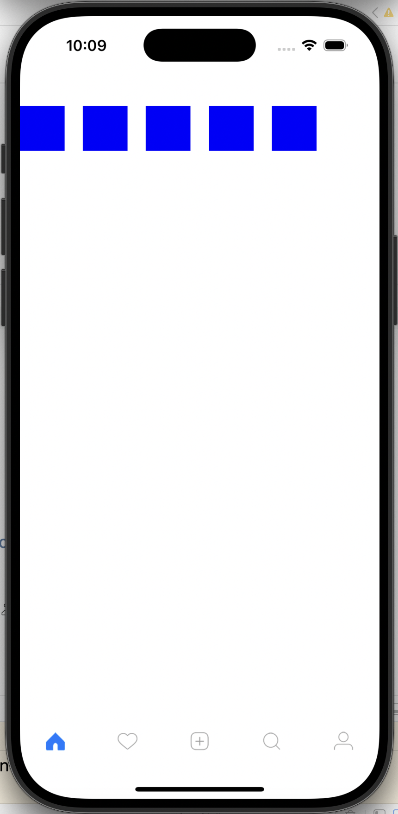

# iOS Swift 02 FeedUI 개발

- 피드 컨트롤러 : 로그인이 되었다는 가정하에 게시물들을 계속 볼 수 있게 하는 것
- 익스텐션 : 확장
- UI 컬렉션 뷰 컨트롤러
- 디퀴 리유져블 셀 : 큐
- 아이덴티피어 : 식별자


### FeedController.swift
``` swift
//  FeedController.swift
import UIKit

private let reuseIdentifier = "Cell" // 보통 그냥 "Cell"로 값을 지정.

class FeedController: UICollectionViewController {
    
    // MARK: - Life cycle
    override func viewDidLoad() {
        super.viewDidLoad()
        
        configureUI()
    }
    
    // MARK: - Helpers
    func configureUI() {
        view.backgroundColor = .yellow
        
        collectionView.register(UICollectionViewCell.self, forCellWithReuseIdentifier: reuseIdentifier)
    }
}

// MARK: - UICollectionView DataSource
extension FeedController {
    override func collectionView(_ collectionView: UICollectionView, numberOfItemsInSection section: Int) -> Int {
        return 5
    }
    
    override func collectionView(_ collectionView: UICollectionView, cellForItemAt indexPath: IndexPath) -> UICollectionViewCell {
        // 셀에 대한 특정 값 만들어 줄 수 있다.
        let cell = collectionView.dequeueReusableCell(withReuseIdentifier: reuseIdentifier, for: indexPath)
        cell.backgroundColor = .blue
        return cell
    }
}

/*
 첫번째 오류:
 collectionView 코드를 완성하고 시뮬레이터에서 실행 하면
 AppDelegate.swift에 다음 에러가 발생 할 수 있습니다.
 Thread 1: "UICollectionView must be initialized with a non-nil layout parameter"
 
 UICollectionView에 대한 레이아웃이 잡혀 있지 않기 때문입니다.
 MainTabBarController에서 FeedController에 대한 레이아웃이 정의 해야 합니다.
 
 
 두번째 오류:
 위 오류를 해결 해도 AppDelegate.swift에 두번째로 다음 에러가 발생 할 수 있습니다.
 Thread 1: "could not dequeue a view of kind: UICollectionElementKindCell with identifier Cell - must register a nib or a class for the identifier or connect a prototype cell in a storyboard"
 FeedController.swift의 MARK: -Hellpers에 collectionView.register 등록.
 
 */

```
실행 결과 



### MainTabBarController.swift
``` swift
// MainTabBarController.swift
import UIKit

class MainTabBarController: UITabBarController {
    
    // MARK: - LifeCycle
    override func viewDidLoad() {
        super.viewDidLoad()
        
        view.backgroundColor = .red
        configureViewController()
        
    }
    
    // MARK: - Helpers
    func configureViewController() {
        
        view.backgroundColor = .white
        
        // 탭바의 색상 변경.
        tabBar.backgroundColor = .white
        
        let layout = UICollectionViewFlowLayout()
        
        // #imageLiteral()을 사용하면 Assets에 접근이 쉽습니다.
        let feed = tabBarNavigationConroller(unselectedImage: #imageLiteral(resourceName: "home_unselected"), selectedImage: #imageLiteral(resourceName: "home_selected"), rootViewController: FeedController(collectionViewLayout: layout))
        
        let notification = tabBarNavigationConroller(unselectedImage: #imageLiteral(resourceName: "like_unselected"), selectedImage: #imageLiteral(resourceName: "like_selected"), rootViewController: NotificationController())
        
        let imageSelector = tabBarNavigationConroller(unselectedImage: #imageLiteral(resourceName: "plus_unselected"), selectedImage: #imageLiteral(resourceName: "add2"), rootViewController: ImageSelectionController())
        
        let search = tabBarNavigationConroller(unselectedImage: #imageLiteral(resourceName: "search_unselected"), selectedImage: #imageLiteral(resourceName: "search_selected"), rootViewController: SearchController())
        
        let profile = tabBarNavigationConroller(unselectedImage: #imageLiteral(resourceName: "profile_unselected"), selectedImage: #imageLiteral(resourceName: "profile_selected"), rootViewController: ProfileController())
        
        viewControllers = [feed, notification, imageSelector, search, profile]
    }
    
    func tabBarNavigationConroller(unselectedImage: UIImage, selectedImage: UIImage, rootViewController: UIViewController) -> UINavigationController {
        let nav = UINavigationController(rootViewController: rootViewController)
        nav.tabBarItem.image = unselectedImage
        nav.tabBarItem.selectedImage = selectedImage
        nav.navigationBar.tintColor = .black
        
        return nav
    }
}

```


## 셀크기 정의 하기


### FeedController.swift
``` swift
//  FeedController.swift
import UIKit

private let reuseIdentifier = "Cell" // 보통 그냥 "Cell"로 값을 지정.

class FeedController: UICollectionViewController {
    
    // MARK: - Life cycle
    override func viewDidLoad() {
        super.viewDidLoad()
        
        configureUI()
    }
    
    // MARK: - Helpers
    func configureUI() {
        view.backgroundColor = .yellow
        
        collectionView.register(UICollectionViewCell.self, forCellWithReuseIdentifier: reuseIdentifier)
    }
}

// MARK: - UICollectionView DataSource
extension FeedController {
    override func collectionView(_ collectionView: UICollectionView, numberOfItemsInSection section: Int) -> Int {
        return 5
    }
    
    override func collectionView(_ collectionView: UICollectionView, cellForItemAt indexPath: IndexPath) -> UICollectionViewCell {
        // 셀에 대한 특정 값 만들어 줄 수 있다.
        let cell = collectionView.dequeueReusableCell(withReuseIdentifier: reuseIdentifier, for: indexPath)
        cell.backgroundColor = .blue
        return cell
    }
}

// 셀 크기를 지정하는 extention
// 자주 사용되는 설정은 Util 폴더에 Extension.swift 파일을 만들어서 사용 합니다. 
extension FeedController: UICollectionViewDelegateFlowLayout {
    func collectionView(_ collectionView: UICollectionView, layout collectionViewLayout: UICollectionViewLayout, sizeForItemAt indexPath: IndexPath) -> CGSize {
        let width = view.frame.width
        return CGSize(width: width, height: width)
    }
}
```

실행 결과
